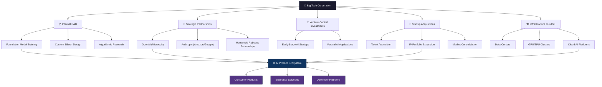
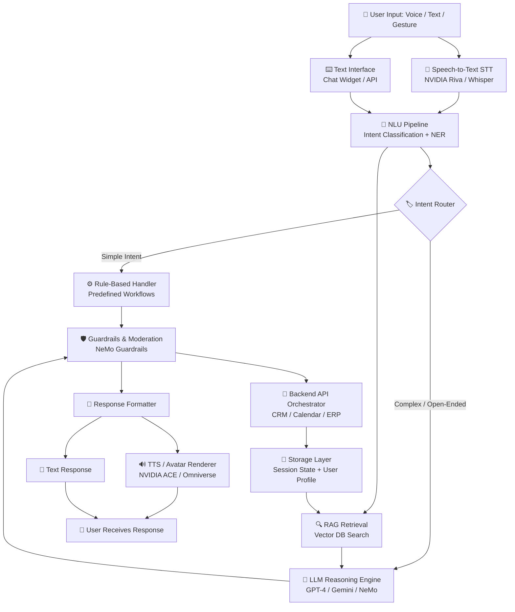
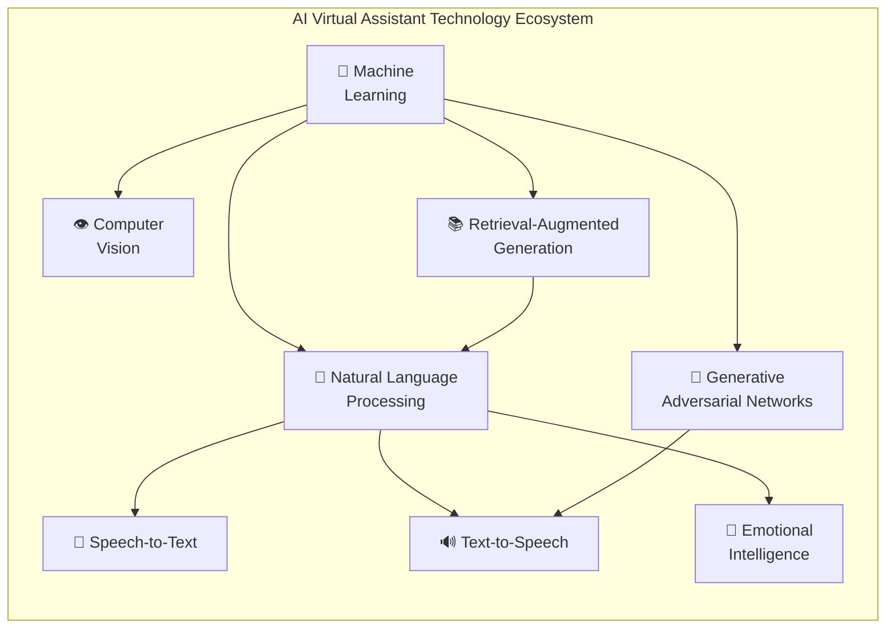
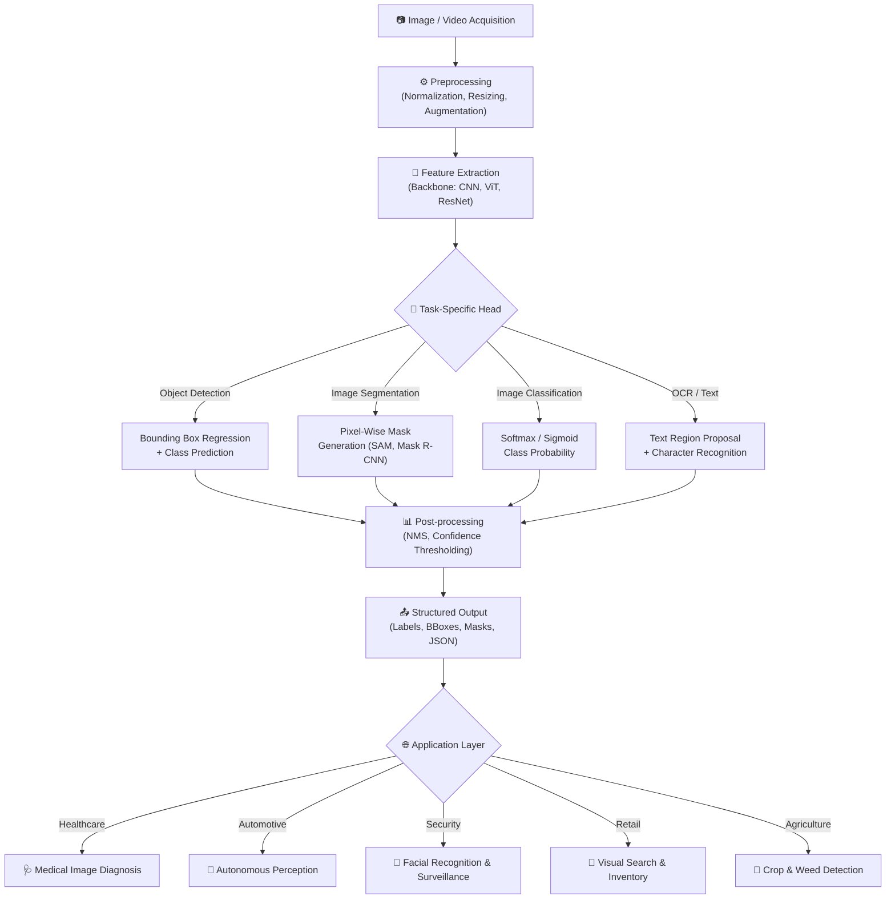
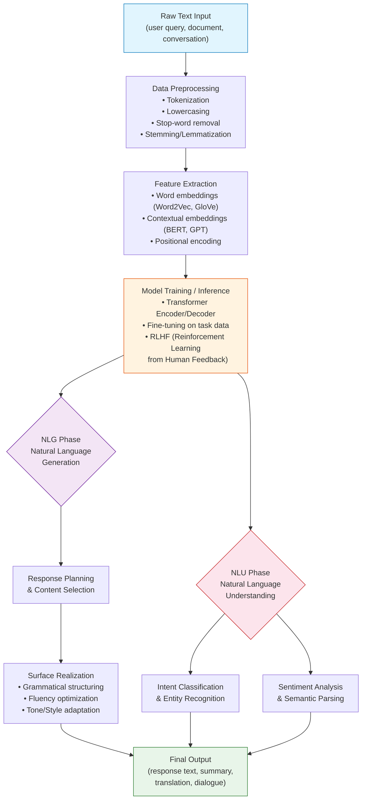
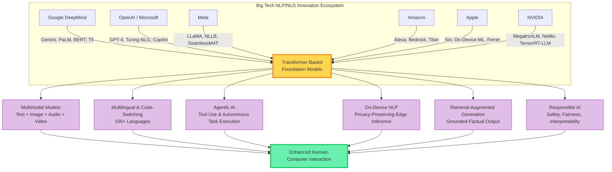
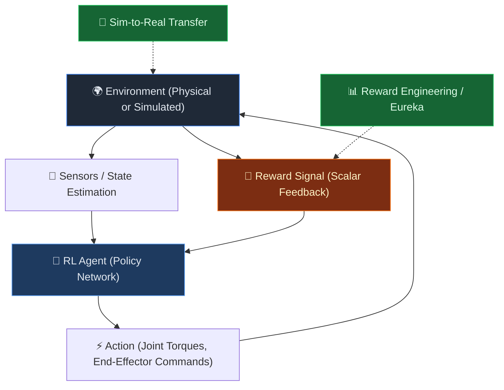
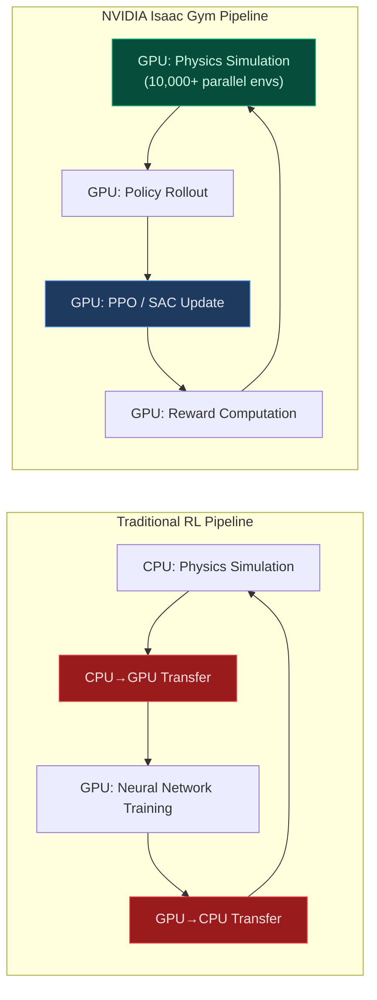
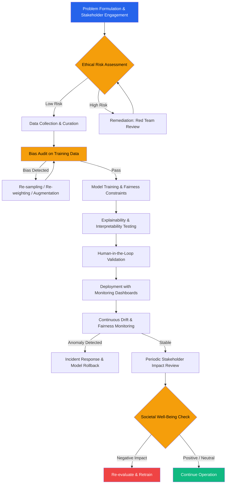

### Introduction to Big Tech and Artificial Intelligence
The artificial intelligence landscape is dominated by Big Tech corporations, including Amazon, Alphabet (Google), Microsoft, Apple, Meta, and Nvidia. These companies have invested heavily in AI research and development, with combined annual expenditures expected to reach over $255 billion by 2025. Their strategic approach involves internal R&D, startup acquisitions, venture capital investments, and cloud infrastructure buildout, focusing on areas such as generative AI, on-device machine learning, humanoid robotics, autonomous systems, and privacy-preserving computation.

### AI-Powered Virtual Assistants
AI-powered virtual assistants are a significant innovation, built on a layered architecture that integrates multimodal input capture, natural language understanding (NLU) pipelines, retrieval-augmented generation (RAG) systems, and backend API orchestration. This technology has been successfully deployed in various industries, including healthcare, e-commerce, and enterprise services, with notable improvements in user experience, such as increased resolution rates and reduced patient anxiety.

### Computer Vision Platforms
Big Tech giants have established dominant computer vision platforms, providing pre-trained, API-accessible models for object detection, facial recognition, OCR, and image classification. These platforms enable developers to implement production-grade computer vision with minimal code, leveraging architectural innovations like foundation model pre-training, edge-optimized on-device inference, and multimodal capabilities. Real-world applications include healthcare, automotive, agriculture, security, retail, and content moderation.

### Natural Language Processing (NLP) and Natural Language Generation (NLG)
The past five years have seen significant breakthroughs in NLP and NLG, driven primarily by Big Tech giants. The Transformer architecture has become the foundation for modern language AI, with model scale growing exponentially. These advances have transformed human-computer interaction across dimensions such as input modality, interaction style, language support, accessibility, personalization, and context retention. Emerging trends include multimodal NLP models, retrieval-augmented generation, agentic AI, on-device NLP, and responsible AI frameworks.

### Robotics and Reinforcement Learning
Big Tech is driving a paradigm shift in robotics through reinforcement learning, with initiatives like NVIDIA's Isaac Gym and Eureka agent achieving significant milestones in autonomous task execution and robotic control. Reinforcement learning improves robotic systems through adaptive locomotion, autonomous reward design, robust sim-to-real transfer, contact-rich dexterous manipulation, and massive training scalability.

### Impact and Ethics of Big Tech AI Inventions
Big Tech AI inventions have a dual-faced impact spectrum, presenting both transformative benefits and material risks. While AI has the potential to drive significant advancements in healthcare, manufacturing, logistics, finance, and environmental sustainability, it also raises concerns about algorithmic bias, opacity, privacy erosion, labor-market disruption, and regulatory fragmentation. The emerging ethical-AI consensus emphasizes the need for fairness, transparency, accountability, privacy, human oversight, explainability, security, environmental sustainability, and social value in AI development and deployment.

### Governance and Regulation
The global regulatory landscape is converging toward risk-tiered oversight, with the EU AI Act, US executive orders, and UNESCO's global recommendation demanding Big Tech harmonize internal standards across jurisdictions. Governance levers, such as internal ethics boards, algorithmic impact assessments, external red-teaming, and public transparency reports, are being adopted unevenly across the industry. Investment dynamics and ESG-integrated funds are also influencing the development of responsible AI practices.# Introduction to Big Tech AI Inventions

The modern artificial intelligence landscape is dominated by a concentrated group of trillion-dollar technology corporations whose research agendas, capital deployments, and product strategies are reshaping the trajectory of AI development globally. Amazon, Alphabet (Google), Microsoft, Apple, Meta, and Nvidia — collectively referred to as "Big Tech" — have emerged not merely as participants in the AI revolution but as its principal architects and gatekeepers. Their collective influence extends across the entire AI stack: from foundational semiconductor hardware and cloud infrastructure to frontier model development and consumer-facing applications.

What distinguishes the current era is the sheer magnitude of resources being committed. The combined capital expenditures of Amazon, Microsoft, Alphabet, and Meta on AI-related investments have surged dramatically, with [CB Insights data](https://research-assets.cbinsights.com/2025/04/11151720/Big-tech-capex.png) documenting a pronounced acceleration from Q1 2020 through Q4 2024. By 2025, individual annual AI investments have reached staggering levels: Microsoft at **$80 billion** (up from $41.2 billion in 2023), Google at **$75 billion** (up from $32.3 billion), and Amazon at **$100 billion** (up from $48.2 billion) — effectively doubling within two years [INDmoney](https://strapi-cdn.indmoney.com/cdn-cgi/image/quality=80,format=auto,metadata=copyright,width=700/https://strapi-cdn.indmoney.com/small_AI_war_3_1_67bd00921f.jpg). As Goldman Sachs Research notes, US tech giants are "continuing to ramp up capital expenditures, despite the uncertainty of tariff policies" [Goldman Sachs](https://www.goldmansachs.com/insights/goldman-sachs-exchanges/ai-exchanges-how-tech-giants-are-navigating-the-ai-landscape).

## Key Research Focus Areas Across Big Tech

The AI research priorities of Big Tech giants span multiple interconnected domains. The following table synthesizes publicly disclosed research concentrationas based on patent filings, M&A activity, venture investments, and product launches from January 2019 through 2025:

| **Company** | **Primary AI Research Areas** | **Notable Initiatives** | **M&A Activity (Patents/Startups)** |
|---|---|---|---|
| **Google / Alphabet** | Foundation models (Gemini), computer vision, NLP, robotics, healthcare AI | DeepMind, Veo (video generation), Waymo | 14+ AI acquisitions [CB Insights](https://research-assets.cbinsights.com/2019/09/17134929/6-4-2019-17-2.png) |
| **Microsoft** | Generative AI, enterprise copilots, cloud AI infrastructure, AGI safety | OpenAI partnership, Azure AI, Copilot ecosystem | 10+ AI acquisitions; $80B capex (2025) [INDmoney](https://strapi-cdn.indmoney.com/cdn-cgi/image/quality=80,format=auto,metadata=copyright,width=700/https://strapi-cdn.indmoney.com/small_AI_war_3_1_67bd00921f.jpg) |
| **Amazon / AWS** | Cloud AI/ML services, Alexa LLM integration, logistics AI, custom silicon (Trainium, Inferentia) | Bedrock, SageMaker, Amazon Q | ~7 AI acquisitions; $100B capex (2025) [INDmoney](https://strapi-cdn.indmoney.com/cdn-cgi/image/quality=80,format=auto,metadata=copyright,width=700/https://strapi-cdn.indmoney.com/small_AI_war_3_1_67bd00921f.jpg) |
| **Apple** | On-device ML, privacy-preserving AI, multimodal models, silicon optimization | Apple Intelligence, Neural Engine, Ferret UI models | **20 AI acquisitions** — highest among peers [CB Insights](https://research-assets.cbinsights.com/2019/09/17134929/6-4-2019-17-2.png) |
| **Meta** | Open-source LLMs (Llama), computer vision, embodied AI, recommendation systems | Llama models, FAIR lab, AI Studio | Significant VC-style AI startup investments |
| **Nvidia** | GPU architecture, AI training/inference hardware, DGX Cloud, autonomous systems, digital twins | CUDA ecosystem, Blackwell platform, Project GR00T (robotics) | 444% increase in AI startup investments since 2022 [CB Insights](https://research-assets.cbinsights.com/2025/04/11151625/Big-tech-AI-investments.png) |


## The Multi-Pronged Strategy for AI Dominance

Big Tech's approach to AI invention is not monolithic. Rather, these firms execute a coordinated, multi-vector strategy that encompasses internal R&D, aggressive startup acquisitions, venture capital investments, and strategic infrastructure buildout. The following diagram maps this strategic architecture:



A critical dimension of this competitive dynamic is the **humanoid robotics frontier**, where multiple Big Tech firms are placing substantial bets. As documented by [CB Insights](https://research-assets.cbinsights.com/2025/04/11151758/Big-tech-humanoids.png), Amazon, Microsoft, Google, Nvidia, Meta, and Apple are all making significant investments and forging partnerships in humanoid robotics — a domain that marries embodied AI with physical-world deployment and represents the next horizon of AI invention.


## How Big Tech AI Inventions Reshape the Broader Landscape

The impact of Big Tech's AI inventions on the overall AI landscape is profound and multidimensional. As researchers at the [University of Michigan Ross Business+Tech](https://businesstech.bus.umich.edu/blog/rise-of-the-robots-the-competitive-surge-in-ai-among-tech-titans) observe, "the big four tech companies — Amazon, Alphabet, Apple, and Microsoft — are already amassing technical and business advantages in the AI race." Their analysis further warns that "as AI becomes increasingly central to the global economy, the Big Tech companies who control it could become not just the richest corporations in the world, but also geopolitical actors to rival nation-states."

Several key dynamics characterize this influence:

### 1. **Resource Concentration and Moat Deepening**
The capital intensity of frontier AI research — requiring billions in computing infrastructure — creates an almost insurmountable barrier to entry. [MarTech Logic](https://martechlogic.com/blockchain/how-big-tech-is-leading-the-ai-revolution) notes that "Big Tech companies are investing billions of dollars annually in AI research and development (R&D). These investments focus on creating AI models that can" push the boundaries of capability. The investment surge captured by [CB Insights](https://research-assets.cbinsights.com/2025/04/11151625/Big-tech-AI-investments.png) — notably Nvidia's 444% increase in AI startup investments since 2022 — illustrates how the rich are getting richer in the AI ecosystem.

### 2. **Platform Control and Ecosystem Lock-In**
Big Tech firms are not merely building AI models; they are constructing entire platforms — from cloud infrastructure (AWS, Azure, Google Cloud) to developer frameworks (CUDA, PyTorch, TensorFlow) — that create durable competitive moats. As the [U-M Ross analysis](https://businesstech.bus.umich.edu/blog/rise-of-the-robots-the-competitive-surge-in-ai-among-tech-titans) concludes: "The AI race is not just about who can build the most advanced AI systems, but also about who can best integrate AI into our daily lives and the global economy."

### 3. **Acquisition-Driven Consolidation**
The pattern of startup acquisitions, led by Apple's 20 AI company purchases, reflects a deliberate strategy of absorbing external innovation before it can mature into competitive threats. The publicly disclosed acquisition data compiled by [CB Insights](https://research-assets.cbinsights.com/2025/04/14133346/Big-tech-acquisitions-v3.png) shows an increasing trajectory from Q1 2020 through Q2 2025, with marquee deals such as Alphabet's acquisition of WIZ and Nvidia's aggressive M&A posture.


### 4. **Open-Source as Strategic Leverage**
Companies like Meta (with Llama) and Google (with Gemma) are strategically releasing open-weight models, simultaneously fostering developer ecosystems while setting industry standards. This dual posture — proprietary at the frontier, open at the commoditized layer — shapes the competitive dynamics for the entire AI startup ecosystem.

The table below captures the scale of AI capital deployment across the largest players:

| **Metric** | **2023** | **2025 (Projected)** | **Growth** |
|---|---|---|---|
| Microsoft AI Capex | $41.2B | $80.0B | +94% |
| Google AI Capex | $32.3B | $75.0B | +132% |
| Amazon AI Capex | $48.2B | $100.0B | +107% |
| Nvidia AI Startup Investments | Baseline | +444% vs. 2022 | 5.4× increase |

*Source: [INDmoney](https://strapi-cdn.indmoney.com/cdn-cgi/image/quality=80,format=auto,metadata=copyright,width=700/https://strapi-cdn.indmoney.com/small_AI_war_3_1_67bd00921f.jpg), [CB Insights](https://research-assets.cbinsights.com/2025/04/11151625/Big-tech-AI-investments.png)*

## Looking Ahead

The trajectory of Big Tech AI invention points toward an era where a small number of vertically integrated corporations control the foundational infrastructure, frontier models, and primary distribution channels for artificial intelligence. The future, as the [U-M Ross analysis](https://businesstech.bus.umich.edu/blog/rise-of-the-robots-the-competitive-surge-in-ai-among-tech-titans) articulates, "is one of coexistence. Google, Amazon, Apple, and the rest of the old guard will continue to dominate search, shopping, smartphones, and cloud computing, while a related set of companies control the chatbots and other AI models weaving their way into how we purchase, socialize, learn, work, and entertain ourselves."

This concentration of inventive capacity — spanning from [Google's Veo-powered VideoFX](https://www.socialmarketingfella.com/what-tech-giants-are-doing-in-artificial-intelligence) to Nvidia's humanoid robotics platforms — raises profound questions about competition, regulation, and the distribution of AI's benefits across society. Understanding the scope, strategies, and implications of Big Tech's AI inventions is therefore not merely an academic exercise but a prerequisite for informed governance, investment, and innovation policy in the age of artificial intelligence.

# AI-Powered Virtual Assistants: Technical Architecture and User Experience

## 1. Introduction

AI-powered virtual assistants represent one of the most transformative inventions to emerge from Big Tech research laboratories in the past decade. From Apple's Siri and Amazon's Alexa to Google Assistant and Microsoft's Cortana, these systems have redefined human-computer interaction by enabling natural, conversational interfaces that understand intent, execute tasks, and learn from user behavior. Modern virtual assistants combine advanced algorithms, natural language processing (NLP), and machine learning (ML) techniques to deliver personalized, context-aware support across devices and platforms [LeewayHertz](https://www.leewayhertz.com/ai-assistant).

The evolution of these systems has been accelerated by the integration of large language models (LLMs), speech AI, and digital human technologies, enabling a new generation of assistants that go far beyond simple command-response paradigms. As illustrated in NVIDIA's reference architecture, contemporary virtual assistants are built upon a triad of capabilities: data ingestion and retrieval, reasoning and response generation, and multimodal interaction [NVIDIA Technical Blog](https://developer.nvidia.com/blog/three-building-blocks-for-creating-ai-virtual-assistants-for-customer-service-with-an-nvidia-nim-agent-blueprint).

---

## 2. Technical Architecture

### 2.1 High-Level Architectural Components

The architecture of AI-powered virtual assistants follows a layered, modular design pattern that separates concerns across the interaction stack. The core components, as synthesized from industry implementations and academic analyses, include the following tiers:

| **Layer** | **Component** | **Function** | **Key Technologies** |
|-----------|--------------|-------------|---------------------|
| **Frontend** | User Interface (Voice/Text/Chat) | Captures multimodal user input and renders responses | Web/mobile SDKs, voice capture APIs, digital avatar renderers |
| **Orchestration** | Conversation Control Logic | Manages dialogue state, context, intent routing, and multi-turn coherence | Finite-state machines, task-oriented dialogue managers, LLM-based agents |
| **NLU Pipeline** | Speech-to-Text (STT), NLP, Intent Recognition | Converts audio to text, parses semantics, extracts entities and intents | NVIDIA Riva, Whisper, BERT-based classifiers, spaCy, custom NER models |
| **Reasoning Engine** | LLM / Generative Model | Generates contextually relevant, coherent responses; performs reasoning and tool-use | GPT-4, Gemini, Llama, NVIDIA NeMo, fine-tuned domain-specific models |
| **Retrieval** | RAG (Retrieval-Augmented Generation) | Augments LLM outputs with grounded, factual knowledge from enterprise data | Vector databases (Pinecone, Milvus), embedding models, semantic search |
| **Backend API** | Service Integration & Fulfillment | Executes actions (scheduling, CRM updates, transactions) via API orchestration | REST/GraphQL APIs, webhooks, third-party connectors |
| **Storage** | User Profiles, Session State, Knowledge Base | Persists user preferences, conversation history, and domain knowledge | SQL/NoSQL databases, object storage, knowledge graphs |
| **Guardrails** | Safety, Compliance, Moderation | Ensures outputs are safe, unbiased, and compliant with enterprise policies | NeMo Guardrails, content filtering, PII redaction |

This architecture is corroborated by multiple industry analyses. A widely-referenced architectural design published by Şenol İşci, PhD identifies the six foundational blocks as: "app frontend, backend API, conversation control logic, storage, and models like LLM for response generation and embeddings" [Medium - Architectural Design](https://miro.medium.com/1*XljCF36MrwIK-dVUiWaEeQ.png). The ResearchGate-published system architecture diagram reinforces this layered approach, emphasizing the separation between the interaction layer, the AI reasoning core, and the fulfillment backend [ResearchGate](https://www.researchgate.net/publication/393414355/figure/fig2/AS:11431281763842194@1764817613198/The-system-architecture-of-AI-based-virtual-assistants.png).


*Figure 1: NVIDIA's three building blocks for AI virtual assistants — data ingestion, retrieval, and multimodal virtual interactions — accelerated by NVIDIA ACE, Riva, and NIM technologies.*

---

### 2.2 Architectural Flow Diagram

The following Mermaid diagram synthesizes the canonical data flow and component interaction model observed across Big Tech virtual assistant architectures:



*Figure 2: End-to-end architectural flow of an AI-powered virtual assistant, illustrating the journey from multimodal input capture through NLU, retrieval-augmented generation, guardrails, backend fulfillment, and multimodal output rendering.*

---

### 2.3 The NVIDIA ACE Ecosystem: A Case Study in Production Architecture

NVIDIA's AI Blueprint for customer service virtual assistants exemplifies the state-of-the-art in production-grade architectures. The stack integrates multiple NVIDIA technologies into a cohesive pipeline [NVIDIA Technical Blog](https://developer.nvidia.com/blog/three-building-blocks-for-creating-ai-virtual-assistants-for-customer-service-with-an-nvidia-nim-agent-blueprint):

| **NVIDIA Technology** | **Role in the Architecture** | **Description** |
|----------------------|------------------------------|-----------------|
| **NVIDIA ACE** | Digital Human Rendering | Powers lifelike digital avatars with real-time animation, enabling natural face-to-face interactions |
| **NVIDIA Riva** | Speech AI | Provides production-grade STT and TTS with customizable vocabulary and multi-language support |
| **NVIDIA NIM** | Optimized Inference | Delivers containerized, GPU-accelerated microservices for LLM inference with minimal latency |
| **NVIDIA NeMo** | Model Customization | Framework for fine-tuning and deploying generative AI models with guardrails |
| **NVIDIA Omniverse** | Avatar & Scene Rendering | Creates and renders photorealistic 3D virtual environments and digital humans |

Deloitte's Frontline AI and Infosys Cortex (part of Infosys Topaz) are prominent enterprise deployments built on this blueprint. Infosys Cortex integrates "NVIDIA AI Blueprints and the NVIDIA NeMo, Riva, and ACE technologies for generative AI, speech AI, and digital human capabilities to deliver specialized and individualized, proactive, and on-demand assistance" [NVIDIA Technical Blog](https://developer.nvidia.com/blog/three-building-blocks-for-creating-ai-virtual-assistants-for-customer-service-with-an-nvidia-nim-agent-blueprint).

---

### 2.4 Supporting Technology Stack

Beyond the core architecture, modern AI virtual assistants leverage an interconnected web of supporting AI technologies. The following hexagonal technology ecosystem, derived from multiple industry analyses, captures the breadth of capabilities:



*Figure 3: The interconnected technology ecosystem powering AI virtual assistants, including speech-to-text, emotional intelligence, GANs for voice synthesis, and NLP [Saxon.ai](https://saxon.ai/wp-content/uploads/2022/07/image-1.png).*

---

### 2.5 Illustrative Code: Virtual Assistant Orchestration Pattern

The following simplified Python example demonstrates the canonical orchestration pattern used in virtual assistant backends, illustrating how intents are classified and routed to either deterministic handlers or LLM-based reasoning:

```python
from typing import Optional, Dict, Any
from dataclasses import dataclass

@dataclass
class UserQuery:
    text: str
    user_id: str
    session_context: Dict[str, Any]

class VirtualAssistantOrchestrator:
    """
    Canonical orchestration pattern for AI virtual assistants.
    Routes intents to either rule-based handlers or LLM reasoning.
    """
    def __init__(self, intent_classifier, llm_engine, rag_retriever, guardrails):
        self.intent_classifier = intent_classifier
        self.llm_engine = llm_engine
        self.rag_retriever = rag_retriever
        self.guardrails = guardrails

    async def process_query(self, query: UserQuery) -> str:
        # Step 1: Classify intent and extract entities
        intent = await self.intent_classifier.classify(query.text)
        
        # Step 2: Route based on complexity
        if intent.confidence > 0.9 and intent.is_simple:
            response = self._handle_deterministic(intent, query)
        else:
            # Step 3: Retrieve grounding context (RAG)
            context_docs = await self.rag_retriever.retrieve(
                query.text, top_k=5
            )
            # Step 4: Generate via LLM with RAG augmentation
            response = await self.llm_engine.generate(
                user_query=query.text,
                context=context_docs,
                session_history=query.session_context
            )
        
        # Step 5: Apply guardrails before returning
        safe_response = self.guardrails.filter(response)
        return safe_response
```

---

## 3. User Experience Improvements

### 3.1 Measurable UX Impact

AI-powered virtual assistants deliver quantifiable improvements across the entire user journey. A landmark deployment by Solo Brands demonstrated that a generative AI chatbot increased the customer interaction resolution rate from **40% to 75%**, substantially reducing escalation needs and improving satisfaction scores [Techtic](https://www.techtic.com/blog/ai-chatbots-virtual-assistants-enhance-user-experience). More broadly, **82% of consumers** report they do not mind interacting with chatbots rather than waiting for human representatives, signaling mainstream acceptance of AI-mediated service [Techtic](https://www.techtic.com/blog/ai-chatbots-virtual-assistants-enhance-user-experience).

| **UX Dimension** | **Pre-AI Baseline** | **With AI Virtual Assistant** | **Improvement Mechanism** |
|------------------|--------------------|------------------------------|--------------------------|
| **Availability** | Business hours only (≈8–12 hrs/day) | 24/7/365 continuous service | Automated handling of routine queries; escalation to humans only for complex cases |
| **Response Latency** | Minutes to hours (queue-dependent) | Sub-second to seconds | Parallel processing; GPU-accelerated inference via NVIDIA NIM |
| **Personalization** | Generic, one-size-fits-all | Individualized, context-aware | User profile learning, session context retention, preference modeling |
| **Resolution Rate** | ~40% (human-dependent triage) | ~75% (AI first-pass) | LLM-powered comprehension of nuanced queries; RAG for factual grounding |
| **Scalability** | Linear cost with volume | Near-zero marginal cost per interaction | Cloud-native auto-scaling infrastructure |
| **Multilingual Support** | Cost-prohibitive | Built-in via multilingual LLMs | Models like GPT-4 and Gemini natively support 50+ languages |

---

### 3.2 Pillars of User Experience Enhancement


*Figure 4: The six foundational benefits of AI-powered virtual assistants: improved communication, cost savings, personalization, scalability, boosted productivity, and reduced repetitive tasks [SmartDev](https://smartdev.com/wp-content/uploads/2024/02/Blog-Posts-23.png).*

The UX improvements delivered by AI virtual assistants can be organized into six pillars:

#### **a) 24/7 Availability & Reduced Wait Times**
Virtual assistants eliminate the constraint of business hours. The continuous availability model means users receive immediate acknowledgment and assistance regardless of time zone or peak load. The 82% consumer acceptance rate of chatbot interactions underscores how this always-on paradigm aligns with modern user expectations [Techtic](https://www.techtic.com/blog/ai-chatbots-virtual-assistants-enhance-user-experience).

#### **b) Personalization Through Learning**
Virtual assistants like Siri and Alexa "learn user preferences over time, providing personalized responses and assistance" [Medium - Glow Design](https://medium.com/glow-team/the-role-of-ai-in-enhancing-user-experience-across-digital-product-4383c38d78cf). This adaptive personalization extends to product recommendations in e-commerce, where "AI-driven personalized product recommendations based on customers' browsing history and preferences" reshape the shopping experience [Techtic](https://www.techtic.com/blog/ai-chatbots-virtual-assistants-enhance-user-experience).

#### **c) Proactive & Context-Aware Assistance**
Modern architectures maintain session state and user profiles in the storage layer, enabling assistants to anticipate needs rather than merely react. Infosys Cortex, for instance, delivers "proactive, and on-demand assistance to every member of a customer service organization" [NVIDIA Technical Blog](https://developer.nvidia.com/blog/three-building-blocks-for-creating-ai-virtual-assistants-for-customer-service-with-an-nvidia-nim-agent-blueprint).

#### **d) Multimodal Interaction**
The integration of speech AI (NVIDIA Riva), digital avatars (NVIDIA ACE), and text interfaces allows users to interact through their preferred modality, reducing friction and improving accessibility.

#### **e) Task Automation & Productivity**
AI virtual assistants automate repetitive workflows including "calendar management, inbox cleanup, CRM updates, meeting notes, content support, and customer communication" [Vastaffer](https://vastaffer.com/wp-content/uploads/2025/05/AI-Powered-Virtual-Assistant-Tasks.jpg), freeing human cognitive bandwidth for higher-value activities.

#### **f) Cost Efficiency**
By handling high-volume, routine inquiries autonomously, virtual assistants dramatically reduce the cost-per-interaction. Consulting firms deploying NVIDIA AI Blueprints report "improving operational efficiency, and reducing costs" as primary drivers alongside enhanced customer experience [NVIDIA Technical Blog](https://developer.nvidia.com/blog/three-building-blocks-for-creating-ai-virtual-assistants-for-customer-service-with-an-nvidia-nim-agent-blueprint).

---

### 3.3 Industry-Specific UX Transformations


*Figure 5: AI virtual assistant use cases mapped across nine major industry verticals, demonstrating the breadth of UX transformation [Biz4Group](https://www.biz4group.com/blog/images/develop-ai-virtual-assistant/use-cases-to-build-ai-virtual-assistant-across-industries.webp).*

| **Industry** | **Key UX Improvement** | **Mechanism** |
|-------------|------------------------|--------------|
| **Healthcare** | Reduced patient anxiety, improved provider efficiency | Proactive health management; streamlined patient intake; AI-driven triage [Digicorp Health](https://www.digicorphealth.com/wp-content/uploads/2024/07/AI-Virtual-Assistant-Benefits-1024x660.png) |
| **E-Commerce & Retail** | Hyper-personalized shopping | AI-driven recommendations based on browsing history and preferences [Techtic](https://www.techtic.com/blog/ai-chatbots-virtual-assistants-enhance-user-experience) |
| **Finance & Banking** | Secure, instant account servicing | 24/7 transaction inquiries; fraud alert notifications; personalized financial insights |
| **Travel & Hospitality** | Seamless booking and concierge | Context-aware travel suggestions; real-time itinerary adjustments; language translation |
| **HR & Employee Support** | Self-service HR workflows | Automated onboarding; benefits inquiries; leave management |
| **Education** | Adaptive learning support | Personalized tutoring; automated grading feedback; 24/7 Q&A |

---

## 4. Deployment Models: Big Tech Approaches

While the underlying architectural patterns converge, Big Tech companies differentiate their virtual assistant offerings through ecosystem integration, hardware-software co-design, and proprietary model capabilities:

| **Company** | **Assistant** | **Architectural Distinction** | **Ecosystem Integration** |
|------------|--------------|------------------------------|--------------------------|
| **Apple** | Siri | On-device ML processing for privacy; tight iOS/macOS/watchOS integration | Apple Neural Engine; HomeKit; Shortcuts automation |
| **Google** | Google Assistant | Deep integration with Knowledge Graph; multilingual prowess; Duplex for phone-based tasks | Android; Google Workspace; Nest smart home; Gemini model family |
| **Amazon** | Alexa | Skills ecosystem with 100,000+ third-party integrations; multi-device ambient computing | AWS cloud backend; Echo devices; Smart Home API; Alexa for Business |
| **Microsoft** | Copilot / Cortana | Deep Office 365 and GitHub integration; enterprise-grade compliance; Copilot stack | Azure OpenAI Service; Microsoft 365 Graph; Power Platform |
| **NVIDIA** | ACE Blueprint (Platform) | GPU-accelerated digital humans; open model flexibility including sovereign LLMs | Omniverse; Riva; NeMo; NIM; hardware-accelerated inference |

A critical architectural evolution observed across all major platforms is the shift from **intent-classifier-and-slot-filling** architectures (dominant circa 2016–2020) toward **LLM-native agentic architectures** (2023–present). In the newer paradigm, the LLM serves as the central reasoning engine, dynamically selecting tools, querying APIs, and composing multi-step workflows rather than relying on pre-programmed dialogue trees.

---

## 5. Key Takeaways

The research landscape reveals several high-level patterns shaping the future of AI-powered virtual assistants:

1. **Architectural Convergence**: Despite competitive differentiation, all major platforms are converging on the RAG-augmented, LLM-orchestrated, multimodal architecture described above.

2. **From Reactive to Proactive**: The next frontier is anticipatory assistance — virtual assistants that predict user needs based on context, schedule, location, and behavioral patterns.

3. **Digital Humans as the Interface Layer**: NVIDIA ACE and similar technologies are making photorealistic, emotionally expressive digital avatars a production reality, potentially transforming the UX from text/voice to face-to-face interaction.

4. **Enterprise Customization**: The NVIDIA AI Blueprint approach — allowing enterprises to "build unique virtual assistants using their preferred AI model — including sovereign LLMs" — signals a trend toward bespoke, domain-specialized assistants rather than one-size-fits-all solutions [NVIDIA Technical Blog](https://developer.nvidia.com/blog/three-building-blocks-for-creating-ai-virtual-assistants-for-customer-service-with-an-nvidia-nim-agent-blueprint).

5. **Measurable ROI**: The Solo Brands case (40% → 75% resolution rate) and the 82% consumer acceptance metric provide compelling evidence that AI virtual assistants deliver both user satisfaction gains and operational efficiency.

# Computer Vision and Image Recognition: Big Tech's High-Impact Inventions

## 1. Introduction

Computer vision represents one of the most transformative domains in artificial intelligence, enabling machines to interpret, analyze, and act upon visual data in ways that increasingly rival — and in some cases surpass — human perceptual capabilities. As [GeeksforGeeks] (https://www.geeksforgeeks.org/blogs/top-computer-vision-companies-and-startups) notes, computer vision is "a pretty advanced field of technology that enables machines to see and understand the world like humans," allowing computers "not just to see but also to interpret visual data including photographs and videos and to make decisions by processing that information." Over the past decade, Big Tech giants — Google, Amazon, Microsoft, Meta, and Apple — have invested billions into computer vision research and productization, yielding platforms that now underpin everything from autonomous vehicles to life-saving medical diagnostics.


---

## 2. Big Tech Computer Vision Platforms: A Comparative Overview

The three dominant cloud providers — Google Cloud, Amazon Web Services, and Microsoft Azure — have each developed comprehensive computer vision platforms that expose state-of-the-art models through managed APIs. These platforms abstract away the immense complexity of training and deploying vision models, democratizing access to technology that would otherwise require deep expertise and vast computational resources.

| **Platform** | **Parent Company** | **Core API / Service** | **Key Capabilities** | **Distinctive Strengths** |
|---|---|---|---|---|
| **Google Cloud Vision AI** (Vertex AI) | Google (Alphabet) | Vision API, Vertex AI Vision | Object detection & localization, OCR, facial detection, landmark recognition, logo detection, explicit content moderation, web entity detection | Deep integration with Google's foundational research (e.g., Transformer architectures); strong in medical imaging diagnostics |
| **Amazon Rekognition** | Amazon (AWS) | Rekognition API, SageMaker | Facial analysis & comparison, object/scene detection, text-in-image, PPE detection, custom labels, content moderation, video analysis | Tight coupling with AWS ecosystem; robust real-time video stream analysis; custom label training without ML expertise |
| **Azure AI Vision** | Microsoft | Azure AI Vision (formerly Computer Vision API) | Image analysis, optical character recognition (OCR), spatial analysis, object detection, image captioning, background removal, face detection | Strong enterprise integration (Power Platform, Dynamics 365); spatial analysis for physical retail; Florence foundation model |

These platforms share a common architectural philosophy: pre-trained, general-purpose models that can be accessed via REST APIs or native SDKs, with optional fine-tuning capabilities for domain-specific use cases. As research from the [Roboflow blog](https://blog.roboflow.com/computer-vision-companies) demonstrates, developers can "quickly run object detection with bounding boxes using Roboflow, Google Vision AI (Vertex AI), Amazon SageMaker, and Microsoft Azure AI Vision, each with a concise step-by-step approach."

---

## 3. Architectural Pipeline: How Big Tech's Computer Vision Systems Work

The computer vision pipeline deployed by major technology companies follows a sophisticated multi-stage architecture that transforms raw pixel data into actionable insights. The diagram below illustrates this end-to-end workflow.




---

## 4. Object Detection in Practice: API-Driven Implementation

One of the defining characteristics of Big Tech's computer vision offerings is the low barrier to implementation. The following Python example illustrates how developers can leverage **Google Cloud Vision AI** to perform object localization — detecting objects within an image and returning pixel-accurate bounding boxes — in fewer than 30 lines of code. This approach, documented by [Roboflow](https://blog.roboflow.com/computer-vision-companies), demonstrates the paradigm of "creating a Google Cloud project, enabling the Vision API, and using the Python client library to perform object detection."

```python
import io
from google.cloud import vision
from PIL import Image, ImageDraw

# Initialize the Vision API client
client = vision.ImageAnnotatorClient()

# Load the image
with io.open('street_scene.jpg', 'rb') as image_file:
    content = image_file.read()

image = vision.Image(content=content)

# Perform object localization (detection with bounding boxes)
objects = client.object_localization(image=image).localized_object_annotations

print(f"Detected {len(objects)} objects:\n")
for obj in objects:
    # Bounding box vertices (normalized coordinates)
    vertices = [(vertex.x, vertex.y) for vertex in obj.bounding_poly.normalized_vertices]
    
    print(f"📦 {obj.name} (confidence: {obj.score:.2%})")
    print(f"   Bounding box: {vertices}\n")

# --- Visualization with PIL ---
pil_image = Image.open('street_scene.jpg')
draw = ImageDraw.Draw(pil_image)
img_w, img_h = pil_image.size

for obj in objects:
    # Convert normalized coordinates to pixel values
    vertices = [(int(v.x * img_w), int(v.y * img_h)) 
                for v in obj.bounding_poly.normalized_vertices]
    
    # Draw bounding rectangle and label
    draw.rectangle([vertices[0], vertices[2]], outline='red', width=3)
    draw.text((vertices[0][0], vertices[0][1] - 12), 
              f"{obj.name} ({obj.score:.0%})", fill='red')

pil_image.save('annotated_output.jpg')
```

Similarly, **Amazon Rekognition** and **Azure AI Vision** offer equivalent APIs. According to the [Roboflow](https://blog.roboflow.com/computer-vision-companies) analysis, Amazon Rekognition "computes pixel-accurate bounding boxes by multiplying Rekognition's normalized coordinates with the actual image dimensions (width and height), draws colored rectangles and labels onto the image using OpenCV." Azure AI Vision, meanwhile, enables developers to "perform object detection with bounding boxes directly from a Python notebook in Google Colab, without training any custom model" — a testament to how far pre-trained models have advanced.

---

## 5. Real-World Applications Across Industries

Big Tech's computer vision technologies have transcended research labs and now permeate virtually every sector of the global economy. As [alwaysAI](https://alwaysai.co/blog/computer-vision-applications) observes, "from facial recognition to sports analytics, computer vision applications have the potential to be major disruptors across a variety of industries." The table below catalogs the most impactful deployments.

| **Industry** | **Application** | **Big Tech Enabler(s)** | **Real-World Impact** | **Source** |
|---|---|---|---|---|
| **Healthcare** | Medical image diagnostics (radiology, pathology, dermatology) | Google Cloud Healthcare API, Vertex AI | Augmented diagnostic accuracy; assistive AI tools that help doctors detect cancers, retinal diseases, and anomalies in X-rays and MRIs | [GeeksforGeeks](https://www.geeksforgeeks.org/blogs/top-computer-vision-companies-and-startups) |
| **Automotive & Transportation** | Autonomous vehicle perception, traffic monitoring | Google Waymo, AWS IoT, Azure AI Vision | Real-time detection and classification of vehicles, pedestrians, cyclists, traffic signs, and lane markings at highway speeds | [Avnet image evidence] |
| **Agriculture** | Precision weed detection and herbicide optimization | Custom CV models on AWS SageMaker, Google Vertex AI | **Up to 77% reduction** in herbicide use through accurate, AI-driven weed vs. crop classification | [Softteco](https://softteco.com/blog/image-recognition-applications) |
| **Security & Surveillance** | Facial recognition, anomaly detection, perimeter monitoring | Amazon Rekognition, Azure AI Vision Face API | Identity verification at scale; real-time threat detection in public spaces, airports, and corporate facilities | [alwaysAI](https://alwaysai.co/blog/computer-vision-applications) |
| **Retail & E-commerce** | Visual product search, automated cataloging, cashier-less stores | Google Vision API Product Search, Azure AI | Automated product tagging and cataloging; "scan-and-go" shopping experiences; inventory shelf monitoring | [Softteco](https://softteco.com/blog/image-recognition-applications) |
| **Content Moderation** | Automated detection of inappropriate or policy-violating imagery | Google Vision API SafeSearch, Amazon Rekognition moderation | Scalable, real-time moderation across billions of images on social platforms and marketplaces | [Roboflow](https://blog.roboflow.com/computer-vision-companies) |
| **Manufacturing** | Defect detection, quality assurance, predictive maintenance | AWS Lookout for Vision, Azure AI Vision | Automated visual inspection on production lines, reducing defect escape rates and manual QA costs | [alwaysAI](https://alwaysai.co/blog/computer-vision-applications) |


---

## 6. Key Technical Innovations Driving Big Tech's Dominance

### 6.1 Foundation Models and Transfer Learning

Big Tech's competitive advantage in computer vision stems in large part from their ability to train massive **foundation models** on petabyte-scale datasets. Google's pioneering work on the Vision Transformer (ViT) architecture, Meta's Segment Anything Model (SAM) for zero-shot image segmentation, and Microsoft's Florence model — which powers Azure AI Vision — exemplify this paradigm. These models are pre-trained on datasets so vast and diverse that they can generalize to novel tasks with minimal fine-tuning, a capability that smaller competitors cannot easily replicate.

### 6.2 Edge AI and On-Device Inference

Apple's Vision framework and Google's ML Kit represent a parallel thrust: deploying computer vision models directly onto consumer devices. By optimizing models through quantization, pruning, and hardware-specific acceleration (e.g., Apple's Neural Engine, Google's TPU Edge), these companies enable real-time face detection, pose estimation, and scene understanding without round-tripping to the cloud — a critical requirement for privacy-sensitive applications and low-latency use cases like augmented reality.

### 6.3 Multimodal Integration

The frontier of Big Tech computer vision increasingly involves **multimodal AI** — systems that jointly reason over images, text, and other modalities. Google's Gemini, OpenAI's GPT-4V (backed by Microsoft), and AWS's forthcoming multimodal capabilities fuse visual understanding with natural language, enabling use cases like "describe this medical scan in plain language" or "find all product images matching this vague description."


---

## 7. Challenges and Ethical Considerations

Despite extraordinary technical progress, Big Tech's computer vision deployments face persistent challenges. **Bias and fairness** remain critical concerns — facial recognition systems from multiple providers have demonstrated significantly higher error rates on darker-skinned and female faces. **Privacy** implications of ubiquitous visual surveillance have prompted regulatory responses including the EU AI Act and various U.S. city-level bans on government use of facial recognition. **Environmental cost**, given the immense compute required to train foundation vision models, has also drawn scrutiny. These ethical dimensions are now as central to the conversation as the technical capabilities themselves.

---

## 8. Conclusion

Computer vision and image recognition represent one of the most mature and commercially impactful domains of artificial intelligence, and Big Tech's platforms — Google Cloud Vision AI, Amazon Rekognition, and Microsoft Azure AI Vision — have become the de facto infrastructure layer for visual AI. From reducing herbicide usage by 77% in agriculture [Softteco](https://softteco.com/blog/image-recognition-applications) to enabling autonomous vehicles that interpret complex highway scenes in real time, these technologies are reshaping industries at an accelerating pace. The convergence of foundation models, edge inference, and multimodal reasoning promises to extend this transformation even further, making visual AI an indispensable component of the modern technological landscape.

# Natural Language Processing and Generation: High-Impact Inventions by Big Tech Giants

## 1. Introduction: The NLP Revolution Led by Big Tech

Natural Language Processing (NLP) and Natural Language Generation (NLG) represent two of the most transformative domains in artificial intelligence, redefining the boundary between human communication and machine intelligence. Over the past half-decade, a concentrated wave of breakthroughs—overwhelmingly driven by the research arms of Big Tech giants including Google, Microsoft, OpenAI, Meta (Facebook), and NVIDIA—has propelled these technologies from narrow, task-specific utilities into general-purpose engines capable of understanding, reasoning over, and generating human language at near-human proficiency. The latest NLP breakthroughs are not academic curiosities; they are actively reshaping the US tech landscape, driving new applications, enhancing existing systems, and opening doors to previously unimaginable possibilities.[1]


The field's trajectory has been shaped by a convergence of three forces: the invention of the **Transformer architecture** (Vaswani et al., 2017), the availability of web-scale training corpora, and the immense computational resources that only hyperscale cloud providers can deploy. Transformer models like GPT and BERT have fundamentally impacted real-world applications, setting new benchmarks across virtually every NLP task.[2] This section examines the landmark inventions, the competitive dynamics among Big Tech firms, and the profound ways these technologies are enhancing human-computer interaction.

---

## 2. The Transformer Architecture: Foundational Breakthrough

The unifying thread across virtually every major NLP and NLG breakthrough of the past five years is the **Transformer architecture**. Introduced by researchers at Google Brain in the seminal 2017 paper *"Attention Is All You Need,"* the Transformer replaced recurrent and convolutional sequence models with a purely attention-based mechanism, enabling parallelized training at unprecedented scale.

This architecture gave rise to two dominant paradigms:

- **Encoder-only models** (e.g., BERT by Google): Optimized for language *understanding*—classification, named entity recognition, question answering.
- **Decoder-only models** (e.g., GPT by OpenAI): Optimized for language *generation*—text completion, summarization, dialogue.
- **Encoder-decoder models** (e.g., T5 by Google, BART by Meta): Suited for sequence-to-sequence tasks such as translation and summarization.

The following diagram illustrates the conceptual relationships among NLP, NLU (Natural Language Understanding), and NLG, which together form the backbone of modern language AI:


---

## 3. Landmark Big Tech Language Models: A Comparative Analysis

The race to build ever-larger and more capable language models has become a defining competitive arena for Big Tech. Below is a comparative overview of the most significant models released by major technology corporations.

### 3.1 Comparison of Major Big Tech Language Models

| **Model** | **Organization** | **Parameters** | **Release Year** | **Architecture** | **Key Innovation** |
|---|---|---|---|---|---|
| BERT | Google | 340M | 2018 | Encoder-only Transformer | Bidirectional context for NLU tasks |
| GPT-2 | OpenAI | 1.5B | 2019 | Decoder-only Transformer | Zero-shot task transfer at scale |
| MegatronLM | NVIDIA | 8.3B | 2019 | Decoder-only Transformer | Model-parallel training infrastructure |
| Turing-NLG | Microsoft | 17B | 2020 | Decoder-only Transformer | Largest model at time of release; state-of-the-art on NLG benchmarks |
| GPT-3 | OpenAI | 175B | 2020 | Decoder-only Transformer | In-context few-shot learning without fine-tuning |
| PaLM | Google | 540B | 2022 | Decoder-only Transformer | Pathways system for training across TPU pods |
| LLaMA | Meta | 7B–65B | 2023 | Decoder-only Transformer | Open-weight release for research community |
| GPT-4 | OpenAI | Undisclosed (~1.7T est.) | 2023 | Decoder-only Transformer | Multimodal input (text + image); state-of-the-art reasoning |
| Gemini Ultra | Google DeepMind | Undisclosed | 2023 | Decoder-only Transformer | Native multimodality across text, image, audio, video |
| LLaMA 3 | Meta | 8B–405B | 2024 | Decoder-only Transformer | Largest open-weight model; competitive with proprietary models |


### 3.2 Microsoft Turing-NLG: A Watershed Moment

Microsoft's **Turing Natural Language Generation (T-NLG)**, unveiled in February 2020, represented a watershed moment in Big Tech's NLP ambitions. At 17 billion parameters, it was the largest language model publicly documented at the time of its release, surpassing NVIDIA's MegatronLM (8.3B) and Google's T5 (11B).[3] Turing-NLG achieved state-of-the-art results on several NLG benchmarks, including abstractive summarization and question answering, demonstrating that raw scale—when combined with optimized training infrastructure on Azure AI supercomputing—could yield qualitative leaps in generation coherence and factual accuracy.[3]

### 3.3 OpenAI's GPT Series: Redefining the Frontier

OpenAI's **GPT-3** (175B parameters, 2020) introduced the paradigm of *in-context few-shot learning*, wherein a single model, without any gradient updates or fine-tuning, could perform a diverse array of NLP tasks—from translation to code generation—simply by conditioning on a handful of input-output examples provided in the prompt. This capability fundamentally altered the economics of NLP deployment, as it dramatically reduced the need for task-specific training data and engineering. **GPT-4** (2023) extended this paradigm into the multimodal domain, accepting image inputs alongside text and achieving human-level performance on professional and academic benchmarks including the Uniform Bar Exam (90th percentile) and advanced biology, chemistry, and physics examinations.[1]

---

## 4. The NLP/NLG Pipeline: From Raw Text to Intelligent Interaction

Understanding how Big Tech NLP systems operate requires a grasp of the end-to-end processing pipeline. The following Mermaid diagram illustrates the canonical workflow employed by production systems at companies like Google, Microsoft, and Amazon.




The distinction between NLP, NLU, and NLG is critical: **NLP** encompasses the entire field; **NLU** focuses on comprehension—extracting intent, entities, sentiment, and semantic meaning from text; **NLG** focuses on production—generating coherent, contextually appropriate, and human-like text from structured or unstructured internal representations.[4] The most advanced Big Tech systems, such as Google's Gemini and OpenAI's GPT-4, blur these boundaries by performing both understanding and generation within a single unified model.

---

## 5. How NLP and NLG Enhance Human-Computer Interaction

The ultimate measure of NLP and NLG advancements is their impact on **Human-Computer Interaction (HCI)**. NLP is a field in artificial intelligence that uses machine learning algorithms to transform how computers understand and interpret human language. HCI, on the other hand, is a research field focused on understanding design patterns and further improving how human beings interact with computers.[5] The convergence of these two fields has produced a paradigm shift: from humans adapting to machine constraints, toward machines adapting to human communication norms.

### 5.1 Dimensions of HCI Enhancement

| **HCI Dimension** | **Pre-NLP Era** | **Post-NLP Breakthrough** | **Exemplar Big Tech System** |
|---|---|---|---|
| **Input Modality** | Keyboard, mouse, structured commands | Natural speech, free-text typing, multimodal (voice + image + text) | Google Assistant, Apple Siri, Amazon Alexa |
| **Interaction Style** | Transactional, command-response | Conversational, context-aware, multi-turn dialogue | OpenAI ChatGPT, Google Bard/Gemini |
| **Language Support** | Monolingual or limited languages | Near-universal multilingual (100+ languages) | Google Translate (Transformer-based), Meta NLLB |
| **Accessibility** | Text-heavy, vision-dependent | Voice-first, screen-reader-optimized, real-time captioning | Microsoft Seeing AI, Google Live Transcribe |
| **Personalization** | Rule-based user profiles | Dynamic adaptation to user's language style, preferences, and knowledge level | Microsoft Copilot, Google Duet AI |
| **Context Retention** | Stateless (each query independent) | Long-context windows (100K–1M+ tokens), persistent memory | Google Gemini 1.5 Pro, Anthropic Claude (via Amazon) |


### 5.2 Conversational AI and Virtual Assistants

The most visible manifestation of NLP-enhanced HCI is the proliferation of **conversational AI**. NLP models can now engage in more natural and coherent conversations, provide precise answers to questions, and generate translations that better capture the nuances of human expression.[6] Virtual assistants—Google Assistant, Amazon Alexa, Apple Siri, and Microsoft Cortana—have evolved from simple command-execution engines into sophisticated conversational agents capable of multi-turn dialogue, contextual reasoning, and proactive suggestion. These systems integrate:

- **Automatic Speech Recognition (ASR)** to transcribe spoken language into text.
- **NLU** to parse intent, extract entities, and resolve anaphora across conversation turns.
- **Dialogue management** to maintain conversation state and determine optimal responses.
- **NLG** to produce fluent, contextually appropriate spoken or written responses.
- **Text-to-Speech (TTS)** to vocalize the generated response.

```python
# Simplified illustration of a modern conversational AI pipeline
# Demonstrating how NLU + NLG work together in a virtual assistant

class ConversationalAgent:
    def __init__(self, nlu_model, dialogue_manager, nlg_model):
        self.nlu = nlu_model       # e.g., fine-tuned BERT for intent classification
        self.dm = dialogue_manager  # state tracker + policy
        self.nlg = nlg_model       # e.g., GPT-based generation model
    
    def process_utterance(self, user_input: str, conversation_history: list) -> str:
        # NLU Phase: Understand what the user wants
        intent = self.nlu.classify_intent(user_input)
        entities = self.nlu.extract_entities(user_input)
        sentiment = self.nlu.analyze_sentiment(user_input)
        
        # Dialogue Management: Decide what to do
        dialogue_state = self.dm.update_state(
            conversation_history, intent, entities
        )
        system_action = self.dm.select_action(dialogue_state)
        
        # NLG Phase: Generate natural language response
        response = self.nlg.generate(
            system_action=system_action,
            entities=entities,
            sentiment=sentiment,
            style="helpful and concise"
        )
        return response
```

---

## 6. The Rise of Multimodal NLP

One of the most significant recent breakthroughs has been the emergence of **multimodal NLP models** that move beyond text-only processing to integrate images, audio, and video alongside natural language.[1] Multimodal NLP models represent a significant leap forward, moving beyond text-only processing to integrate various forms of data such as images, audio, and video alongside natural language. This capability is crucial for applications demanding a deeper, more human-like understanding of information.[1]

The implications span multiple industries:

- **Healthcare**: Radiological image analysis combined with clinical note generation.
- **Media & Advertising**: Understanding the full scope of user intent and sentiment from combined text, image, and video signals.
- **Customer Service**: Analyzing both voice tone and transcript content for sentiment-aware routing.
- **Accessibility**: Generating rich textual descriptions of visual scenes for visually impaired users (e.g., Microsoft's Seeing AI).


---

## 7. Emerging Trends and the Competitive Landscape

The Big Tech NLP landscape continues to evolve at a blistering pace. The following diagram captures the key trends shaping the near future:



Key trends identified in the current research landscape include:[7]

1. **Virtual Assistants** evolving into proactive, context-aware AI companions.
2. **Sentiment Analysis** achieving granular, aspect-based emotion detection beyond binary positive/negative classification.
3. **Multilingual Language Models** (e.g., Meta's No Language Left Behind) supporting over 200 languages, breaking down global communication barriers.
4. **Propaganda and Misinformation Analysis**—NLP models trained to detect rhetorical manipulation at scale.
5. **Creative AI Models** that generate poetry, narrative fiction, marketing copy, and even screenplay dialogue.
6. **Retrieval-Augmented Generation (RAG)** combining LLMs with real-time information retrieval to ground outputs in verifiable sources, reducing hallucination.
7. **Agentic AI**—language models that can orchestrate multi-step tasks by invoking external tools, APIs, and code execution environments.


---

## 8. Conclusion

The NLP and NLG breakthroughs spearheaded by Big Tech giants over the past half-decade represent one of the most consequential technological shifts in computing history. From Google's BERT revolutionizing language understanding, to OpenAI's GPT-4 achieving human-level performance on professional examinations, to Microsoft's Turing-NLG demonstrating the power of hyperscale training infrastructure, these innovations have collectively dismantled the barrier between human language and machine computation. The implications for human-computer interaction are profound: we are transitioning from an era where humans learned machine interfaces to one where machines adapt to human communication, supporting natural conversation, multimodal expression, and genuinely intelligent assistance across every domain of human endeavor.

# Reinforcement Learning and Robotics: Big Tech’s Frontier in Autonomous Machines

## 1. Introduction

Reinforcement learning (RL) has emerged as one of the most transformative paradigms in robotics, enabling machines to learn complex behaviors through trial-and-error interaction with their environments. Unlike supervised learning, which requires labeled datasets, RL agents learn by maximizing cumulative rewards — a framework that maps naturally onto the challenges of locomotion, manipulation, and dexterous control. Over the past decade, Big Tech giants — **NVIDIA, Microsoft, Boston Dynamics (Hyundai), and OpenAI** — have invested heavily in RL-driven robotics, producing breakthroughs that close the gap between simulated training and real-world deployment [NVIDIA Eureka](https://blogs.nvidia.com/blog/eureka-robotics-research).

As Anima Anandkumar, senior director of AI research at NVIDIA, observed: *“Reinforcement learning has enabled impressive wins over the last decade, yet many challenges still exist, such as reward design, which remains a trial-and-error process.”* [NVIDIA Eureka](https://blogs.nvidia.com/blog/eureka-robotics-research) This bottleneck has driven innovation across the industry, leading to autonomous reward-writing systems, end-to-end sim-to-real pipelines, and foundation models for humanoid robots.

---

## 2. The Reinforcement Learning Loop in Robotics

At its core, RL in robotics follows a closed-loop architecture in which an agent (the robot) perceives the environment state through sensors, selects actions via a policy, and receives scalar reward signals that shape future behavior. This loop, repeated millions of times in simulation before transferring to hardware, underpins every major Big Tech robotics initiative.



*Figure 1: The canonical RL-in-robotics architecture. The agent iteratively perceives state, selects actions, and receives rewards. Sim-to-real transfer and reward engineering (e.g., NVIDIA’s Eureka) are the two critical enablers identified across Big Tech research programs.*

---

## 3. Major Big Tech Initiatives: A Comparative Landscape

The following table summarizes the principal RL-in-robotics programs across leading Big Tech organizations, mapping their focus areas, technology stacks, and key achievements.

| Organization | Initiative / Platform | RL Focus | Key Innovation | Year |
|---|---|---|---|---|
| **NVIDIA** | Isaac Gym | End-to-end physics simulation for GPU-accelerated RL training | Massively parallelized RL training on GPU; 100,000+ environments simultaneously | 2021–Present |
| **NVIDIA** | Eureka | Autonomous reward-function generation using LLMs (GPT-4) | AI agent writes reward algorithms; trained robotic hand to pen-spin at human level across 30 tasks | 2023 |
| **NVIDIA** | Project GR00T | Foundation model for humanoid robots | General-purpose humanoid foundation model integrating multimodal perception and motor control | 2024 |
| **NVIDIA** | Dexterity Research | Sim-to-real dexterous manipulation with real robot hands | Repeated manipulation success via sim-trained policies transferred to physical hardware | 2022 |
| **Boston Dynamics** | Spot RL Locomotion | RL-integrated locomotion controller | RL enables Spot to adapt to real-world terrain variability with minimal hand-tuning | 2023 |
| **Boston Dynamics** | Atlas & Next-Gen | Self-teaching RL for dynamic behaviors | Machines “teaching themselves new tricks,” reducing dependence on pre-programmed controllers | 2024 |
| **OpenAI** | Dactyl | Dexterous in-hand manipulation with Shadow Dexterous Hand | Domain-randomized sim training transferred to real hardware; solved Rubik’s Cube manipulation | 2018–2019 |
| **Microsoft** | Project Bonsai / RL Platform | Industrial robotics & autonomous systems | RL-as-a-Service for industrial robotic arms; Sebertech robotic integration | 2020 |

---

## 4. Deep Dive: Breakthrough Technologies

### 4.1 NVIDIA Isaac Gym: GPU-Accelerated End-to-End RL

NVIDIA Isaac Gym represents a paradigm shift in how RL policies are trained for robotics. By hosting both the physics simulation and the RL training loop on a single GPU, Isaac Gym eliminates the CPU–GPU communication bottleneck, enabling **tens of thousands of environments to be simulated in parallel** [NVIDIA Isaac Gym](https://developer.nvidia.com/blog/introducing-isaac-gym-rl-for-robotics). This dramatically accelerates the data generation rate — the critical constraint in model-free RL — and has been applied to tasks including solving a Rubik’s Cube and learning locomotion by imitating animals.



*Figure 2: The Isaac Gym architectural advantage. By collapsing the entire RL training loop onto a single GPU, NVIDIA eliminates CPU–GPU transfer overhead and enables orders-of-magnitude more simulation throughput.*

```python
# Illustrative pseudocode for Isaac Gym-style GPU-parallel RL training
import isaacgym

# 10,000+ parallel environments on a single GPU
num_envs = 16384
envs = isaacgym.create_envs(num_envs=num_envs)
policy = PPOPolicy(obs_dim=48, act_dim=12)

for iteration in range(max_iterations):
    # All environments step in parallel on GPU
    obs = envs.reset()
    for step in range(horizon):
        actions = policy.sample(obs)          # batched across all envs
        next_obs, rewards, dones = envs.step(actions)
        buffer.store(obs, actions, rewards, next_obs, dones)
        obs = next_obs
    # PPO update using the massive batch of experiences
    policy.update(buffer.get_all())
```

### 4.2 NVIDIA Eureka: LLM-Driven Autonomous Reward Design

Perhaps the most radical Big Tech advancement is **Eureka**, an AI agent — built on GPT-4 — that autonomously writes reward algorithms for training robots. Published in 2023, Eureka achieved a milestone: it trained a simulated robotic hand to perform rapid pen-spinning tricks at a level comparable to human dexterity, one of nearly 30 tasks robots learned through its auto-generated reward functions [NVIDIA Eureka](https://blogs.nvidia.com/blog/eureka-robotics-research).

Eureka addresses what has long been the Achilles’ heel of RL in robotics: **reward engineering**. Manually designing reward functions that balance multiple objectives (speed, stability, energy efficiency) without inducing unintended behaviors is notoriously difficult. Eureka uses LLM-based code generation with iterative refinement — generating candidate reward functions, evaluating them in Isaac Gym, and using the training results as feedback to improve subsequent reward designs.

```mermaid
sequenceDiagram
    participant LLM as "GPT-4 (Eureka)"
    participant Sim as "Isaac Gym Simulation"
    participant Eval as "Evaluation Engine"

    LLM->>LLM: Generate candidate reward function R₁
    LLM->>Sim: Deploy R₁ to parallel environments
    Sim->>Sim: Train policy with R₁ (PPO/SAC)
    Sim->>Eval: Return training metrics (success rate, return)
    Eval->>LLM: Feedback: "R₁ yields 72% success; sparse early exploration"
    LLM->>LLM: Refine → Generate R₂ with shaping bonus
    LLM->>Sim: Deploy R₂
    Sim->>Eval: Metrics: 94% success
    Eval->>LLM: Accept R₂; proceed to next task
```

*Figure 3: The Eureka autonomous reward-generation loop. GPT-4 proposes reward functions, Isaac Gym evaluates them, and iterative feedback drives improvement — eliminating the human-in-the-loop bottleneck.*

### 4.3 Boston Dynamics: RL for Real-World Locomotion

Boston Dynamics, now a Hyundai subsidiary, has integrated RL directly into **Spot’s locomotion controller**, enabling the quadruped robot to handle increasingly diverse real-world terrain. Founder Marc Raibert has publicly stated that reinforcement learning is helping his creations “gain more independence” [WIRED](https://www.wired.com/story/boston-dynamics-led-a-robot-revolution-now-its-machines-are-teaching-themselves-new-tricks). The company’s approach is notable because it bridges the historic gap between classical control theory and learned policies: rather than replacing the entire control stack with an end-to-end RL policy, Boston Dynamics layers RL-based adaptation on top of a model-predictive control foundation, combining the robustness of classical controllers with the flexibility of learned behaviors [Boston Dynamics Blog](https://bostondynamics.com/blog/starting-on-the-right-foot-with-reinforcement-learning).

### 4.4 OpenAI Dactyl: Sim-to-Real Dexterous Manipulation

OpenAI’s Dactyl project (2018–2019) demonstrated that a policy trained entirely in simulation — using domain randomization — could transfer to a physical Shadow Dexterous Hand to solve a Rubik’s Cube. This was one of the earliest and most influential demonstrations of **sim-to-real transfer** for high-degree-of-freedom manipulation, and it directly inspired NVIDIA’s subsequent dexterity research. The key insight — that a policy trained across thousands of randomized simulated environments (varying friction, gravity, joint dynamics) learns representations robust enough for the real world — remains foundational across Big Tech robotics efforts [TechTalks](https://bdtechtalks.com/2019/05/openai-dactyl-reinforcement-learning-robot-hand/).


*Figure 4: OpenAI’s Dactyl — a Shadow Dexterous Hand trained via domain-randomized RL to manipulate objects with near-human dexterity. Source: [TechTalks](https://bdtechtalks.com/2019/05/openai-dactyl-reinforcement-learning-robot-hand/)*

---

## 5. Project GR00T: Toward Generalist Humanoid Robots

Announced in 2024, NVIDIA’s **Project GR00T** (Generalist Robot 00 Technology) is a foundation model purpose-built for humanoid robots. Unlike task-specific RL policies, GR00T aims to produce a single model capable of understanding natural language instructions, perceiving multimodal input (vision, proprioception, language), and generating whole-body motor commands across diverse embodiments [NVIDIA Newsroom](https://iprsoftwaremedia.com/219/files/20242/project-gr00t-humanoid).


*Figure 5: NVIDIA’s Project GR00T represents a convergence of RL, large language models, and humanoid embodiment. Source: [NVIDIA Newsroom](https://iprsoftwaremedia.com/219/files/20242/project-gr00t-humanoid)*

GR00T integrates into the broader **NVIDIA Isaac robotics platform**, which provides simulation (Isaac Sim), RL training (Isaac Gym), and deployment tooling — forming a vertically integrated pipeline from foundation model to physical robot.

---

## 6. How RL Improves Robotic Systems: A Mechanisms Analysis

The following table synthesizes the specific mechanisms through which RL enhances robotic capabilities, mapped to concrete Big Tech implementations:

| Improvement Mechanism | Traditional Approach | RL-Based Approach | Big Tech Exemplar |
|---|---|---|---|
| **Locomotion Adaptation** | Pre-programmed gaits; brittle on novel terrain | Policy learns to adapt gait online from proprioceptive feedback | Boston Dynamics Spot RL locomotion |
| **Reward Specification** | Manual reward engineering (weeks to months per task) | LLM-driven autonomous reward generation (Eureka) | NVIDIA Eureka (30 tasks automated) |
| **Sim-to-Real Transfer** | Extensive hardware iteration; fragile policies | Domain randomization + GPU-parallel training → robust sim-to-real | OpenAI Dactyl, NVIDIA Dexterity |
| **Dexterous Manipulation** | Kinematic planning with known object models | Model-free RL learns contact-rich manipulation from scratch | NVIDIA pen-spinning; OpenAI Rubik’s Cube |
| **Scalability** | Single-robot, single-task training | 10,000+ parallel environments on one GPU; multi-task policies | NVIDIA Isaac Gym |
| **Autonomy** | Supervised resets and environment engineering required | Autonomous self-improving systems; minimal-reset algorithms | Stanford autonomous RL frameworks |

---

## 7. The Future Trajectory

The convergence of large language models (LLMs), massive GPU-accelerated simulation, and RL is producing a new class of **autonomous self-improving robotic systems**. Research from Stanford’s Digital Repository articulates a formal learning framework in which autonomy is treated as a “first-class citizen,” enabling robots that train with minimal human supervision and scale the volume of interaction data exponentially [Stanford Digital Repository](https://purl.stanford.edu/ms635hm7259).

Meanwhile, Boston Dynamics’ transition from pre-programmed behaviors to self-taught RL policies signals a broader industry shift: *“We’ve integrated reinforcement learning into Spot’s locomotion to enable the robot to handle more and more real-world variability”* [Boston Dynamics Blog](https://bostondynamics.com/blog/starting-on-the-right-foot-with-reinforcement-learning).

The next frontier — being actively pursued by NVIDIA through Project GR00T and by broader industry efforts — is the **generalist robot**: a single foundation model that can control diverse embodiments across varied tasks, trained on trillions of robot interaction tokens and guided by language.


*Figure 6: The expanding application landscape of RL in robotics and automation, spanning autonomous vehicles, healthcare, agriculture, smart cities, cybersecurity, and beyond. Source: [IABAC](https://iabac.org/blog/uploads/images/202512/image_870x_693a8700c070b.jpg)*

---

## 8. Conclusion

Big Tech’s investment in RL for robotics is reshaping the entire stack — from simulation infrastructure (NVIDIA Isaac Gym), to reward engineering (Eureka), to locomotion (Boston Dynamics Spot), to foundation models for humanoids (Project GR00T). The common thread is a shift away from hand-crafted controllers toward **learned, generalizable, and autonomously improving policies**, enabled by massive GPU parallelism, domain randomization, and the emerging symbiosis between LLMs and RL. These technologies directly improve robotic systems by making them more adaptive, more dexterous, faster to train, and capable of operating in the unstructured, variable environments that characterize the real world.

# Ethics and Societal Impact of AI Inventions

## 1. Introduction: The Dual Mandate of Big Tech AI

The accelerating pace of artificial intelligence innovation driven by Big Tech giants — Microsoft, Google, NVIDIA, Meta, OpenAI, and others — has ushered in an era of unprecedented technological capability. Yet this velocity of invention carries with it a profound dual mandate: maximize transformative potential while safeguarding against the cascading ethical and societal risks that accompany powerful autonomous systems. As Divyendu Verma of Audiri Vox observes, the latest AI developments raise "complex ethical and societal implications" that demand rigorous scrutiny across legal, moral, and social dimensions. [Managing IP](https://www.managingip.com/article/2bc988k82fc0ho408vwu8/expert-analysis/ai-inventions-the-ethical-and-societal-implications)

The following analysis dissects the benefit-risk landscape, examines structural approaches to ethical AI design, and maps the governance frameworks necessary for aligning Big Tech innovation with societal well-being.


*Figure 1: AI ethics sits at the intersection of technological capability and human values. Source: [Managing IP](https://www.managingip.com/article/2bc988k82fc0ho408vwu8/expert-analysis/ai-inventions-the-ethical-and-societal-implications)*

---

## 2. The Benefit–Risk Spectrum of Big Tech AI

### 2.1 Transformative Benefits

The engineering breakthroughs of major technology firms have yielded AI systems that demonstrably improve human welfare across multiple sectors:

| **Domain** | **Benefit** | **Illustrative Big Tech Contributor** |
|---|---|---|
| Healthcare | Clinical decision support, personalized treatment, accelerated drug discovery | Google DeepMind (AlphaFold), Microsoft (Nuance DAX) |
| Manufacturing | Intelligent automation, predictive maintenance, production optimization | NVIDIA (digital twins), Microsoft (Azure IoT) |
| Logistics | Route optimization, demand forecasting, supply-chain resilience | Amazon (last-mile AI), Google (fleet routing) |
| Finance | Fraud detection, risk assessment, algorithmic trading safeguards | Google Cloud AI, Microsoft Azure AI |
| Environmental Sustainability | Climate modeling, energy-grid optimization, carbon-footprint analytics | Google (DeepMind for grid cooling), Microsoft (AI for Earth) |

Established technology companies like Microsoft, Google, and NVIDIA have directed substantial capital toward AI capabilities that generate both commercial returns and societal dividends. [Simply Ethical](https://simplyethical.com/blog/investing-in-ai-the-benefits-and-risks) The Ethics Guidelines for Trustworthy AI further emphasize that AI systems must "contribute positively to environmental and societal wellbeing." [Nemko](https://www.nemko.com/blog/environmental-and-societal-wellbeing-a-key-requirement-for-trustworthy-ai)

### 2.2 Material Risks and Ethical Hazards

Counterbalancing these benefits is a catalog of well-documented risks, many of which emerge directly from the scale at which Big Tech deploys AI:

| **Risk Category** | **Description** | **Real-World Manifestation** |
|---|---|---|
| **Bias & Discrimination** | AI systems reflect and amplify biases latent in training data, producing unfair outcomes across race, gender, and socioeconomic lines. | Hiring algorithms penalizing female candidates; facial recognition misidentifying darker-skinned individuals. [Medium](https://medium.com/@pixelradaronline/tech-giants-and-ai-ethics-fde7a2c0083a) |
| **Opacity & Lack of Transparency** | Proprietary black-box models resist external audit, undermining accountability. | LLM training-data opacity at OpenAI, Google, and Meta. |
| **Privacy Erosion** | Massive data ingestion for model training threatens individual privacy and enables surveillance. | Medical data used for AI training often contains "personal privacy information regarding individuals' physical, psychological, and behavioral aspects." [PMC](https://pmc.ncbi.nlm.nih.gov/articles/PMC10695628) |
| **Labor Market Disruption** | Industrial robots and intelligent automation create "employment competition between industrial robots and human workers, causing labor market instability." [PMC](https://pmc.ncbi.nlm.nih.gov/articles/PMC10695628) |
| **Security Vulnerabilities** | Adversarial attacks, model inversion, and prompt injection expose AI systems to exploitation. | Jailbreaking LLMs; data poisoning in federated learning pipelines. |
| **Regulatory & Legal Uncertainty** | Rapid advancement outpaces legislative frameworks, creating compliance gaps. | EU AI Act classification debates; US executive-order ambiguity. |
| **Environmental Cost** | Training frontier models exacts a steep energy toll. | Single large-model training runs can emit hundreds of tons of CO₂ equivalent. |
| **Concentration of Power** | A handful of firms control the most capable models, compute infrastructure, and data flywheels. | The "hyperscaler" dynamic among Microsoft/OpenAI, Google, and Amazon/Anthropic. |


*Figure 2: The six principal AI risks confronting modern enterprises. Source: CloudFront/CDN aggregation; see [Managing IP](https://www.managingip.com/article/2bc988k82fc0ho408vwu8/expert-analysis/ai-inventions-the-ethical-and-societal-implications) for the legal dimension.*

The financial sector illustrates the privacy-security nexus with particular clarity: AI applications in "risk control, investment decision-making, and customer service bring potential privacy and security risks." [PMC](https://pmc.ncbi.nlm.nih.gov/articles/PMC10695628) These risks are not hypothetical; they are structural features of systems trained on sensitive, real-world data.

---

## 3. Designing AI for Ethics and Societal Well-Being

### 3.1 Foundational Principles

The emerging consensus among regulatory bodies, academic institutions, and civil-society organizations converges on a set of core principles that should govern AI design:


*Figure 3: UNESCO's mapped policy areas for AI ethics — spanning governance, data policy, environment, gender, culture, education, communication, and social wellbeing. Source: [UNESCO](https://www.unesco.org/sites/default/files/styles/paragraph_medium_desktop/public/2023-05/ai_policy_areas_610px.jpg.webp)*

The nine principles of responsible AI, as synthesized across multiple frameworks, include:

1. **Fairness** — Mitigate bias; ensure equitable outcomes across demographic groups.
2. **Transparency** — Disclose model capabilities, limitations, and training provenance.
3. **Accountability** — Establish clear lines of responsibility for AI-driven decisions.
4. **Privacy** — Embed data-minimization and consent mechanisms by design.
5. **Human Oversight** — Retain meaningful human control over consequential decisions.
6. **Explainability** — Produce interpretable outputs that affected parties can understand and challenge.
7. **Security** — Harden systems against adversarial manipulation and data breaches.
8. **Environmental Sustainability** — Measure and minimize the carbon footprint of training and inference.
9. **Social Value** — Demonstrate net-positive contribution to human flourishing. [Vera Solutions](https://verasolutions.org/wp-content/uploads/2025/04/Principles-graphic-edit-2-scaled.jpg)


*Figure 4: Key principles of ethical AI development — transparency, accountability, privacy, fairness, human oversight, and explainability. Source: [SmartDev](https://smartdev.com/wp-content/uploads/2025/03/3-6.png)*

### 3.2 The Ethical AI Development Lifecycle

Translating principles into practice demands a structured lifecycle that embeds ethical gatekeeping at every stage — from problem formulation through post-deployment monitoring. The following flowchart models the governance process:



*Figure 5: An ethical AI development lifecycle embedding fairness audits, explainability gates, human oversight checkpoints, and continuous societal-impact monitoring. Adapted from principles in [Nemko](https://www.nemko.com/blog/environmental-and-societal-wellbeing-a-key-requirement-for-trustworthy-ai) and [SmartDev](https://smartdev.com/wp-content/uploads/2025/03/2-4.png).*

The cycle emphasizes that "engaging with stakeholders is crucial for identifying potential unintended consequences of AI systems and ensuring that these technologies are deployed in ways that genuinely enhance societal wellbeing." [Nemko](https://www.nemko.com/blog/environmental-and-societal-wellbeing-a-key-requirement-for-trustworthy-ai)

---

## 4. Implementation Mechanisms for Big Tech

### 4.1 Technical Safeguards

Concrete engineering interventions available to Big Tech firms include:

- **Differential Privacy**: Inject calibrated noise into training pipelines to protect individual record confidentiality while preserving aggregate statistical utility.
- **Federated Learning**: Train models across decentralized data silos, keeping raw data on-device and reducing centralized privacy risk.
- **Algorithmic Fairness Constraints**: Apply pre-processing (re-weighting), in-processing (adversarial debiasing), and post-processing (equalized odds calibration) techniques.
- **Model Cards and Datasheets**: Publish standardized documentation detailing intended use, performance boundaries, and fairness evaluations.

The following minimalist Python snippet illustrates a conceptual fairness audit using the `fairlearn` library — a pattern increasingly adopted in Big Tech model-evaluation pipelines:

```python
from fairlearn.metrics import (
    MetricFrame,
    selection_rate,
    demographic_parity_difference,
)
from sklearn.metrics import accuracy_score

# Assume y_true, y_pred, and sensitive_features from a production model
metric_frame = MetricFrame(
    metrics={"accuracy": accuracy_score, "selection_rate": selection_rate},
    y_true=y_true,
    y_pred=y_pred,
    sensitive_features=sensitive_features,
)

print(f"Demographic parity difference: {demographic_parity_difference(y_true, y_pred, sensitive_features=sensitive_features):.4f}")
print(metric_frame.by_group)
```

### 4.2 Organizational and Governance Levers

Beyond code, institutional architecture matters. Leading firms are establishing:

| **Governance Mechanism** | **Function** | **Example Adoption** |
|---|---|---|
| Internal AI Ethics Boards | Gatekeeper review of high-risk model launches | Google's Advanced Technology Review Council; Microsoft's Office of Responsible AI |
| Algorithmic Impact Assessments | Structured pre-deployment risk scoring | Mandated under the proposed EU AI Act for high-risk systems |
| External Red-Teaming & Bug Bounties | Independent adversarial testing | OpenAI's red-teaming network; Google's AI bug-bounty program |
| Public Transparency Reports | Periodic disclosure of safety incidents and fairness metrics | Meta's quarterly adversarial-threat reports |
| Stakeholder Advisory Panels | Civil-society and domain-expert input on product direction | Meta's Oversight Board (content-moderation context) |

An "Ethical Steward" approach — prioritizing "ethical design, fairness, and accountability" — ensures that AI serves humanity responsibly rather than optimizing solely for engagement or revenue. [LinkedIn](https://www.linkedin.com/pulse/ai-social-good-leveraging-technology-more-ethical-world-hern%C3%A1ndez-mlj1c)

---

## 5. The Investment Dimension: Aligning Capital with Ethics

The capital allocation decisions of institutional investors exert a powerful steering effect on Big Tech behavior. The case for ethical AI investing rests on both fiduciary and moral logic:

- **Diversification across AI sectors** (software, hardware, applications) mitigates concentration risk while incentivizing responsible innovation across the stack. [Simply Ethical](https://simplyethical.com/blog/investing-in-ai-the-benefits-and-risks)
- **Prioritizing established leaders with proven AI strategies** over speculative startups channels capital toward firms with mature governance infrastructure and reputational accountability. [Simply Ethical](https://simplyethical.com/blog/investing-in-ai-the-benefits-and-risks)
- **ESG-integrated AI funds** increasingly screen for transparency, bias-mitigation practices, and environmental sustainability metrics.

However, investors must remain vigilant: "Many AI companies, especially startups, are valued based on future growth rather than current profitability, making them vulnerable to market corrections," and "rapid advancements mean today's leading AI technology could become obsolete." [Simply Ethical](https://simplyethical.com/blog/investing-in-ai-the-benefits-and-risks) These dynamics can incentivize corner-cutting on safety and ethics in pursuit of first-mover advantage.

---

## 6. Toward a Coherent Regulatory Landscape


*Figure 6: The balance scale between AI-driven innovation and human-centric responsibility. Source: [MetaPress](https://metapress.com/wp-content/uploads/2024/06/Ethical-AI-Balancing-Innovation-with-Responsibility.png)*

The global regulatory mosaic is crystallizing around several poles:

- **EU AI Act**: A risk-tiered framework imposing stringent obligations on "high-risk" AI applications, including conformity assessments, human-oversight mandates, and transparency requirements.
- **US Executive Orders**: The Biden-era Executive Order on Safe, Secure, and Trustworthy AI invoked the Defense Production Act to mandate safety testing and reporting for dual-use foundation models.
- **UNESCO Recommendation on the Ethics of AI**: The first global normative instrument, adopted by 193 member states, establishing principles for proportionality, fairness, and human oversight. [UNESCO](https://www.unesco.org/sites/default/files/styles/paragraph_medium_desktop/public/2023-05/ai_policy_areas_610px.jpg.webp)

The challenge for Big Tech is navigating this fragmented terrain while maintaining coherent internal standards. Integrating "Trustworthy AI principles into the development and deployment of AI systems is crucial for ensuring that these technologies contribute positively to environmental and societal wellbeing" across jurisdictions. [Nemko](https://www.nemko.com/blog/environmental-and-societal-wellbeing-a-key-requirement-for-trustworthy-ai)

---

## 7. Conclusion

The ethics and societal impact of Big Tech AI inventions cannot be relegated to an afterthought. The same firms that unlock transformative benefits in healthcare, logistics, and environmental sustainability also concentrate the power to exacerbate bias, erode privacy, disrupt labor markets, and widen inequality. The path forward demands a tripartite commitment: **technical rigor** (fairness constraints, differential privacy, model transparency), **organizational governance** (ethics boards, impact assessments, red-teaming), and **regulatory coherence** (risk-tiered legislation with cross-border interoperability). Only by embedding the nine principles of responsible AI — from fairness and explainability to environmental stewardship — into every stage of the development lifecycle can Big Tech fulfill its ethical mandate to serve humanity responsibly.**References**

- [The Race For AI: Here Are The Tech Giants Rushing To Snap Up Artificial Intelligence Startups](https://research-assets.cbinsights.com/2019/09/17134929/6-4-2019-17-2.png)  
- [AI is making big tech even bigger — here's how the trillion‑dollar tech giants are deepening their moat and fueling future growth - CB Insights Research](https://research-assets.cbinsights.com/2025/04/11151720/Big-tech-capex.png)  
- [AI is making big tech even bigger — CB Insights: Big Tech Humanoid Robotics Investments](https://research-assets.cbinsights.com/2025/04/11151758/Big-tech-humanoids.png)  
- [AI is making big tech even bigger — CB Insights: AI Startup Investments Surge](https://research-assets.cbinsights.com/2025/04/11151625/Big-tech-AI-investments.png)  
- [AI is making big tech even bigger — CB Insights: Big Tech Acquisitions](https://research-assets.cbinsights.com/2025/04/14133346/Big-tech-acquisitions-v3.png)  
- [The Race For AI: Tech Giants Like Alphabet, Microsoft Investing Billions For AI In 2025 - INDmoney](https://strapi-cdn.indmoney.com/cdn-cgi/image/quality=80,format=auto,metadata=copyright,width=700/https://strapi-cdn.indmoney.com/small_AI_war_3_1_67bd00921f.jpg)  
- [AI Exchanges: How tech giants are navigating the AI landscape | Goldman Sachs](https://www.goldmansachs.com/insights/goldman-sachs-exchanges/ai-exchanges-how-tech-giants-are-navigating-the-ai-landscape)  
- [Rise of the Robots: The Competitive Surge in AI Among Tech Titans - U‑M Ross Business+Tech](https://businesstech.bus.umich.edu/blog/rise-of-the-robots-the-competitive-surge-in-ai-among-tech-titans)  
- [What Tech Giants Are Doing in Artificial Intelligence - Social Marketing Fella](https://www.socialmarketingfella.com/what-tech-giants-are-doing-in-artificial-intelligence)  
- [How Big Tech is Leading the AI Revolution - MarTech Logic](https://martechlogic.com/blockchain/how-big-tech-is-leading-the-ai-revolution)  
- [Big tech and the pursuit of AI dominance - The Economist](https://www.economist.com/content-assets/images/20230401_EPC511.png)  
- [Three Building Blocks for Creating AI Virtual Assistants for Customer Service with an NVIDIA AI Blueprint](https://developer.nvidia.com/blog/three-building-blocks-for-creating-ai-virtual-assistants-for-customer-service-with-an-nvidia-nim-agent-blueprint)  
- [Architectural Design of AI Virtual Assistants: Some Foundations | Medium](https://miro.medium.com/1*XljCF36MrwIK-dVUiWaEeQ.png)  
- [The system architecture of AI‑based virtual assistants | ResearchGate](https://www.researchgate.net/publication/393414355/figure/fig2/AS:11431281763842194@1764817613198/The-system-architecture-of