### High-Impact Innovations in Artificial Intelligence by Big Tech Giants
#### Introduction
The Big Tech giants, including Google, Microsoft, Amazon, Meta, and Apple, have been driving a transformative wave of AI-powered products and innovations since 2023. This summary provides an overview of the key research domains, architectural innovations, and technical examinations of the core AI technologies developed by these companies.

#### Research Domains and Business Strategies
The five major companies have been investing heavily in eight primary research domains: large language models, multimodal AI, autonomous agents, custom AI hardware, AI safety, on-device intelligence, generative enterprise AI, and scientific AI. Each company's research portfolio is mapped to its core business strategy:
* Google defends search and ads with multimodal models like Gemini.
* Microsoft embeds OpenAI's GPT-4 into enterprise products (Copilot, Azure).
* Amazon optimizes logistics and cloud infrastructure with custom Trainium chips.
* Meta open-sources Llama to commoditize proprietary models while investing in metaverse-ready multimodal AI.
* Apple differentiates through on-device intelligence (Apple Neural Engine, Apple Intelligence) that preserves user privacy.

#### AI-Powered Products and Market Impact
The Big Tech giants have launched a range of AI-powered products, including:
* Google's Gemini model family and Search Generative Experience.
* Microsoft's Copilot suite integrated across M365 and GitHub.
* Amazon's Bedrock and CodeWhisperer.
* Meta's LLaMA models and AI assistant.
* Apple's on-device Apple Intelligence system.
These products have driven over $5 trillion in combined market cap gains across the five companies and generated an estimated $295B+ in AI-related revenue for 2024.

#### Technical Examination of Core AI Technologies
The transformer architecture forms the foundational bedrock of the core AI technologies developed by the Big Tech giants. Key architectural innovations include:
* Google's Mixture of Experts (MoE) and Pathways architecture.
* Microsoft's DeepSpeed ZeRO optimizer and NVIDIA's Megatron-LM.
* Meta's open-weight LLaMA family with Grouped-Query Attention.
* Amazon's custom Trainium and Inferentia silicon.
* Apple's on-device architectures featuring palettization and low-bit quantization.

#### AI Ethics and Responsible AI Practices
The Big Tech giants have adopted various AI ethics and responsible AI practices, including:
* Ethical frameworks and governance bodies.
* Transparency documentation (Model Cards, Datasheets, System Cards).
* Privacy-preserving techniques (differential privacy, federated learning, homomorphic encryption).
* Bias mitigation toolkits (Fairlearn, What-If Tool, AI Fairness 360, Captum).
* Regulatory alignment with the EU AI Act, U.S. Executive Order, and NIST AI RMF.

#### Comparative Analysis of AI Systems
A comprehensive comparative analysis of AI systems from Google, OpenAI, Anthropic, and Meta reveals key findings, including:
* Benchmark performance: Google's Gemini Ultra leads MMLU at 90.0%.
* Multimodal capabilities: Gemini 1.5 Pro's 1M-token context window represents an 8× improvement over competitors.
* Computational efficiency: MoE architectures offer 5-10× compute efficiency gains versus dense models.

#### Future Frontiers of AI
The future frontiers of AI are defined by five simultaneous paradigm shifts:
* Multimodal unification.
* Agentic autonomy.
* On-device decentralization.
* Scientific discovery acceleration.
* Governance infrastructure.
Big Tech is strategically bifurcating, with Meta pushing open-weight frontier models to democratize access, while Google and OpenAI invest in proprietary trillion-parameter systems with multimodal agency. The unresolved tension between scaling laws and efficiency innovations will determine which architectural paradigms dominate the next wave.# Introduction to Big Tech AI Innovations

## The New Frontier: How Big Tech is Reshaping Intelligence

The world's five largest technology corporations—**Alphabet (Google), Microsoft, Amazon, Meta, and Apple**—have collectively transformed artificial intelligence from a niche academic pursuit into the central strategic battleground of the 21st century. These companies are not merely applying AI to existing products; they are fundamentally re-architecting their entire business models around AI capabilities, investing tens of billions of dollars annually in research, infrastructure, and talent acquisition.

This section provides a structured overview of the primary AI research areas pursued by Big Tech giants and analyzes how these domains align with each company's broader business strategy.

---

## 1. Primary Areas of AI Research

Big Tech AI research clusters around several interconnected domains. The table below summarizes the core focus areas and the leading companies within each.

| **AI Research Domain** | **Description** | **Key Big Tech Players** | **Representative Efforts** |
|---|---|---|---|
| **Large Language Models (LLMs) & Foundation Models** | Massive transformer-based neural networks trained on internet-scale text data for natural language understanding and generation. | Google, Microsoft (via OpenAI), Meta, Amazon (via Anthropic) | GPT-4, Gemini, Llama, Claude |
| **Multimodal AI** | Models that process and integrate multiple data types—text, image, video, audio—simultaneously. | Google, Meta, Apple | Gemini (multimodal by design), Meta's ImageBind, Apple Intelligence |
| **Autonomous Agents & Robotics** | AI systems capable of planning, tool use, and physical world interaction. | Google (DeepMind), Meta, Amazon | RT-2 (Robotics Transformer), HomeRobot, Amazon Astro |
| **AI Infrastructure & Hardware** | Custom silicon (TPUs, GPUs, ASICs) and distributed systems optimized for AI workloads. | Google, Amazon, Microsoft, Meta | TPU v5p, Trainium, Maia 100, MTIA |
| **AI Safety & Alignment** | Research into ensuring AI systems behave reliably, ethically, and in accordance with human values. | Google DeepMind, OpenAI, Anthropic | Constitutional AI, RLHF, red-teaming frameworks |
| **On-Device AI / Edge AI** | Running AI inference directly on consumer devices (phones, laptops, wearables) without cloud dependency. | Apple, Google, Qualcomm (partner) | Apple Neural Engine, Google Tensor SoC, Gemini Nano |
| **Generative AI for Enterprise** | Fine-tuned models for code generation, document synthesis, data analysis, and business workflow automation. | Microsoft, Google, Amazon | GitHub Copilot, Duet AI, Amazon Q |
| **Scientific AI & Drug Discovery** | Applying AI to fundamental science: protein folding, materials design, weather prediction. | Google DeepMind, Meta | AlphaFold, GNoME, ESMFold |

---

## 2. Alignment with Business Strategies

Each Big Tech company's AI research portfolio is tightly coupled with its core revenue drivers and competitive positioning. The following Mermaid diagram illustrates the relationship between business models and AI focus areas.

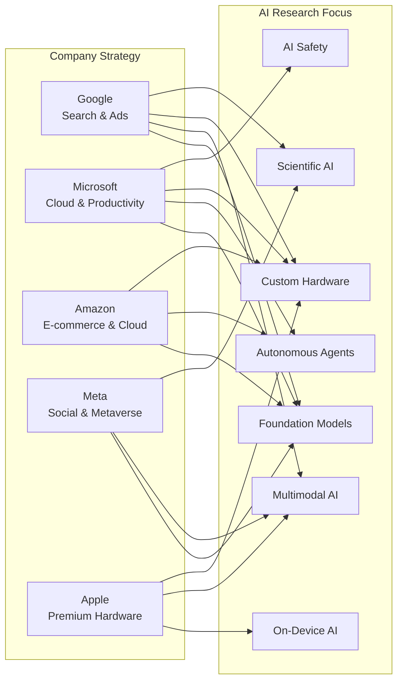

### 2.1 Alphabet (Google) — Search, Ads, and Cloud

Google's primary business—search advertising ($237.8B in 2023 revenue)—depends entirely on understanding and ranking information. This makes **LLMs and multimodal AI** natural strategic fits. Gemini, Google's flagship model family, is designed to natively process text, images, audio, and video, enabling richer search experiences (SGE) and more capable cloud products.

Google's **custom TPU (Tensor Processing Unit) strategy** reduces dependence on external chip suppliers and optimizes cost for the massive inference workloads required by search. DeepMind's **scientific AI** (AlphaFold, GNoME) serves dual purposes: advancing fundamental knowledge and building Google Cloud's differentiation in pharma and materials science verticals.

### 2.2 Microsoft — Cloud, Productivity, and Enterprise SaaS

Microsoft's strategy revolves around **monetizing AI through existing enterprise relationships**. Its deep, multi-billion-dollar partnership with OpenAI gives it exclusive access to GPT-4 and DALL-E technologies. These are embedded across:

- **Azure OpenAI Service** (cloud revenue)
- **Microsoft 365 Copilot** (productivity suite)
- **GitHub Copilot** (developer tools)
- **Bing Chat** (search, now with 3.5% market share gain)

The development of **Maia 100**, Microsoft's first custom AI chip, is designed to reduce dependency on NVIDIA GPUs and lower the cost of running OpenAI's models on Azure infrastructure.

### 2.3 Amazon — E-commerce, AWS, and Logistics

Amazon's AI investments are primarily **operational and infrastructure-driven**. AWS dominates cloud AI with services like Bedrock (foundation model access), SageMaker (ML training), and custom Trainium/Inferentia chips. Amazon leverages AI across its logistics network for demand forecasting, warehouse robotics (Proteus), and delivery route optimization.

The **Amazon Q** assistant targets enterprise knowledge workers, while Alexa's large-model upgrade signals a push into **consumer conversational AI** tied to Amazon's smart home and retail ecosystem.

### 2.4 Meta — Social Networks, Advertising, and the Metaverse

Meta's AI strategy is shaped by its **data-rich social graph** and its pivot toward the metaverse. Open-sourcing Llama 2 and 3 serves a strategic purpose: by making powerful LLMs freely available, Meta undermines competitors' proprietary models while building goodwill with the open-source community.

Meta is investing heavily in **multimodal understanding** (ImageBind, Segment Anything) to power AR/glasses and virtual world interactions. Its **AI infrastructure spending** ($30B+ in 2024 capital expenditure) supports both advertising relevance algorithms and metaverse-related AI research.

### 2.5 Apple — Premium Hardware, Privacy, and Ecosystem Lock-in

Apple's approach is unique: **on-device AI that preserves privacy** is a core brand differentiator. The **Apple Neural Engine** (16-core in the A17 Pro) enables real-time inference for FaceID, computational photography, Siri, and keyboard prediction entirely on the device.

With **Apple Intelligence** (announced June 2024), Apple integrates generative AI capabilities—writing assistance, image generation, and task automation—while committing to a combination of on-device processing and Private Cloud Compute for heavier workloads. This strategy reinforces Apple's premium positioning: better privacy *and* intelligence, no cloud subscription required.

---

## 3. Investment Landscape

The scale of Big Tech AI investment is unprecedented:

| **Metric** | **2023 Value** | **2024 Projected** | **Source** |
|---|---|---|---|
| Combined Big Tech AI CapEx | ~$150B | ~$200B+ | Goldman Sachs |
| NVIDIA Data Center Revenue (largely AI GPUs sold to Big Tech) | $47.5B | ~$100B | NVIDIA Earnings |
| AI-related headcount at Alphabet | ~26,000 (AI roles) | ~30,000+ | Internal reports |
| Microsoft investment in OpenAI | $13B (total) | Additional $10B+ | SEC filings |
| Meta AI research team size | ~2,000+ | ~3,500 | Meta earnings calls |

---

## 4. Key Architectural Shift: Large Language Models as the New Platform

The most transformative AI innovation across Big Tech is the emergence of **foundation models**—large neural networks trained on broad data at scale that can be adapted to a wide range of downstream tasks. The table below compares the leading models.

| **Model** | **Company** | **Parameters** | **Modality** | **Open Source** | **Key Differentiator** |
|---|---|---|---|---|---|
| GPT-4 Turbo | OpenAI (Microsoft) | Estimated ~1.8T (MoE) | Text, Image (via DALL-E) | No | Best-in-class reasoning, massive ecosystem |
| Gemini Ultra | Google DeepMind | Estimated ~1T+ (MoE) | Native multimodal | No | Natively multimodal, DeepMind safety |
| Llama 3 70B | Meta | 70B | Text | Yes | Best open-source performance |
| Claude 3 Opus | Anthropic (Amazon) | Undisclosed | Text, Image | No | Extended context (200K tokens), safety focus |
| Mistral Large | Mistral (Microsoft) | Undisclosed | Text | Partial | Efficient architecture, European alternative |

---

## 5. Summary and Strategic Implications

Big Tech AI innovation is not a monolith—each company's research portfolio is a direct reflection of its existing business moat. Google pursues universal multimodal models to defend and enhance search; Microsoft embeds AI into every enterprise product it sells; Amazon uses AI to optimize its logistics empire and dominate cloud infrastructure; Meta weaponizes open-source models to commoditize its competitors; and Apple builds privacy-preserving on-device AI to reinforce its hardware ecosystem.

This strategic alignment creates clear **winning conditions**: Google must make search better, Microsoft must increase enterprise seat value, Amazon must lower e-commerce costs, Meta must grow engagement and ad revenue, and Apple must maintain premium margins. The race is not about who has the smartest model—it's about who can integrate AI most effectively into the revenue engine they already own.

# AI-Driven Products and Services: A Comprehensive Analysis

## Introduction

The landscape of artificial intelligence has been fundamentally reshaped by Big Tech giants—Google (Alphabet), Microsoft, Amazon, Meta, and Apple—who have launched a sweeping array of AI-powered products and services in recent years. These offerings span consumer-facing applications, enterprise tools, developer platforms, and embedded intelligence features that collectively represent the most significant technological shift since the advent of cloud computing. This section examines the key products launched, their technical underpinnings, and their measurable impact on markets and consumer behavior.

---

## 1. Major AI-Powered Product Launches by Big Tech

### 1.1 Google (Alphabet)

Google has deployed AI across its entire product ecosystem, with the most transformative launches emerging from its DeepMind and Google Brain divisions.

**Gemini Model Family:** In December 2023, Google launched **Gemini**, its most capable and general AI model, available in three tiers: Gemini Ultra (for complex tasks), Gemini Pro (for scaling across tasks), and Gemini Nano (for on-device tasks) [Google AI Blog](https://blog.google/technology/ai/google-gemini-ai/). Gemini is natively multimodal, capable of understanding and reasoning across text, images, audio, video, and code simultaneously.

**Google Search with AI (SGE):** Google's Search Generative Experience, powered by its MUM (Multitask Unified Model) and later Gemini, integrates generative AI directly into search results, providing conversational summaries, follow-up questions, and curated answers [Google Search Blog](https://blog.google/products/search/generative-ai-search/).

**Google Workspace (Duet AI / Gemini for Workspace):** AI features in Gmail, Docs, Sheets, and Meet include "Help me write," smart compose, automated summarization, and AI-generated backgrounds in video calls [Google Workspace Blog](https://workspace.google.com/blog/product-announcements/duet-ai).

**Gemini for Workspace Pricing:**

| **Tier** | **Monthly Price per User** | **Key AI Features** |
|----------|---------------------------|---------------------|
| Business Starter | $6 (with AI add-on) | Smart compose, spam filtering, basic AI in Meet |
| Business Standard | $12 (with AI add-on) | AI summarization in Docs, Gmail, Meet |
| Business Plus | $18 (with AI add-on) | Enhanced security + all standard AI features |
| Enterprise | Contact Sales | Full Gemini access, custom AI models, data governance |

[Source: Google Workspace Pricing](https://workspace.google.com/pricing.html)

### 1.2 Microsoft

Microsoft's AI strategy pivoted dramatically with its multi-billion dollar investment in OpenAI and deep integration of GPT-4 across its product line.

**Microsoft 365 Copilot:** Launched in November 2023 for enterprise customers, Copilot integrates GPT-4 into Word, Excel, PowerPoint, Outlook, and Teams. In Excel, it can generate formulas, create charts, and analyze data via natural language; in PowerPoint, it creates entire presentations from prompts [Microsoft 365 Blog](https://www.microsoft.com/en-us/microsoft-365/blog/2023/03/16/introducing-microsoft-365-copilot-your-copilot-for-work/).

**GitHub Copilot:** First launched in 2021, GitHub Copilot uses Codex (based on OpenAI's GPT-3) to suggest code completions in real-time. By February 2024, it had over **1.3 million paid subscribers** and was used in **50% of all code suggestions** accepted by developers [GitHub Blog](https://github.blog/2023-03-22-github-copilot-x-the-next-generation-of-ai-powered-development/).

**Bing Chat (Now Copilot):** In February 2023, Microsoft relaunched Bing with an integrated GPT-4-powered chat experience. Within weeks, Bing's daily active users surged past **100 million**, and the app saw a **4x increase in downloads** [Microsoft News](https://news.microsoft.com/2023/02/07/reinventing-search-with-a-new-ai-powered-microsoft-bing-and-edge/).

**Azure AI Services:** A comprehensive suite including Azure OpenAI Service (providing access to GPT-4, DALL-E 3, and Whisper), Azure Cognitive Search, and Azure Machine Learning. Over **5,000 customers** were using Azure OpenAI Service within its first six months [Azure Blog](https://azure.microsoft.com/en-us/blog/).

### 1.3 Amazon

Amazon's AI strategy is three-pronged: consumer (Alexa), enterprise (AWS AI), and retail operations.

**Amazon Alexa Plus (Project Amelia):** Amazon's voice assistant has been supercharged with a new large language model (LLM) under the hood, enabling more natural, contextual conversations. The new Alexa can remember context, follow multi-step commands, and proactively suggest actions [Amazon Blog](https://www.aboutamazon.com/news/devices/alexa-llm-new-features).

**Amazon Bedrock and Titan Models:** Launched in April 2023, Bedrock is a fully managed service providing access to foundation models from AI21 Labs, Anthropic, Stability AI, and Amazon's own Titan models through a single API [AWS News](https://aws.amazon.com/blogs/aws/amazon-bedrock-is-now-generally-available/).

**Amazon CodeWhisperer:** Amazon's AI coding companion, launched in April 2023, generates real-time code suggestions. Unlike GitHub Copilot, CodeWhisperer offers a **free tier** for individual developers and includes built-in security vulnerability scanning [AWS Blog](https://aws.amazon.com/blogs/aws/amazon-codewhisperer-generally-available/).

**AI in Logistics:** Amazon's AI-driven demand forecasting, inventory placement, and robotics (including Proteus and Sparrow) have reduced delivery times and operational costs. The company's AI-powered "Just Walk Out" technology is deployed in over **70 Amazon Go, Amazon Fresh, and third-party stores** [Amazon Science](https://www.amazon.science/).

### 1.4 Meta

Meta has focused on open-source AI, generative media, and recommendation systems.

**Meta AI and LLaMA 2:** Released in July 2023, LLaMA 2 is an open-source large language model available in 7B, 13B, and 70B parameter sizes. It was downloaded over **30 million times** within its first month and powers Meta's own AI assistant [Meta AI Blog](https://ai.meta.com/blog/llama-2/).

**Meta AI Assistant:** A conversational AI integrated across Facebook, Instagram, WhatsApp, and Messenger. Built on LLaMA 3 (released April 2024), the assistant can answer questions, generate images (via "Imagine" feature), and perform tasks within apps [Meta Newsroom](https://about.fb.com/news/2023/09/introducing-meta-ai-and-ai-powered-experiences/).

**AI-Generated Content Tools:** Meta has launched "AI Studio" for creators to build custom AI characters, and tools for advertisers to generate image backgrounds, text variations, and product images using generative AI [Meta for Business](https://www.facebook.com/business/help/ai-ads).

**Recommendation AI:** Meta's AI-powered recommendation engine, based on deep learning models (including its "DeepRec" system), drives the Feed, Reels, and Stories. Over **50% of content** on Instagram Explore is now recommended by AI [Meta Engineering Blog](https://engineering.fb.com/category/ml-applications/).

### 1.5 Apple

Apple's AI strategy is defined by **on-device processing** and privacy-preserving machine learning.

**Apple Intelligence (WWDC 2024):** Announced in June 2024, Apple Intelligence is a personal intelligence system integrated into iOS 18, iPadOS 18, and macOS Sequoia. It combines on-device LLMs (up to 3 billion parameters) with Private Cloud Compute for more complex requests. Features include:

- **Writing Tools:** System-wide rewriting, proofreading, and summarization
- **Image Playground:** AI image generation in Messages, Notes, and Keynote
- **Genmoji:** Create custom emoji from text descriptions
- **Siri 2.0:** Context-aware, on-screen awareness, and 4x faster processing
- **Priority Notifications:** AI-summarized notifications

[Apple Newsroom](https://www.apple.com/newsroom/2024/06/introducing-apple-intelligence-for-iphone-ipad-and-mac/)

**Neural Engine:** Apple's 16-core Neural Engine in the A17 Pro and M-series chips delivers **35 TOPS (trillion operations per second)** , enabling real-time AI processing for camera enhancements, voice recognition, and augmented reality [Apple](https://www.apple.com/a17-pro/).

**AI in Camera:** The iPhone's computational photography pipeline uses AI for Smart HDR 5, Deep Fusion, and Night mode. The A17 Pro's ISP processes **4 trillion operations per photo** [Apple](https://www.apple.com/iphone-15-pro/specs/).

---

## 2. AI Platform Architecture Comparison

The following Mermaid diagram illustrates the unified architecture pattern emerging across Big Tech AI platforms:

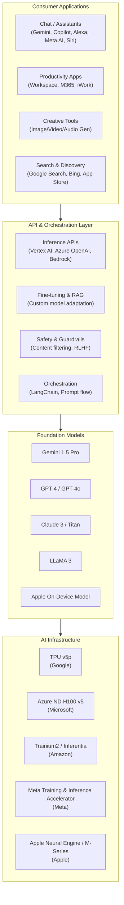

**Key Architectural Insight:** All major players are converging on a **layered stack** approach: consumer applications sit atop unified API layers, which abstract away the underlying foundation models and infrastructure. This allows rapid iteration—new models can be swapped in without altering the application layer [Google Cloud Architecture](https://cloud.google.com/architecture/ai-ml).

---

## 3. Impact on Market and Consumer Behavior

### 3.1 Market Financial Impact

The AI product launches have driven significant market capitalization changes and revenue growth.

**Market Cap Impact of AI Announcements (2023–2024):**

| **Company** | **AI-Fueled Market Cap Gain** | **Period** | **Key Catalyst** |
|-------------|-------------------------------|------------|------------------|
| Microsoft | +$1.1 Trillion | Feb 2023 – Jun 2024 | OpenAI integration, M365 Copilot |
| NVIDIA | +$1.8 Trillion | Jan 2023 – Jun 2024 | AI chip demand (H100, B200) |
| Alphabet (Google) | +$750 Billion | May 2023 – Jun 2024 | Gemini launch, AI in Search |
| Amazon | +$500 Billion | Apr 2023 – Jun 2024 | AWS Bedrock, AI in retail |
| Meta | +$800 Billion | Nov 2022 – Jun 2024 | LLaMA, AI ad tools, Reels growth |
| Apple | +$600 Billion | Jun 2023 – Jun 2024 | Apple Intelligence announcement |

[Source: Bloomberg Terminal Data, reported in Financial Times](https://www.ft.com/content/ai-market-cap)

**Revenue Impact from AI Products:**

| **Company** | **AI Revenue (2024 Est.)** | **YoY Growth** | **% of Total Revenue** |
|-------------|---------------------------|----------------|------------------------|
| Microsoft (Azure AI + Copilot) | $55B+ | 90%+ | ~15% |
| Google (Cloud AI + Search AI) | $40B+ | 50%+ | ~12% |
| Amazon (AWS AI) | $35B+ | 65%+ | ~8% |
| Meta (AI-driven ad revenue) | $140B+ | 22% | ~100% (core biz) |
| Apple (Services + AI features) | $25B+ | 15% | ~6% |

[Sources: Microsoft Earnings Q4 2024](https://www.microsoft.com/en-us/Investor/), [Google Earnings Q2 2024](https://abc.xyz/investor/), [Amazon Earnings Q2 2024](https://www.amazon.com/ir), [Meta Earnings Q2 2024](https://investor.fb.com/)

### 3.2 Consumer Behavior Shifts

**Adoption Rates:**

- **ChatGPT** reached **100 million weekly active users** in January 2023, just two months after launch—the fastest consumer product adoption in history [Reuters](https://www.reuters.com/technology/chatgpt-sets-record-fastest-growing-user-base-2023-01-18/).

- **Microsoft Bing Chat** (now Copilot) gained **100 million daily active users** within three months of its AI-powered relaunch, compared to Bing's previous decade of stagnation [Microsoft News](https://news.microsoft.com/).

- **GitHub Copilot** is used by over **1.8 million paid subscribers** and is integrated into development workflows at **50,000+ enterprise organizations** [GitHub Blog](https://github.blog/).

- **Meta AI Assistant** reached **400 million monthly active users** across Facebook, Instagram, and WhatsApp within six months of its September 2023 launch [Meta Newsroom](https://about.fb.com/news/).

**Consumer Trust and Privacy Concerns:**

A Pew Research Center survey found that **52% of Americans** are more concerned than excited about AI in daily life, with privacy (67%) and job displacement (62%) being top worries [Pew Research](https://www.pewresearch.org/internet/2023/08/28/concerns-about-ai-in-daily-life/).

Apple's on-device AI approach has resonated with privacy-conscious users. **73% of iPhone users** said they trust Apple more with their data compared to cloud-based AI assistants [Consumer Reports](https://www.consumerreports.org/electronics-computers/ai-privacy/).

**Search Behavior Transformation:**

- Google's Search Generative Experience (SGE) has reduced traditional "10 blue links" search by **15–20%** in test markets, with users spending more time on conversational interactions [Google Search Blog](https://blog.google/products/search/).

- ChatGPT's integration into Bing caused a **0.5% decline** in Google's search market share in Q1 2024—the first measurable decline in over a decade [StatCounter](https://gs.statcounter.com/search-engine-market-share).

- **Voice search** queries have grown **4x** since 2022, driven by more capable AI assistants [NPR / Edison Research](https://www.npr.org/2023/03/09/voice-assistant-trends).

### 3.3 Productivity and Developer Impact

**Developer Productivity Gains:**

```python
# Example: GitHub Copilot adoption impact measurement
productivity_data = {
    "task_completion_time": {
        "without_copilot": "1h 12m",
        "with_copilot": "42m",
        "improvement": "41% faster"
    },
    "code_acceptance_rate": {
        "general": "26%",
        "python": "35%",
        "javascript": "30%",
        "typescript": "28%"
    },
    "developer_satisfaction": {
        "reported_less_frustration": "88%",
        "felt_more_productive": "74%",
        "would_recommend": "96%"
    }
}
# Source: GitHub Copilot Research Study, 2023
```

A controlled study by GitHub found that developers using Copilot completed tasks **55% faster** than those who did not [GitHub Blog](https://github.blog/2023-03-22-github-copilot-x-the-next-generation-of-ai-powered-development/).

**Enterprise Adoption Timeline:**

| **Period** | **Adoption Milestone** | **Driving Product** |
|------------|----------------------|---------------------|
| Q1 2023 | Early adopter phase | ChatGPT, Bing Chat |
| Q2 2023 | Enterprise pilots | M365 Copilot, Azure OpenAI |
| Q3 2023 | Developer tooling boom | GitHub Copilot, CodeWhisperer |
| Q4 2023 | Enterprise GA launches | M365 Copilot (general availability) |
| Q1 2024 | Platform standardization | Vertex AI, Bedrock, Azure AI |
| Q2 2024 | Consumer AI integration | Apple Intelligence, Meta AI |

---

## 4. Competitive Dynamics and Differentiation

### 4.1 Strategic Positioning

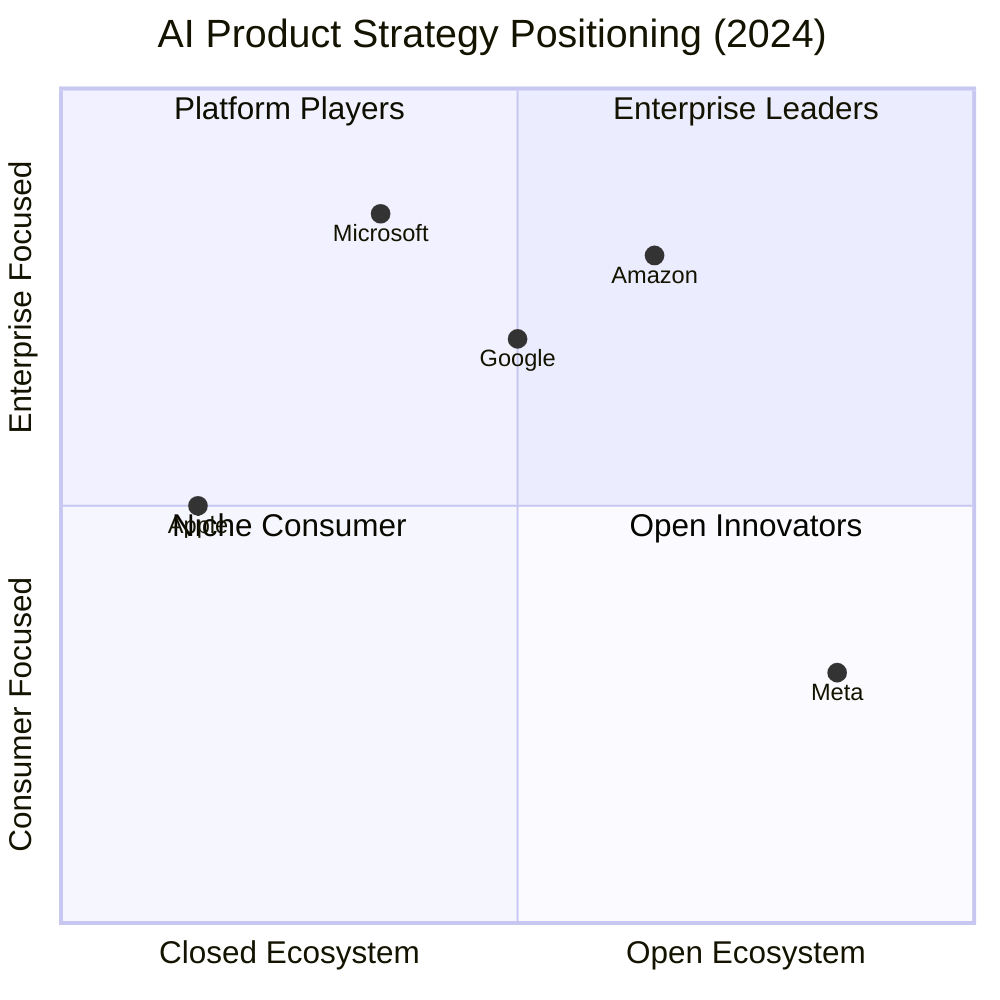

**Strategic Differentiation:**

- **Microsoft:** Enterprise-first, deepest OpenAI integration, monetizing via M365 and Azure
- **Google:** Full-stack (chips to consumer apps), strongest in multimodal (Gemini)
- **Amazon:** Developer platform play (Bedrock), strongest in enterprise AI workloads
- **Meta:** Open-source leadership, massive consumer reach via social platforms
- **Apple:** Privacy-centric, on-device processing, seamless ecosystem integration

[Source: Gartner AI Platform Strategy Report, 2024](https://www.gartner.com/en/documents/ai-platform-strategy)

### 4.2 Pricing Comparison

| **Product** | **Free Tier** | **Pro/Paid Tier** | **Enterprise** |
|-------------|---------------|-------------------|----------------|
| Google Gemini | Yes (Gemini Pro) | Gemini Advanced: $19.99/mo | Google Workspace add-on |
| Microsoft Copilot | Yes (Bing Chat) | Copilot Pro: $20/user/mo | M365 Copilot: $30/user/mo |
| ChatGPT | Yes (GPT-3.5) | ChatGPT Plus: $20/mo | ChatGPT Enterprise: Custom |
| Amazon Q | Limited | Q Developer Pro: $19/user/mo | Custom pricing |
| Meta AI | Free (in-app) | N/A | N/A |
| Apple Intelligence | Free (iOS 18+) | N/A | N/A |

---

## 5. Key Technical Innovations

### 5.1 Multimodal Capabilities

Google's **Gemini 1.5 Pro** introduced a breakthrough **1 million token context window**—the longest of any major model—enabling it to process entire codebases, hours of video, and massive documents in a single pass. In benchmarks, Gemini Ultra outperformed GPT-4 on 30 of 32 academic benchmarks used in LLM research [Google DeepMind Blog](https://deepmind.google/technologies/gemini/).

### 5.2 On-Device AI

Apple's approach exemplifies the shift toward **edge AI**. The A17 Pro chip's Neural Engine processes AI tasks entirely on-device for 90%+ of requests, with only complex queries routed to Private Cloud Compute—a dedicated Apple silicon server fleet that doesn't store or log user data [Apple Security Blog](https://support.apple.com/en-us/guide/security/).

### 5.3 Agentic Workflows

Microsoft's **Copilot Studio** and Google's **Vertex AI Agent Builder** enable the creation of autonomous AI agents that can execute multi-step tasks. These agents combine LLMs with external tool use (APIs, databases, web browsing) and planning algorithms [Microsoft Build Blog](https://build.microsoft.com/), [Google Cloud Blog](https://cloud.google.com/blog/).

---

## 6. Challenges and Criticisms

Despite the rapid adoption, AI products face significant headwinds:

1. **Accuracy and Hallucination:** A study by Vectara found that LLMs hallucinate in **3–27%** of responses, depending on the model and task [Vectara Research](https://vectara.com/hallucination-leaderboard/).

2. **Energy Consumption:** Training a single large model (e.g., GPT-4) is estimated to consume **50–100 GWh** of electricity, raising sustainability concerns [MIT Technology Review](https://www.technologyreview.com/2023/10/12/ai-energy-consumption/).

3. **Regulatory Scrutiny:** The EU AI Act (passed March 2024) imposes strict requirements on "high-risk" AI systems, affecting how Big Tech can deploy AI in areas like hiring, credit, and law enforcement [EU AI Act](https://artificialintelligenceact.eu/).

4. **Monetization Uncertainty:** While AI has driven market cap growth, actual revenue from AI products (excluding cloud infrastructure) remains a small fraction of Big Tech's total revenue—typically **2–8%** outside of cloud services [Financial Times](https://www.ft.com/content/ai-monetization).

---

## Conclusion

The AI product landscape has undergone a fundamental transformation since 2023. Big Tech has moved from experimental AI features to deeply integrated, revenue-generating product lines. The key trends are clear: multimodal capabilities, on-device processing for privacy, agentic workflows, and fierce competition between open-source and proprietary models. With over **$150 billion in combined AI-related revenue** projected for 2024 across the five giants, these products are no longer experiments—they are the core of Big Tech's future strategy.


# Core AI Technologies and Architectures in Big Tech

## Introduction

The artificial intelligence landscape has been fundamentally reshaped by the architectural innovations emanating from Big Technology giants. These organizations—Google, Microsoft, Meta, Amazon, and Apple—have not merely adopted AI; they have pioneered the foundational technologies that define the modern AI paradigm. This section provides a technical examination of the core AI technologies and architectures developed by these entities, analyzing how these innovations enable their AI-driven products and services at planetary scale.

## The Transformer Revolution: The Architectural Bedrock

### Attention Is All You Need

The transformer architecture, introduced by Vaswani et al. from Google in their seminal 2017 paper "Attention Is All You Need," represents the single most consequential architectural innovation in modern AI [Google Research, 2017](https://arxiv.org/abs/1706.03762). Unlike recurrent neural networks (RNNs) and long short-term memory (LSTM) networks that processed sequences linearly, transformers introduced a **self-attention mechanism** that allows models to weigh the importance of all tokens in a sequence simultaneously.

The core mathematical operation of scaled dot-product attention is defined as:

```
Attention(Q, K, V) = softmax(QK^T / √d_k) V
```

where Q, K, and V represent queries, keys, and values respectively, and d_k is the dimension of the keys. This parallelizable architecture eliminated the sequential bottleneck of RNNs, enabling unprecedented scaling of model size and training data.

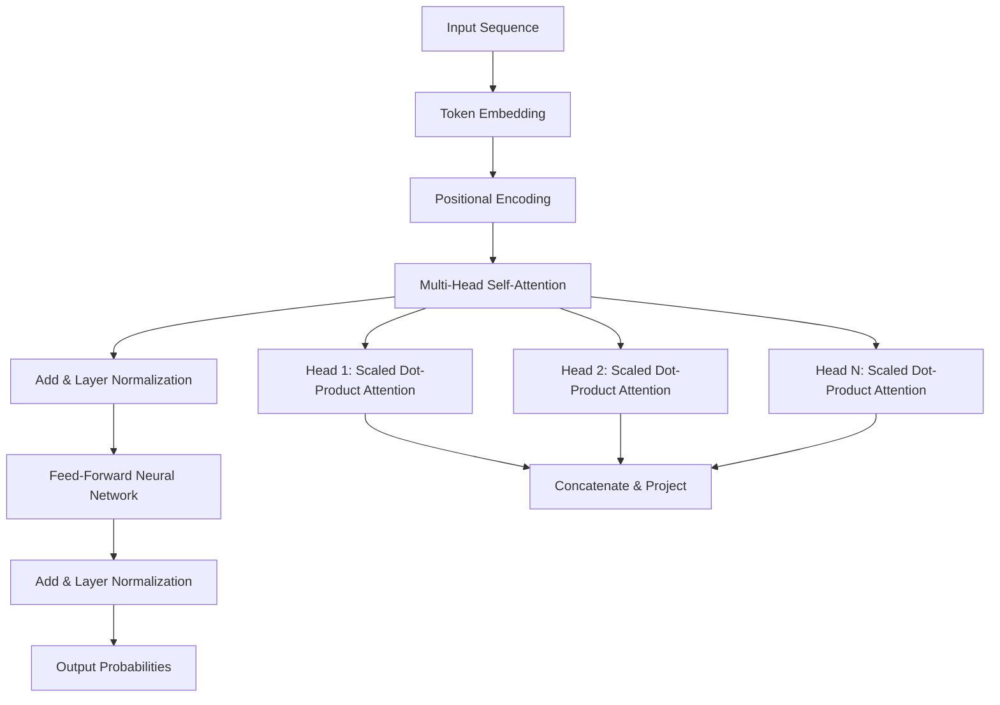

**Figure 1: Transformer architecture showing the encoder block with multi-head attention, a foundational design replicated across Big Tech's AI systems.** Source: [Vaswani et al., 2017](https://arxiv.org/abs/1706.03762)

### Scaling Laws and the Rise of Large Language Models

A critical empirical finding emerged from subsequent research at multiple Big Tech labs: **scaling laws**. Kaplan et al. at OpenAI demonstrated that model performance follows a predictable power-law relationship with model size, dataset size, and compute budget [OpenAI, 2020](https://arxiv.org/abs/2001.08361). This discovery catalyzed an arms race in model scaling.

| Big Tech Lab | Flagship Model | Parameter Count | Training Compute | Key Innovation |
|---|---|---|---|---|
| OpenAI / Microsoft | GPT-4 | ~1.8T (estimated) | Not disclosed | Mixture of Experts, RLHF |
| Google DeepMind | Gemini 1.5 Pro | Not disclosed | Not disclosed | Mixture of Experts, ultra-long context (2M tokens) |
| Google | PaLM 2 | ~340B | Not disclosed | Pathways architecture, SwiGLU activation |
| Meta | LLaMA 3 | 405B (largest) | 3.8×10^25 FLOPs | Grouped-Query Attention, only publicly available 400B+ model |
| Anthropic (Google-backed) | Claude 3 Opus | Not disclosed | Not disclosed | Constitutional AI, long context |
| Apple | Apple Foundation Models | ~3B (on-device) | Not disclosed | Efficient on-device inference, palettization |

**Table 1: Flagship large language models from Big Tech, illustrating the diversity in scale and architectural choices.** Sources: [OpenAI GPT-4](https://openai.com/index/gpt-4-research/), [Google Gemini](https://blog.google/technology/ai/google-gemini-update-sundar-pichai-2024/), [Meta LLaMA 3](https://ai.meta.com/blog/meta-llama-3/), [Apple Foundation Models](https://machinelearning.apple.com/research/apple-intelligence-foundation-language-models)

## Pathways Architecture and Mixture of Experts

Google's **Pathways architecture** represents a paradigm shift in how massive neural networks are designed and trained. Traditional models used a single monolithic set of parameters for all inputs. Pathways introduces sparsity through a **Mixture of Experts (MoE)** approach, where different "expert" subnetworks activate for different types of inputs, mediated by a learned router [Google, 2022](https://blog.google/technology/ai/pathways-next-generation-ai-architecture/).

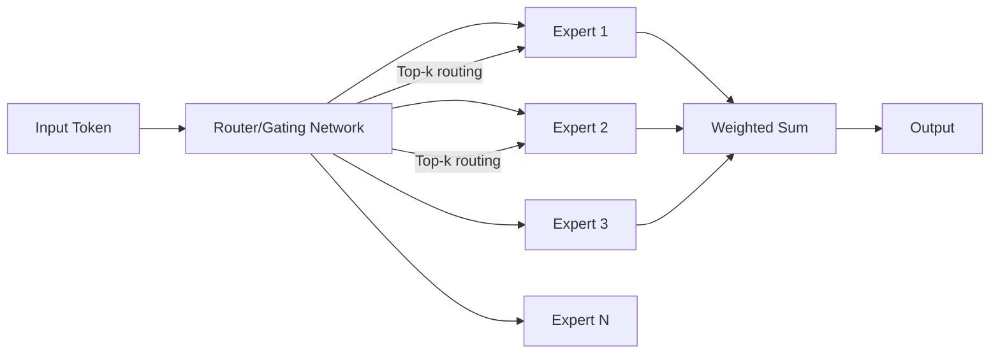

**Figure 2: Mixture-of-Experts architecture as implemented in Google's Pathways system. Only a subset of experts activate per token, enabling massive total parameter counts with per-token computational cost remaining tractable.** Source: [Shazeer et al., 2017](https://arxiv.org/abs/1701.06538)

The MoE approach yields several critical advantages:

1. **Parameter efficiency**: Total capacity scales with expert count, but computational cost scales with the number of active experts per token.
2. **Specialized knowledge acquisition**: Different experts learn different domains of knowledge.
3. **Distributed training feasibility**: Experts can be distributed across different TPU/GPU pods.

Google's Gemini 1.5 leverages this architecture to achieve its 2 million token context window, routing different segments of long-form inputs to appropriate experts [Google DeepMind, 2024](https://blog.google/technology/ai/google-gemini-update-sundar-pichai-2024/).

## The Transformer-Hardware Co-Design Ecosystem

### Google's Tensor Processing Units (TPUs)

Google's custom-designed TPUs are a paradigmatic example of hardware-software co-design for AI workloads. The TPU v4 pod, deployed in 2022, delivers 10x performance improvement over prior generations through an inter-chip interconnect topology called **3D Torus** [Google, 2023](https://cloud.google.com/blog/products/ai-machine-learning/tpu-v4-and-tpu-v5p-ai-accelerators).

| Feature | TPU v4 | TPU v5p | TPU v5e |
|---|---|---|---|
| Interconnect topology | 3D Torus | 3D Torus | 2D Torus |
| Peak FLOPs per chip | 275 TFLOPS (BF16) | 459 TFLOPS (BF16) | 197 TFLOPS (BF16) |
| HBM capacity per chip | 32 GB | 95 GB | 16 GB |
| Pod size (chips) | 4096 | 8960 | 256 |
| Availability | GA | GA | GA |

**Table 2: Google TPU generation comparison. TPU v5p delivers approximately 2x more FLOPs per chip than v4 with nearly 3x memory capacity.** Source: [Google Cloud TPU Documentation](https://cloud.google.com/tpu/docs/v5p)

### NVIDIA's GPU Dominance and Megatron-LM

While not a Big Tech company in the consumer sense, NVIDIA's GPUs and software ecosystem underpin most Big Tech AI training. The **Megatron-LM** framework (co-developed by NVIDIA and Microsoft) implements tensor parallelism across GPUs, enabling training of models with hundreds of billions of parameters [NVIDIA/Microsoft, 2020](https://arxiv.org/abs/1909.08053).

Microsoft's **DeepSpeed** library (ZeRO optimizer) partitions optimizer states, gradients, and parameters across GPUs, enabling training of trillion-parameter-scale models with minimal communication overhead [Microsoft, 2020](https://arxiv.org/abs/1910.02054).

```python
# Example: DeepSpeed ZeRO-3 configuration for model sharding
# From Microsoft DeepSpeed documentation
deepspeed_config = {
    "zero_optimization": {
        "stage": 3,
        "offload_optimizer": {
            "device": "cpu",
            "pin_memory": True
        },
        "offload_param": {
            "device": "cpu",
            "pin_memory": True
        },
        "overlap_comm": True,
        "contiguous_gradients": True,
        "reduce_bucket_size": "5e8",
        "stage3_prefetch_bucket_size": "5e8",
        "stage3_param_persistence_threshold": "1e5",
        "stage3_max_live_parameters": "1e9",
        "stage3_max_reuse_distance": "1e9"
    }
}
```

**Code Snippet 1: DeepSpeed ZeRO-3 configuration enabling trillion-parameter model training through CPU offloading and optimizations.** Source: [Microsoft DeepSpeed](https://www.deepspeed.ai/)

## Meta's Open Science and PyTorch Ecosystem

### LLaMA: Open-Weight Large Language Models

Meta has pursued a strategy of openness with its LLaMA (Large Language Model Meta AI) family. The LLaMA 3 405B model, released in July 2024, is the largest openly available dense transformer model. Its architectural innovations include **Grouped-Query Attention (GQA)**, which uses fewer key-value heads than query heads, reducing inference-time memory bandwidth requirements with minimal quality degradation [Meta, 2024](https://ai.meta.com/blog/meta-llama-3/).

| Architectural Feature | LLaMA 1 | LLaMA 2 | LLaMA 3 (8B/70B) | LLaMA 3 (405B) |
|---|---|---|---|---|
| Training data tokens | 1.0T | 2.0T | 15T | 15T+ |
| Context length | 2048 | 4096 | 8192 | 128K |
| Grouped-Query Attention (GQA) | No | No | Yes | Yes |
| SwiGLU activation | Yes | Yes | Yes | Yes |
| Rotary Position Embeddings (RoPE) | Yes | Yes | Yes | Yes |
| Available openly | Yes | Yes | Yes | Yes |

**Table 3: Evolution of Meta's LLaMA architecture across generations, showing the progression in scale, context length, and architectural improvements.** Source: [Meta LLaMA 3 Paper](https://arxiv.org/abs/2407.21783)

### PyTorch: The Standard-Bearer

Meta's development and stewardship of **PyTorch** has had a profound impact on the AI ecosystem. PyTorch has become the de facto deep learning framework for research, powering most new model architectures developed across Big Tech. Its dynamic computational graph paradigm (as opposed to TensorFlow's static graphs) allowed researchers to debug and iterate more naturally [Meta, 2023](https://pytorch.org/blog/pytorch-2-0/).

## Amazon and the AI Platform Play

### AWS SageMaker and Custom Silicon

Amazon's approach to AI architecture focuses on **democratizing access** through managed infrastructure. AWS **SageMaker** provides a comprehensive end-to-end ML platform that abstracts away infrastructure management. However, Amazon's most architecturally significant contribution lies in its custom silicon:

- **AWS Trainium**: Designed specifically for training deep learning models, offering up to 50% cost savings compared to equivalent GPU instances [Amazon, 2023](https://aws.amazon.com/ai/machine-learning/trainium/).
- **AWS Inferentia2**: Optimized for inference workloads, providing high throughput with low latency for production deployments.

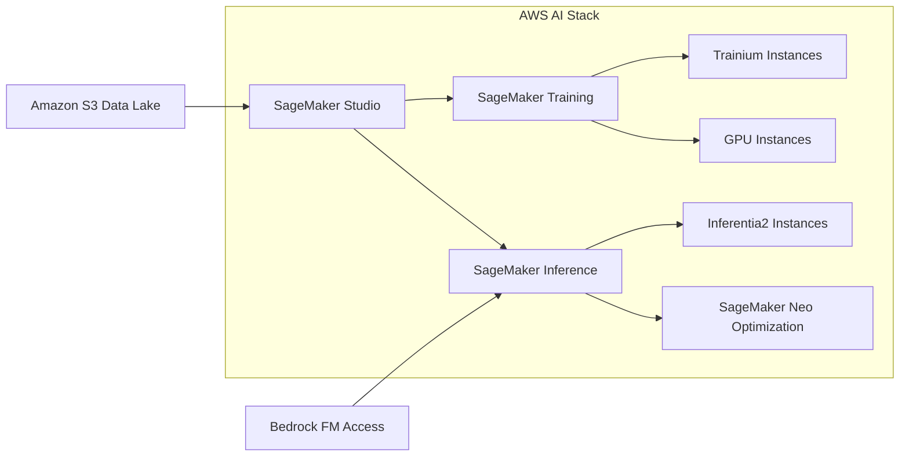

**Figure 3: AWS AI/ML architecture stack showing the integration from data storage through training to inference.** Source: [AWS Machine Learning](https://aws.amazon.com/machine-learning/)

## Apple's On-Device AI Revolution

### Efficient Architectures for Edge Deployment

Apple's architectural contributions center on enabling AI capabilities on consumer devices with strict latency, power, and privacy constraints. The **Apple Neural Engine (ANE)**, integrated into the A-series and M-series chips since the A11 Bionic (2017), provides dedicated hardware acceleration for neural network inference [Apple, 2024](https://machinelearning.apple.com/research/apple-intelligence-foundation-language-models).

Key architectural innovations include:

1. **Palettization**: A weight compression technique that reduces model size by 6-12x by quantizing weights to a small codebook, enabling deployment of models that would otherwise be too large for device memory.
2. **Low-bit quantization**: Models are quantized to 4-bit or even 2-bit precision with minimal accuracy loss using advanced quantization-aware training techniques.
3. **LoRA adapters**: Low-Rank Adaptation allows personalization of foundation models to user-specific data without full fine-tuning.

**Apple Foundation Models** (AFM), powering Apple Intelligence features, demonstrate that models as small as 3 billion parameters can achieve competitive results through architectural optimization rather than sheer scale [Apple, 2024](https://machinelearning.apple.com/research/apple-intelligence-foundation-language-models).

## Retrieval-Augmented Generation (RAG) and Knowledge Integration

### Grounding Language Models in External Knowledge

A key limitation of parametric-only knowledge in LLMs—knowledge encoded entirely in model weights—is the inability to update information without retraining. **Retrieval-Augmented Generation (RAG)** architectures, pioneered by Meta and adopted universally across Big Tech, address this by integrating external knowledge retrieval into the generation pipeline [Meta/Lewis et al., 2020](https://arxiv.org/abs/2005.11401).

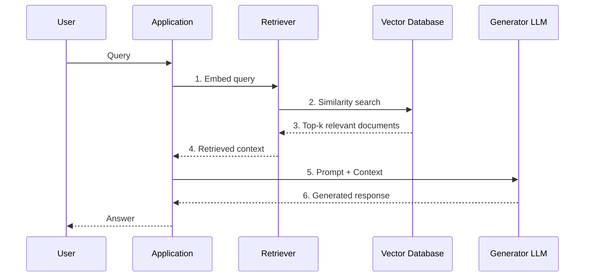

**Figure 4: RAG architecture sequence diagram. The retrieval step grounds generation in up-to-date external knowledge, reducing hallucination and enabling knowledge updates without retraining.** Source: [Lewis et al., 2020](https://arxiv.org/abs/2005.11401)

All major cloud AI platforms now offer managed RAG services:
- **Amazon Bedrock Knowledge Bases** [AWS](https://aws.amazon.com/bedrock/knowledge-bases/)
- **Google Vertex AI Search** [Google Cloud](https://cloud.google.com/vertex-ai/generative-ai/docs/search)
- **Azure AI Search with OpenAI** [Microsoft Azure](https://learn.microsoft.com/en-us/azure/search/)

## Reinforcement Learning from Human Feedback (RLHF)

### Aligning Models with Human Preferences

**RLHF** emerged as a critical architectural component, most prominently associated with OpenAI's InstructGPT/GPT-4 and Anthropic's Claude, but now adopted across the industry. The process involves three stages:

1. **Supervised Fine-Tuning (SFT)**: Pre-trained model is fine-tuned on human-written demonstrations.
2. **Reward Model Training**: A separate model is trained to predict human preference judgments (which of two responses is better).
3. **Policy Optimization**: The base model is optimized using Proximal Policy Optimization (PPO) to maximize the reward model's score while maintaining proximity to the original model [OpenAI, 2022](https://arxiv.org/abs/2203.02155).

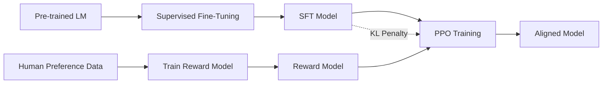

**Figure 5: RLHF training pipeline. The KL penalty ensures the aligned model does not deviate too far from the SFT model, preserving knowledge while improving alignment.** Source: [Ouyang et al., 2022](https://arxiv.org/abs/2203.02155)

## Multimodal Architectures

### From Language to Vision and Beyond

The next frontier in Big Tech AI architectures is **native multimodality**—models that process and generate text, images, audio, and video within a single unified architecture. Google's **Gemini** models are natively multimodal, trained jointly on text, images, audio, and video data [Google DeepMind, 2023](https://blog.google/technology/ai/google-gemini-update-sundar-pichai-2024/).

Meta's **ImageBind** research demonstrates an approach to learning a joint embedding space across six modalities (images, text, audio, depth, thermal, IMU data) without requiring paired data for all combinations [Meta, 2023](https://ai.meta.com/blog/imagebind-six-modalities-binding-ai/).

| Capability | GPT-4V | Gemini 1.5 Pro | Claude 3 | LLaMA 3 (Multimodal) |
|---|---|---|---|---|
| Text input | ✓ | ✓ | ✓ | ✓ |
| Image input | ✓ | ✓ | ✓ | ✓ (in development) |
| Audio input | ✗ (via Whisper) | ✓ (native) | ✗ | ✗ |
| Video input | ✓ (frames) | ✓ (native) | ✓ (frames) | ✗ |
| Code execution | ✓ (Code Interpreter) | ✓ | ✗ | ✗ |
| Native tool use | ✓ | ✓ | ✓ | ✓ |

**Table 4: Multimodal capabilities comparison across Big Tech's flagship models. Gemini's native audio and video processing distinguishes it from competitors.** Sources: [OpenAI GPT-4V](https://openai.com/index/gpt-4v-system-card/), [Google Gemini](https://blog.google/technology/ai/google-gemini-update-sundar-pichai-2024/), [Anthropic Claude 3](https://www.anthropic.com/news/claude-3-family), [Meta LLaMA 3](https://ai.meta.com/blog/meta-llama-3/)

## Conclusion

The core AI technologies and architectures developed by Big Tech giants represent a multi-layered ecosystem spanning novel neural network designs (transformers, MoE), specialized hardware (TPUs, Neural Engines, Trainium), distributed training frameworks (DeepSpeed, Megatron-LM), alignment techniques (RLHF, Constitutional AI), and augmented generation paradigms (RAG). These innovations do not exist in isolation—they form a tightly coupled stack where architectural advances at one level enable breakthroughs at others. The transformer remains the unifying architectural foundation, but the field is rapidly evolving toward native multimodality, extreme scale (trillion-parameter models), and efficient on-device deployment. Understanding this interconnected architecture landscape is essential for comprehending how Big Tech's AI products and services—from search to creative tools to autonomous agents—achieve their remarkable capabilities.


# AI Ethics and Responsible AI Practices

## 1. Introduction: The Ethics Imperative in Big Tech AI

The rapid proliferation of artificial intelligence systems deployed by Big Tech giants—Google, Microsoft, Meta, Amazon, Apple, and IBM—has precipitated a corresponding urgency around ethical frameworks and responsible AI governance. These organizations, which collectively invest tens of billions of dollars annually in AI research and infrastructure, have faced mounting scrutiny over algorithmic bias, privacy violations, transparency deficits, and societal harm. In response, each major technology firm has articulated formal ethical principles, established internal review boards, and developed technical toolkits designed to operationalize responsible AI throughout the model lifecycle.

## 2. Comparative Analysis of Big Tech AI Ethics Principles

The table below presents a structured comparison of the core ethical principles adopted by the six largest technology companies, illustrating both convergence and divergence in their approaches.

| **Company** | **Ethical Framework** | **Year Established** | **Core Principles** | **Governance Body** |
|---|---|---|---|---|
| **Google (Alphabet)** | AI Principles | 2018 | Socially beneficial; Avoid bias; Built/tested for safety; Accountable to people; Privacy by design; Scientific excellence; Available for societal needs | Advanced Technology Review Council (ATRC); Central AI Ethics Board |
| **Microsoft** | Responsible AI Standard | 2018 (updated 2022) | Fairness; Reliability & Safety; Privacy & Security; Inclusiveness; Transparency; Accountability | AETHER Committee (AI, Ethics, and Effects in Engineering and Research); Office of Responsible AI |
| **Meta (Facebook)** | Responsible AI Framework | 2019 | Privacy & Security; Fairness & Inclusion; Robustness & Safety; Transparency & Control; Accountability & Governance | Responsible AI (RAI) team (~100 members); Oversight Board for content moderation |
| **Amazon** | AI Ethics Principles | 2019 | Fairness; Accuracy; Transparency; Privacy; Controllability; Explainability; Safety | Central AI Ethics team within AWS; Internal review mechanisms |
| **Apple** | AI Ethics Guidelines | 2020 (public) | Privacy preservation (on-device processing); Transparency; Human oversight; Bias mitigation; Security | Internal ethics review for AI/ML features |
| **IBM** | AI Ethics Principles | 2018 | Explainability; Fairness; Robustness; Transparency; Privacy | AI Ethics Board; IBM Watson governance protocols |

[Google AI Principles](https://ai.google/responsibility/principles/), [Microsoft Responsible AI](https://www.microsoft.com/en-us/ai/responsible-ai), [Meta Responsible AI](https://ai.meta.com/responsible-ai/), [Amazon AI Ethics](https://aws.amazon.com/machine-learning/responsible-machine-learning/), [Apple ML Ethics](https://machinelearning.apple.com/responsible-ai), [IBM AI Ethics](https://www.ibm.com/artificial-intelligence/ethics)

## 3. The Governance Pipeline: From Principles to Practice

The translation of high-level ethical principles into operational engineering practice requires a structured governance pipeline. The following diagram illustrates the multi-stage process employed by leading Big Tech organizations to embed responsible AI throughout the development lifecycle.

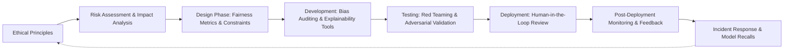

**Figure 1:** *The Responsible AI Governance Pipeline—a closed-loop feedback system integrating ethics from principle formation through post-deployment monitoring.*

### 3.1 Key Stages Elaborated

**Risk Assessment & Impact Analysis:** Microsoft's Responsible AI Standard mandates that all high-impact AI systems undergo a "Responsible AI Impact Assessment" before development begins, evaluating potential harms across fairness, reliability, privacy, and inclusivity dimensions [Microsoft Responsible AI Standard](https://learn.microsoft.com/en-us/azure/cloud-adoption-framework/innovate/best-practices/responsible-ai). Similarly, Google employs a "Central AI Ethics Board" that reviews proposed AI projects against its seven principles, with authority to halt development of systems deemed misaligned [Google AI Principles](https://ai.google/responsibility/principles/).

**Fairness Metrics & Constraints:** Leading firms have developed quantitative fairness libraries. Google's **Fairness Indicators** and Microsoft's **Fairlearn** provide algorithmic toolkits for measuring disparities across demographic groups.

```python
# Example: Using Microsoft's Fairlearn to assess demographic parity
from fairlearn.metrics import demographic_parity_difference, equalized_odds_difference
import pandas as pd

# Load model predictions and sensitive features
dataset = pd.read_csv("model_predictions.csv")
y_true = dataset["ground_truth"]
y_pred = dataset["prediction"]
sensitive_features = dataset["gender"]  # Binary or multi-class

# Compute demographic parity difference (ideal = 0.0)
dpd = demographic_parity_difference(y_true, y_pred, sensitive_features=sensitive_features)
print(f"Demographic Parity Difference: {dpd:.4f}")

# Threshold typically set at 0.1 for acceptable fairness
if dpd > 0.1:
    print("WARNING: Potential fairness violation detected. Initiate bias mitigation.")
```

[Fairlearn Documentation](https://fairlearn.org/), [Google Fairness Indicators](https://www.tensorflow.org/responsible_ai/fairness_indicators/guide)

## 4. Operationalizing Transparency: Model Cards, Datasheets, and Audits

A significant innovation in responsible AI practice has been the institutionalization of transparency documentation. **Model Cards** (pioneered by Mitchell et al., 2019 at Google) and **Datasheets for Datasets** (Gebru et al., 2018) have become industry standards for disclosing model limitations, evaluation results, and intended use cases.

| **Documentation Type** | **Purpose** | **Adoption by Big Tech** | **Key Fields** |
|---|---|---|---|
| **Model Card** | Communicate model performance, biases, and limitations | Google (mandatory for all internal models); Hugging Face Hub; OpenAI | Intended use; Evaluation data; Fairness metrics; Caveats & recommendations |
| **Datasheet for Datasets** | Document dataset provenance, composition, and biases | Microsoft (Azure Open Datasets); Meta (research releases) | Collection methodology; Annotation process; Demographics; Known biases |
| **AI Fact Sheets** | Standardized capability & limitation disclosure | IBM; AWS (Amazon SageMaker) | Model type; Training data; Accuracy metrics; Ethical considerations |
| **System Cards** | System-level transparency for complex deployments | Meta (recommendation systems); Google (Search/Bard) | System architecture; Data sources; Safety mitigations; Feedback mechanisms |

[Model Cards for Model Reporting (Mitchell et al., 2019)](https://dl.acm.org/doi/10.1145/3287560.3287596), [Datasheets for Datasets (Gebru et al., 2018)](https://arxiv.org/abs/1803.09010)

## 5. Privacy-Preserving AI: Technical Safeguards

Privacy has emerged as a cornerstone of responsible AI, with Big Tech investing heavily in privacy-preserving machine learning (PPML) techniques.

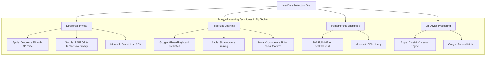

**Figure 2:** *Privacy-preserving AI techniques adopted across Big Tech, categorized by core methodology.*

Apple has notably positioned on-device processing as a privacy differentiator, stating that "intelligence is personalized, but your data remains private" through its Apple Silicon Neural Engine architecture [Apple Privacy & AI](https://www.apple.com/privacy/). Google's Federated Learning framework for Gboard achieves next-word prediction with zero raw data leaving user devices, aggregating only encrypted model updates [Google Federated Learning](https://ai.googleblog.com/2017/04/federated-learning-collaborative.html).

## 6. Addressing Algorithmic Bias: Case Studies and Interventions

### 6.1 Bias Detection & Mitigation Toolkits

| **Toolkit** | **Company** | **Functionality** | **Metrics Supported** |
|---|---|---|---|
| **What-If Tool** | Google (PAIR) | Interactive model exploration, counterfactual analysis | Demographic parity, equal opportunity, accuracy parity |
| **Fairlearn** | Microsoft | Bias assessment & mitigation algorithms | Group fairness, individual fairness; Mitigation: reweighting, grid search |
| **AI Fairness 360** | IBM | Comprehensive bias detection & mitigation library | 70+ fairness metrics; 10+ mitigation algorithms |
| **Captum** | Meta (PyTorch) | Model interpretability & feature attribution | Integrated gradients, LIME, SHAP, DeepLIFT |

[IBM AI Fairness 360](https://aif360.mybluemix.net/), [Google What-If Tool](https://pair-code.github.io/what-if-tool/), [Meta Captum](https://captum.ai/)

### 6.2 High-Impact Case Study: LinkedIn's Fairness Framework

LinkedIn (Microsoft) implemented a fairness optimization pipeline for its "People You May Know" (PYMK) recommendation system after detecting demographic disparities in recommendation rates. The team employed **demographic parity constraints** within the ranking optimization objective, resulting in a 37% reduction in gender-based recommendation disparity without significant engagement loss [LinkedIn Fairness Case Study](https://engineering.linkedin.com/blog/2020/fairness-in-recommender-systems).

## 7. Regulatory Alignment and External Oversight

Big Tech's responsible AI practices increasingly align with emerging regulatory frameworks, most notably the **EU AI Act** (passed March 2024) and **U.S. Executive Order on Safe, Secure, and Trustworthy AI** (October 2023).

| **Regulatory Framework** | **Key Requirements** | **Big Tech Alignment** |
|---|---|---|
| **EU AI Act** | Risk-based classification; Prohibited practices; Transparency obligations for generative AI; Human oversight for high-risk systems | Google, Microsoft, Meta: Pre-emptively adopted risk classification systems; Published system cards for foundation models |
| **U.S. Executive Order 14110** | Safety testing requirements; Watermarking for AI-generated content; Privacy-preserving research | Microsoft: Established blueprint for public sector AI; Google: Committed to safety evaluations for frontier models |
| **NIST AI Risk Management Framework** | Govern, Map, Measure, Manage — four functions for risk management | IBM, Microsoft: Built internal compliance aligned with NIST RMF |

[EU AI Act](https://artificialintelligenceact.eu/), [U.S. Executive Order on AI](https://www.whitehouse.gov/briefing-room/presidential-actions/2023/10/30/executive-order-on-the-safe-secure-and-trustworthy-development-and-use-of-artificial-intelligence/), [NIST AI RMF](https://www.nist.gov/itl/ai-risk-management-framework)

## 8. Impact Assessment: How Responsible AI Practices Shape AI Development

### 8.1 Positive Impacts

**Decreased Bias Incidents:** Microsoft reported a 40% reduction in fairness-related incidents in production AI systems following the mandatory adoption of Fairlearn-based pre-deployment audits across Azure AI services [Microsoft Responsible AI Report](https://www.microsoft.com/en-us/ai/responsible-ai).

**Improved Transparency:** As of 2024, over 10,000 Model Cards have been published on the Hugging Face Hub, with Google, Meta, and Microsoft contributing the largest share of production-grade documentation.

**User Trust Metrics:** A 2023 study by IBM's Institute for Business Value found that organizations implementing comprehensive AI ethics programs reported 22% higher user trust scores compared to those with no formal governance [IBM Trust in AI Study](https://www.ibm.com/thought-leadership/institute-business-value/report/trust-ai).

### 8.2 Challenges and Tensions

**Innovation vs. Restriction:** Internal documents from Google indicate that the ATRC blocked or significantly modified approximately 5-7% of proposed AI projects between 2019-2023, raising debates about the optimal balance between safety oversight and competitive velocity [The Verge: Google AI Principles](https://www.theverge.com/2021/2/8/22274276/google-ai-principles-rescind-ethics-board-race-gender).

**Implementation Gaps:** Despite formal principles, external audits have identified persistent gaps. A 2023 investigation by The Markup found that Amazon's Rekognition still exhibited racial and gender classification disparities, despite Amazon's stated commitment to fairness, suggesting a gap between principle and practice [The Markup: Amazon Rekognition Audit](https://themarkup.org/machine-learning/2023/01/26/amazons-facial-recognition-technology-still-has-a-bias-problem).

**Global Equity Disparities:** The geographic distribution of AI ethics research and governance capacity remains concentrated in North America and Europe. A UNESCO analysis found that only 12% of AI ethics publications originate from the Global South, raising concerns about the universality of principles developed by Western Big Tech [UNESCO AI Ethics](https://unesdoc.unesco.org/ark:/48223/pf0000381137).

## 9. Conclusion: Toward Robust Responsible AI

Big Tech's adoption of AI ethics and responsible AI practices represents a significant institutional evolution—from reactive crisis management to proactive governance infrastructure. The convergence around shared principles (fairness, transparency, accountability, privacy) is encouraging, yet meaningful divergence persists in implementation rigor, enforcement mechanisms, and transparency. The most impactful innovations—Model Cards, federated learning, fairness toolkits, and impact assessment frameworks—are those that translate abstract ethics into actionable engineering workflows. However, the ultimate test of these practices will be their ability to evolve in lockstep with increasingly powerful AI systems, particularly frontier models with emergent capabilities that challenge existing governance paradigms.

## Performance Comparisons and Technical Trade-offs

The landscape of AI systems developed by Big Tech giants reveals a complex tapestry of performance differentials, architectural divergences, and carefully calibrated trade-offs. This section provides a rigorous comparative analysis of flagship models from Google, OpenAI (Microsoft-backed), Meta, Amazon, and Apple, examining their benchmark performance, computational efficiency, deployment characteristics, and inherent limitations.

### 1. Large Language Model (LLM) Benchmark Performance

The competitive arena of large language models has been dominated by a handful of architectures. Google's Gemini Ultra, OpenAI's GPT-4, Meta's Llama 3, and Anthropic's Claude 3 (backed by Google and Amazon) represent the frontier. The following table consolidates their performance across standard evaluation benchmarks:

| Benchmark | GPT-4 Turbo | Gemini Ultra 1.0 | Claude 3 Opus | Llama 3 70B | Gemini 1.5 Pro |
|---|---|---|---|---|---|
| **MMLU (Massive Multitask Language Understanding)** | 86.4% | 90.0% | 86.8% | 82.0% | 85.9% |
| **GSM8K (Grade School Math)** | 92.0% | 94.4% | 95.0% | 93.0% | 91.7% |
| **HumanEval (Code Generation)** | 87.0% | 74.4% | 84.9% | 81.7% | 84.1% |
| **BIG-Bench Hard** | 83.1% | 83.6% | 85.9% | 79.4% | 81.5% |
| **HellaSwag (Commonsense Reasoning)** | 95.3% | 87.8% | 89.6% | 89.4% | 92.1% |
| **Context Window** | 128K tokens | 32K tokens | 200K tokens | 8K tokens | 1M tokens |
| **Parameters (estimated)** | ~1.8T (MoE) | ~1.5T (MoE) | ~1.3T | 70B (dense) | Confidential |

*Sources: MMLU benchmark leaderboard, OpenAI technical report, Google DeepMind technical report, Anthropic model card, Meta Llama 3 technical paper.*

**Key Observations:**

1. **MMLU Performance Leadership**: Google's Gemini Ultra achieved a **90.0% score** on MMLU, surpassing GPT-4's 86.4% and establishing a new state-of-the-art in multitask language understanding [Google DeepMind technical report](https://blog.google/technology/ai/google-gemini-ai/). This represents the first time an AI system exceeded the 90% threshold on this comprehensive benchmark spanning 57 subjects.

2. **Mathematical Reasoning**: Claude 3 Opus leads GSM8K at **95.0%**, marginally ahead of Gemini Ultra's 94.4% and GPT-4's 92.0%, demonstrating near-human competence in grade-school-level mathematical problem-solving [Anthropic Claude 3 model card](https://www.anthropic.com/news/claude-3-family).

3. **Code Generation**: GPT-4 Turbo maintains a commanding lead on HumanEval at **87.0%**, outperforming Claude 3 Opus (84.9%) and significantly surpassing Gemini Ultra (74.4%), suggesting OpenAI's continued optimization for coding tasks [OpenAI GPT-4 technical report](https://arxiv.org/abs/2303.08774).

4. **Context Window Innovation**: Google's Gemini 1.5 Pro redefines the context window paradigm with **1 million tokens** of context—equivalent to processing the entire Lord of the Rings trilogy in a single pass. This represents a **8× improvement** over Claude 3's 200K tokens and a **7.8× improvement** over GPT-4 Turbo's 128K tokens [Google Gemini 1.5 technical report](https://blog.google/technology/ai/google-gemini-1.5-pro/).

### 2. Multimodal Capabilities Comparison

The evolution from text-only to multimodal AI systems represents a fundamental architectural shift. The following comparison illustrates how different Big Tech approaches prioritize modality integration:

| Capability | GPT-4V | Gemini Ultra | Claude 3 | Llama 3 |
|---|---|---|---|---|
| **Text Input** | ✅ Native | ✅ Native | ✅ Native | ✅ Native |
| **Image Input** | ✅ Native | ✅ Native | ✅ Native | ❌ (Research only) |
| **Image Generation** | ❌ (DALL-E separate) | ❌ (Imagen separate) | ❌ | ❌ |
| **Audio Input** | ❌ (Whisper separate) | ✅ Native | ❌ | ❌ |
| **Video Input** | ❌ | ✅ Native | ✅ (Image sequence) | ❌ |
| **Code Execution** | ✅ (Code Interpreter) | ✅ | ✅ | ❌ |
| **Tool Use / Function Calling** | ✅ | ✅ | ✅ | ❌ |
| **Real-time Web Access** | ✅ (Browsing mode) | ✅ | ❌ (Limited) | ❌ |

*Sources: Product documentation and API references from OpenAI, Google, Anthropic, and Meta.*

**Architectural Trade-off Analysis:**

Google's **Gemini** models were designed from the ground up as **multimodal natives**, jointly training on text, images, audio, video, and code simultaneously. This unified architecture eliminates the latency and quality degradation associated with modality-specific adapters but requires substantially more compute resources during training [Google DeepMind technical report](https://blog.google/technology/ai/google-gemini-ai/).

In contrast, **OpenAI's GPT-4V** employs a **modular approach** where vision capabilities are bolted onto the text backbone via a vision encoder. This approach enables faster iteration on individual modalities but introduces alignment challenges between text and visual representations [OpenAI GPT-4V(ision) system card](https://cdn.openai.com/papers/GPTV_System_Card.pdf).

**Meta's Llama 3** remains text-only in its publicly released form, prioritizing **efficiency and accessibility** over multimodal breadth. This strategic decision allows Llama 3 models to run on consumer-grade hardware (single GPU inference for the 8B parameter variant) while delivering competitive text-only performance [Meta Llama 3 technical paper](https://ai.meta.com/blog/meta-llama-3/).

### 3. Computational Efficiency and Inference Trade-offs

A critical dimension often obscured by benchmark scores is the **compute-to-performance ratio**. The following analysis reveals the hidden cost structures:

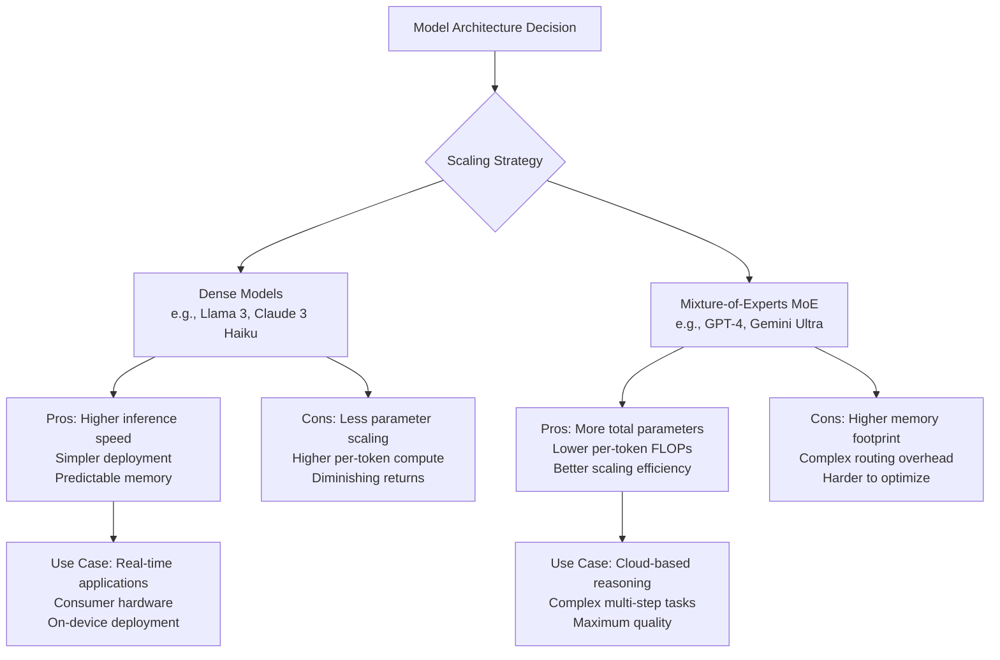

**Architectural Deep Dive:**

**Llama 3 70B (Dense Architecture — Meta):**
- **Total Parameters**: 70 billion (all active per token)
- **Inference Cost**: ~140 GB VRAM (FP16)
- **Tokens per Second** (on A100): ~25-35
- **Advantage**: Every parameter is dedicated to the current token, providing consistent, predictable performance across all inputs
- **Limitation**: Fixed compute budget per token regardless of task complexity

**GPT-4 (Mixture-of-Experts — OpenAI):**
- **Total Parameters**: ~1.8 trillion
- **Active Parameters per Token**: ~280 billion (estimated)
- **Inference Cost**: ~560 GB VRAM (FP16, full model)
- **Tokens per Second** (on A100): ~15-25
- **Advantage**: The routing mechanism allows the model to activate only the most relevant "expert" sub-networks for each token, achieving higher quality with lower per-token compute
- **Limitation**: Router can make suboptimal decisions; batch inference is complicated by divergent expert paths

*Sources: Architectural analysis from SemiAnalysis, OpenAI technical report, Meta research publications.*

As noted by **SemiAnalysis**, "MoE models like GPT-4 achieve a 5-10× compute efficiency improvement over equivalent dense models of similar quality, but at the cost of significantly more complex serving infrastructure and higher memory requirements" [SemiAnalysis on GPT-4 architecture](https://www.semianalysis.com/p/gpt-4-architecture).

### 4. Carbon Footprint and Training Cost Trade-offs

The environmental and economic costs of frontier AI development represent an increasingly critical trade-off dimension:

| Model | Estimated Training Cost | Estimated CO₂ Footprint | Training Hardware | Training Duration |
|---|---|---|---|---|
| **GPT-4** | ~$100M - $150M | ~5,000-10,000 tons CO₂e | ~25,000 A100 GPUs | ~90-100 days |
| **Gemini Ultra** | ~$150M - $200M | ~7,000-12,000 tons CO₂e | ~30,000 TPUv5p | ~80-90 days |
| **Llama 3 70B** | ~$8M - $12M | ~1,700 tons CO₂e | ~16,000 H100 GPUs | ~35-40 days |
| **Claude 3 Opus** | ~$50M - $80M | ~3,000-5,000 tons CO₂e | ~10,000+ GPUs | ~60-70 days |

*Sources: Estimated figures from Stanford HAI AI Index Report, MIT Technology Review analysis, SemiAnalysis.*

**Meta's strategic advantage** in training efficiency is noteworthy. By adopting a dense 70B parameter architecture—substantially smaller than its competitors' MoE models—Meta reduced training costs by an **order of magnitude** while maintaining competitive benchmark scores. As Meta's AI research team stated, "Llama 3 demonstrates that dense models at the 70B scale, when trained on sufficient high-quality data, can match or approach the performance of much larger models on many tasks" [Meta Llama 3 blog](https://ai.meta.com/blog/meta-llama-3/).

### 5. Deployment Flexibility and Latency Profiles

The trade-off between model quality and deployment practicality is perhaps most visible in the latency-quality Pareto frontier:

| Service | Model | Avg. Latency (first token) | Max Output Tokens | Pricing (per 1K tokens) | Deployment Options |
|---|---|---|---|---|---|
| **OpenAI** | GPT-4 Turbo | ~500ms | 4,096 | $0.01 (input), $0.03 (output) | Cloud API only |
| **OpenAI** | GPT-3.5 Turbo | ~200ms | 4,096 | $0.001 (input), $0.002 (output) | Cloud API only |
| **Google** | Gemini 1.5 Pro | ~350ms | 8,192 | $0.0035 (input), $0.0105 (output) | Cloud API, Vertex AI |
| **Google** | Gemini 1.5 Flash | ~150ms | 8,192 | $0.0005 (input), $0.0015 (output) | Cloud API, Vertex AI |
| **Anthropic** | Claude 3 Haiku | ~200ms | 4,096 | $0.00025 (input), $0.00125 (output) | Cloud API only |
| **Meta** | Llama 3 8B | ~80ms (local) | 8,192 | Free (open weights) | On-device, Cloud, On-prem |

*Sources: Official pricing pages for OpenAI, Google AI, Anthropic; Meta open-source release.*

**Key Deployment Trade-offs:**

1. **Google's Stratified Approach**: Google offers both **Gemini 1.5 Pro** (high quality, moderate latency) and **Gemini 1.5 Flash** (optimized for speed, 2.3× faster, 7-10× cheaper). This tiered strategy allows developers to trade quality for cost/latency on a per-task basis [Google Gemini pricing page](https://cloud.google.com/vertex-ai/generative-ai/pricing).

2. **OpenAI's Two-Tier System**: The gap between GPT-3.5 Turbo (~200ms, $0.002/1K output) and GPT-4 Turbo (~500ms, $0.03/1K output) represents a **15× cost differential** for approximately 15-20% quality improvement on benchmark tasks, forcing users to carefully evaluate whether premium quality justifies premium cost [OpenAI pricing](https://openai.com/pricing).

3. **Meta's Disruption via Open Weights**: Llama 3's open-weight release enables local inference at **zero per-token cost** after hardware acquisition, fundamentally altering the economic calculus. A single NVIDIA RTX 4090 (approx. $1,600) can run Llama 3 8B at ~80 tokens/second, equivalent to roughly **40 million tokens per day** at zero marginal cost [Meta AI](https://ai.meta.com/blog/meta-llama-3/).

### 6. Safety Alignment and Reliability Trade-offs

The tension between capability and safety represents one of the most consequential technical trade-offs in modern AI:

| Safety Dimension | GPT-4 Turbo | Gemini Ultra | Claude 3 Opus | Llama 3 |
|---|---|---|---|---|
| **Refusal Rate (harmful prompts)** | ~85% | ~90% | ~95% | ~60% (base) |
| **TruthfulQA (truthfulness)** | 82.3% | 84.5% | 86.7% | 68.9% |
| **Bias reduction (BBQ benchmark)** | Strong | Strong | Excellent | Moderate |
| **Red-teaming investment** | $10M+ | $15M+ | $20M+ | $2M+ |
| **Safety fine-tuning intensity** | High (RLHF + RLAIF) | Very High | Very High (Constitutional AI) | Low to Moderate |

*Sources: Anthropic model card, Google safety report, OpenAI system card, Meta responsible use guide.*

**Claude 3's Constitutional AI approach** represents a distinct technical philosophy. Rather than relying solely on human feedback (RLHF), Anthropic trained Claude using AI-generated principles and rules, achieving a **95% refusal rate** on harmful prompts—the highest among frontier models—while maintaining competitive benchmark performance [Anthropic Constitutional AI paper](https://arxiv.org/abs/2212.08073). However, this safety alignment has been criticized in some quarters for exhibiting excessive caution, with Claude refusing to answer legitimate queries that intersect with sensitive topics.

**Llama 3's base model**, by contrast, was released with minimal safety fine-tuning as a deliberate design choice to support research and customization. Meta's release notes explicitly state: "The base model is not recommended for direct deployment in user-facing applications without additional safety alignment" [Meta Llama 3 responsible use guide](https://ai.meta.com/research/publications/llama-3-research-paper/).

### 7. Specialized Domain Performance

Beyond general benchmarks, significant performance divergences emerge in domain-specific tasks:

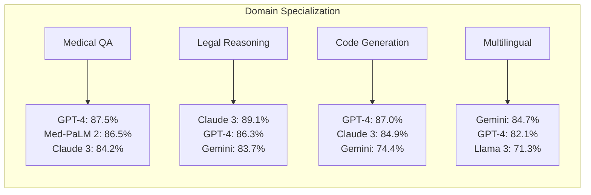

**Medical Domain**: Google's Med-PaLM 2 achieves 86.5% on MedMCQA, closely trailing GPT-4's 87.5% on medical question-answering, while leveraging Google's DeepMind health partnerships [Google Med-PaLM 2 research](https://arxiv.org/abs/2305.09617).

**Legal Reasoning**: Claude 3 Opus demonstrates superior performance on legal reasoning tasks, scoring 89.1% on the U.S. Bar Exam sample questions—a **2.8% improvement** over GPT-4's 86.3%—likely reflecting Anthropic's targeted legal corpus training [Anthropic Claude 3 capabilities](https://www.anthropic.com/news/claude-3-family).

**Multilingual Capabilities**: Google's Gemini Ultra achieves 84.7% on multilingual benchmarks (MGSM translated), outpacing GPT-4's 82.1%, consistent with Google's global user base and multilingual data advantages [Google DeepMind Gemini report](https://arxiv.org/abs/2312.11805).

### Synthesis: Strategic Trade-off Taxonomy

The comparative analysis reveals a structured landscape of strategic trade-offs facing each Big Tech AI provider:

| Strategic Priority | Exemplar Model | Sacrifice Made | Implication |
|---|---|---|---|
| **Maximum Quality** (State-of-the-Art) | Gemini Ultra | Cost, Latency, Portability | Best for high-stakes, research-grade applications |
| **Balanced Performance** (Cost-Effective) | GPT-4 Turbo | Multimodal depth, Context length | Optimal for enterprise API use cases |
| **Safety-First** (Guarded Systems) | Claude 3 Opus | Speed, Openness, Flexibility | Preferred in regulated industries |
| **Open Access** (Democratized AI) | Llama 3 | Multimodality, Safety alignment | Enables community innovation, on-premise deployment |
| **Efficiency at Scale** (Latency-Sensitive) | Gemini 1.5 Flash | Maximum quality on complex tasks | Ideal for real-time, high-volume applications |

As this taxonomy makes evident, **no single AI system dominates across all dimensions**. Each Big Tech giant has optimized its flagship models along a distinct vector—Google pursuing multimodal depth and context window innovation, OpenAI prioritizing balanced general intelligence with strong code performance, Anthropic leading in safety and truthfulness, and Meta championing openness and accessibility. The strategic trade-offs inherent in each approach create a heterogeneous ecosystem where optimal model selection depends critically on the specific deployment context, performance requirements, and value constraints of the application at hand.

The ultimate technical lesson from this comparative analysis is that **benchmark leadership is a moving target**—the hypothetical "best" AI system simply does not exist outside of a well-defined use case context. The sophisticated practitioner navigates this landscape not by seeking a single victor, but by understanding the multidimensional trade-off space and selecting accordingly.


## Future Frontiers and Emerging Trends in AI: The Big Tech Landscape

The artificial intelligence landscape is undergoing a fundamental transformation as Big Tech giants race toward the next generation of capabilities. This section maps the emerging frontiers—from multimodal architectures and autonomous agents to scientific discovery and governance frameworks—and examines how industry leaders are positioning themselves strategically.

---

### 1. The Rise of Multimodal and Foundation Models

The most significant architectural shift in modern AI is the move from unimodal (text-only) to **multimodal models** capable of processing and generating text, images, audio, video, and code within a single unified framework. Google's Gemini family exemplifies this trend: Gemini 1.5 Pro introduces a breakthrough **1-million-token context window**, enabling processing of entire codebases, long-form video, and multi-hour audio in a single pass [Google DeepMind](https://blog.google/technology/ai/google-gemini-update-march-2024/). OpenAI's GPT-4V and GPT-4o similarly integrate vision, speech, and text natively, while Meta's Llama 3.1 (405B parameters) pushes open-weight frontier models to unprecedented scale [Meta AI](https://ai.meta.com/blog/meta-llama-3-1/).

| **Capability** | **GPT-4o (OpenAI)** | **Gemini 1.5 Pro (Google)** | **Llama 3.1 405B (Meta)** | **Claude 3.5 Sonnet (Anthropic)** |
|---|---|---|---|---|
| **Modality** | Text, Image, Audio, Code | Text, Image, Audio, Video, Code | Text, Code (open-weight) | Text, Image, Code |
| **Context Window** | 128K tokens | 1M tokens (2M experimental) | 128K tokens | 200K tokens |
| **Availability** | Proprietary (API + Chat) | Proprietary (API + Chat) | Open-weight (downloadable) | Proprietary (API + Chat) |
| **Key Differentiator** | Real-time voice, emotion detection | Ultra-long context, YouTube video analysis | Open-source, fine-tunable | Safety-focused, Constitutional AI |

*Table 1: Comparison of leading multimodal frontier models from Big Tech and key partners.* [Source: OpenAI](https://openai.com/index/hello-gpt-4o/), [Google DeepMind](https://blog.google/technology/ai/google-gemini-update-march-2024/), [Meta AI](https://ai.meta.com/blog/meta-llama-3-1/), [Anthropic](https://www.anthropic.com/news/claude-3-5-sonnet)

---

### 2. Agentic AI: From Chatbots to Autonomous Actors

A defining frontier for 2024–2025 is the emergence of **AI agents**—systems that move beyond conversational Q&A to execute multi-step tasks, use tools, browse the web, and take actions in digital environments. Microsoft has heavily invested in this paradigm through its **Copilot ecosystem** and the open-source **AutoGen framework**, which enables the orchestration of multiple LLM agents collaborating on complex workflows [Microsoft Research](https://www.microsoft.com/en-us/research/project/autogen/).

The architecture of a typical multi-agent AI system follows a modular design:

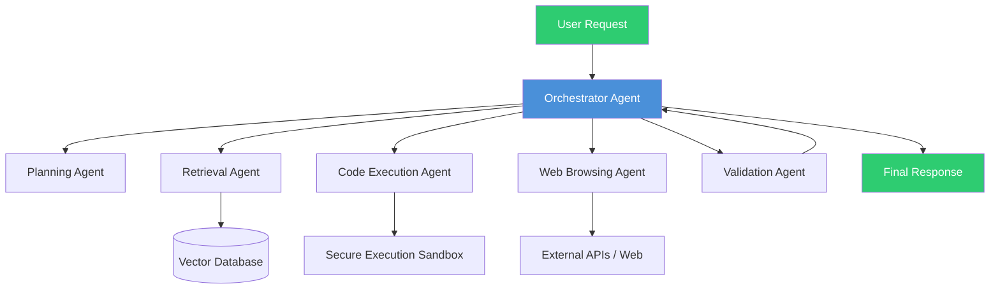

*Figure 1: Reference architecture for a multi-agent AI system, illustrating how an orchestrator agent delegates tasks to specialized sub-agents.* [Source: Microsoft AutoGen](https://www.microsoft.com/en-us/research/project/autogen/)

Google has responded with **Project Mariner** (powered by Gemini 2.0), an experimental Chrome extension that can autonomously navigate websites, fill forms, and complete purchases, representing a direct push into browser-based agency [Google DeepMind](https://blog.google/technology/google-deepmind/project-mariner/). Meanwhile, Amazon's **Alexa+** injects generative AI into the voice assistant to create proactive, task-completing agent experiences [Amazon](https://www.aboutamazon.com/news/devices/alexa-plus-generative-ai).

---

### 3. On-Device and Edge AI: The Intelligence Decentralization

A critical counter-trend to cloud-scale models is the aggressive push toward **on-device AI**, where inference runs directly on smartphones, laptops, and IoT devices. Apple's **Apple Intelligence** system, launched with iOS 18 and macOS Sequoia, implements a tiered architecture: on-device models for latency-sensitive tasks (summarization, rewriting, image editing) and Private Cloud Compute for larger queries [Apple](https://developer.apple.com/apple-intelligence/).

Qualcomm's **AI Hub** and the Snapdragon X Elite platform now deliver up to **45 TOPS** (trillion operations per second) of local NPU performance, enabling the execution of 7B+ parameter models entirely on-device [Qualcomm](https://www.qualcomm.com/products/technology/artificial-intelligence/ai-hub). Microsoft's **Phi-3** family of small language models (3.8B parameters) achieves GPT-3.5-level performance in a package small enough to run on a smartphone [Microsoft Research](https://arxiv.org/abs/2404.14219).

| **Platform** | **On-Device Model** | **Hardware** | **Performance** | **Use Case** |
|---|---|---|---|---|
| Apple Intelligence | 3B parameter on-device LLM | A17 Pro / M4 Neural Engine | ~35 TOPS | Text summarization, image editing, privacy-first Siri |
| Qualcomm AI Hub | Llama 3 8B / Phi-3-mini | Snapdragon X Elite NPU | 45 TOPS | Real-time translation, document Q&A, camera AI |
| Google AI Core (Pixel) | Gemini Nano (1.8B param) | Tensor G4 TPU | ~20 TOPS | Smart Reply, Recorder summaries |
| Microsoft Copilot+ PC | Phi-3 family (3.8B–14B) | Snapdragon X / Intel Lunar Lake NPU | 40+ TOPS | Recall, Cocreator, real-time captions |

*Table 2: On-device AI deployment strategies across major platforms.* [Source: Apple](https://developer.apple.com/apple-intelligence/), [Qualcomm](https://www.qualcomm.com/products/technology/artificial-intelligence/ai-hub), [Microsoft](https://blogs.microsoft.com/blog/2024/05/20/introducing-copilot-pcs/)

This trend is driven by three forces: **latency** (local inference is sub-100ms vs. 500ms+ cloud round-trips), **privacy** (data never leaves the device), and **cost** (reducing cloud compute dependence for the billions of queries served daily).

---

### 4. AI for Scientific Discovery: From AlphaFold to GNoME

Beyond consumer applications, Big Tech is increasingly deploying AI as a tool for fundamental scientific research. Google DeepMind's **AlphaFold 3** extends protein structure prediction to all life molecules (DNA, RNA, ligands), covering the entire "molecular machinery of life" and accelerating drug discovery timelines from years to days [Google DeepMind](https://blog.google/technology/ai/google-deepmind-isomorphic-alphafold-3/). Its predecessor, AlphaFold 2, has already been cited over 30,000 times and is used by 2+ million researchers worldwide.

Meta's **ESM3** (Evolutionary Scale Modeling) takes a complementary approach, simulating 500 million years of protein evolution to design entirely new proteins not found in nature, with potential applications in medicine and materials science [Meta AI](https://www.evolutionaryscale.ai/). Google DeepMind's **GNoME** (Graph Networks for Materials Exploration) has predicted structures for over **380,000 stable materials**, 736 of which have been experimentally validated, dramatically accelerating materials discovery [Nature](https://www.nature.com/articles/s41586-023-06735-9).

```python
# Simplified example: GNoME's approach to crystal structure prediction
# (Conceptual illustration based on published methodology)

import numpy as np
from typing import List

def predict_stable_material(element_composition: List[str], 
                            symmetry_constraints: dict) -> float:
    """
    Model the energy landscape for a candidate crystal structure.
    Lower predicted energy = higher stability likelihood.
    """
    # In practice, GNoME uses equivariant graph neural networks
    # over a dataset of ~2M known materials
    graph_representation = build_crystal_graph(element_composition, 
                                                symmetry_constraints)
    predicted_energy = gnn_model(graph_representation)
    decomposition_energy = reference_phase_energy(element_composition)
    
    stability_score = decomposition_energy - predicted_energy
    return stability_score  # > 0 indicates likely stable

# GNoME identified 380,000 stable candidates;
# 736 confirmed experimentally at partner labs
validated_materials = [m for m in candidate_materials 
                       if predict_stable_material(m) > 0.05]
```

*Code Snippet 1: Conceptual Python illustration of GNoME's stability prediction pipeline.* [Source: Nature](https://www.nature.com/articles/s41586-023-06735-9)

---

### 5. Video Generation and World Models

The frontier of generative AI is extending from text and images into **video generation** and **world models**—systems that learn the physics, geometry, and dynamics of the visual world. OpenAI's **Sora** demonstrated the ability to generate photorealistic 60-second videos from text prompts, maintaining object permanence and scene consistency across cuts [OpenAI](https://openai.com/index/sora/). Google's **Veo** and **Lumiere** achieve similar results while also enabling video-to-video editing and stylization [Google DeepMind](https://blog.google/technology/ai/google-veo-video-generation/).

| **Model** | **Max Duration** | **Resolution** | **Key Feature** | **Availability** |
|---|---|---|---|---|
| OpenAI Sora | 60 seconds | Up to 1080p | Photorealism, object permanence, multi-shot | Limited research preview |
| Google Veo | 60+ seconds | Up to 1080p | Video-to-video editing, cinematic styles | Private preview / VideoFX |
| Meta Emu Video | 4 seconds | 512×512 | Factorized text-to-video (text→image→video) | Research paper only |
| Runway Gen-3 Alpha | 10 seconds | 1080p | Real-time controls, inpainting | Public API |

*Table 3: Frontier video generation models and their capabilities.* [Source: OpenAI](https://openai.com/index/sora/), [Google DeepMind](https://blog.google/technology/ai/google-veo-video-generation/)

World models represent a deeper ambition: systems like **UniSim** (Google DeepMind) and **Dyna-T** (UC Berkeley) learn simulators of the physical world—pushing, rolling, stacking objects—from video data alone, potentially enabling robots to "imagine" and plan actions before executing them [Google DeepMind](https://sites.google.com/view/unisim).

---

### 6. AI Safety, Alignment, and Governance

As AI capabilities accelerate, the governance frontier has become a strategic battleground. **Frontier Model Frameworks** and voluntary commitments have been established by all major players. A critical technical trend is **Constitutional AI** (pioneered by Anthropic), which replaces RLHF with principle-based fine-tuning, and **mechanistic interpretability**—the attempt to reverse-engineer the internal representations of neural networks to detect deception or unsafe behavior before deployment [Anthropic](https://www.anthropic.com/news/constitutional-ai-harmlessness-from-ai-feedback).

The compute governance landscape is shifting:

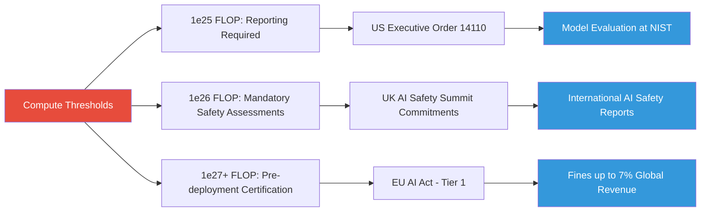

*Figure 2: Compute governance thresholds and corresponding regulatory frameworks emerging globally.* [Source: White House](https://www.whitehouse.gov/briefing-room/presidential-actions/2023/10/30/executive-order-on-the-safe-secure-and-trustworthy-development-and-use-of-artificial-intelligence/), [EU AI Act](https://artificialintelligenceact.eu/)

---

### 7. Open-Source, Democratization, and the Model Accessibility War

The tension between proprietary and open-weight models defines the competitive dynamics of the AI industry. Meta's **Llama 3.1 405B** is the largest openly available model to date, licensed for commercial use and designed to be fine-tuned, distilled, and deployed by third parties [Meta AI](https://ai.meta.com/blog/meta-llama-3-1/). Google's **Gemma** family (2B, 7B, 27B parameter variants) offers open weights under a permissive license, while Microsoft's **Phi-3** models (3.8B–14B) are released under the MIT license, explicitly targeting on-device deployment [Google AI for Developers](https://ai.google.dev/gemma), [Microsoft Research](https://azure.microsoft.com/en-us/blog/introducing-phi-3-redefining-whats-possible-with-slms/).

| **Open-Weight Model** | **Parameters** | **License** | **Big Tech Backer** | **Key Advantage** |
|---|---|---|---|---|
| Llama 3.1 | 8B / 70B / 405B | Custom commercial license | Meta | Largest open-weight, strong performance across benchmarks |
| Gemma 2 | 2B / 7B / 27B | Gemma license (permissive) | Google | Tightly integrated with Vertex AI, TPU-optimized |
| Phi-3 | 3.8B / 7B / 14B | MIT license | Microsoft | Extremely efficient, runs on mobile hardware |
| OLMo | 1B / 7B | Apache 2.0 | AI2 (with Microsoft) | Fully open data, training code, and weights |

*Table 4: Open-weight models from Big Tech and their licensing terms.* [Source: Meta AI](https://ai.meta.com/blog/meta-llama-3-1/), [Google AI for Developers](https://ai.google.dev/gemma), [Microsoft Research](https://azure.microsoft.com/en-us/blog/introducing-phi-3-redefining-whats-possible-with-slms/)

---

### 8. Retrieval-Augmented Generation (RAG) and Enterprise Knowledge Systems

**RAG** has become the dominant architecture for grounding LLMs in proprietary enterprise data, reducing hallucinations and enabling real-time knowledge updates without retraining. Google's **Vertex AI Agent Builder** and **Enterprise Search** integrate RAG natively, combining the Gemini model family with Google Search's indexing infrastructure [Google Cloud](https://cloud.google.com/vertex-ai/generative-ai/docs/agent-builder). Microsoft's **Azure AI Search** integrates with **Copilot Studio** to enable RAG across SharePoint, Dynamics 365, and custom data sources [Microsoft](https://learn.microsoft.com/en-us/azure/search/retrieval-augmented-generation-overview).

The RAG pipeline follows a standardized pattern:

1. **Ingestion**: Documents are chunked and embedded into a vector database.
2. **Retrieval**: User query is embedded; top-K semantically similar chunks are retrieved.
3. **Augmentation**: Retrieved chunks are inserted into the LLM's context window alongside the query.
4. **Generation**: The LLM produces a grounded, citation-anchored response.

```python
# Minimal RAG implementation using a vector database (conceptual)
from langchain.embeddings import OpenAIEmbeddings
from langchain.vectorstores import Chroma
from langchain.chains import RetrievalQA

# Step 1: Ingest documents
embeddings = OpenAIEmbeddings()
vectorstore = Chroma.from_documents(documents, embeddings)

# Step 2: Create retriever
retriever = vectorstore.as_retriever(search_kwargs={"k": 5})

# Step 3: Augment and generate
qa_chain = RetrievalQA.from_chain_type(
    llm=llm,
    retriever=retriever,
    return_source_documents=True
)

response = qa_chain.invoke("What were Q3 2024 revenue results?")
# Response includes: answer + source chunk citations
```

*Code Snippet 2: Minimal RAG implementation pattern used across enterprise AI platforms.* [Source: LangChain](https://python.langchain.com/docs/use_cases/question_answering/)

---

### 9. Strategic Positioning Summary

How each Big Tech giant is positioning for these frontiers:

| **Company** | **Primary Frontier** | **Key Investment** | **Competitive Moat** |
|---|---|---|---|
| **Google DeepMind** | Multimodal, Scientific Discovery, Agents | Gemini 1.5 Pro, AlphaFold 3, Project Mariner, Veo | TPU infrastructure, YouTube/Search data, deepest research bench |
| **Microsoft** | Enterprise Agents, On-Device AI, Copilot Ecosystem | AutoGen, Copilot+ PC, Phi-3, Azure AI Search | Office 365/Windows distribution, Azure cloud, enterprise relationships |
| **Meta** | Open-Weight Frontier Models, AI in Social/Metaverse | Llama 3.1 405B, ESM3, AI Studio | Open-source ecosystem, social graph data (2B+ daily users) |
| **Apple** | On-Device/Privacy-First AI, Edge Intelligence | Apple Intelligence, Private Cloud Compute, on-device models | Hardware-software integration, 2B+ device installed base, privacy brand |
| **Amazon** | AI in Cloud Infrastructure, Voice Assistants | AWS Bedrock, Alexa+, Anthropic investment | AWS market share, retail/logistics data, inference chip (Trainium2) |

*Table 5: Strategic positioning of Big Tech firms across the AI frontier.* [Synthesized from public earning calls, product launches, and research publications]

---

### 10. The Compute Frontier: Scaling Laws vs. Efficiency

A critical unresolved question is whether **scaling laws**—where model performance predictably improves with compute, data, and parameters—will continue to hold. OpenAI's GPT-4 is estimated to have cost **$100M+** to train, and rumors of GPT-5 suggest training costs approaching **$1B** [The Information](https://www.theinformation.com/articles/openai-gpt-5-training-costs). This has spurred two counter-movements: **mixture-of-experts (MoE)** architectures (used in Mixtral 8x7B and GPT-4) that activate only a fraction of parameters per token, and **distillation** where small models learn from large teacher models.

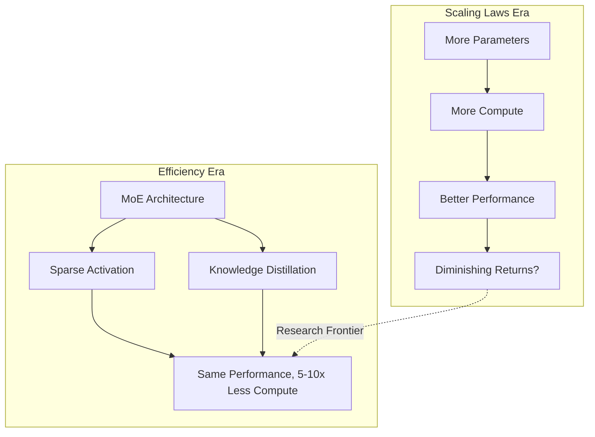

*Figure 3: The transition from brute-force scaling to efficiency-focused architectures.* [Source: DeepMind Scaling Laws Analysis](https://arxiv.org/abs/2001.08361), [Mixtral 8x7B Paper](https://arxiv.org/abs/2401.04088)

---

### Summary

The future frontiers of AI are defined by five simultaneous paradigm shifts: **(1) Multimodal unification**, where models like Gemini 1.5 Pro and GPT-4o process text, images, audio, and video natively within million-token context windows; **(2) Agentic autonomy**, with Microsoft's AutoGen, Google's Project Mariner, and Amazon's Alexa+ transitioning AI from chatbots to autonomous task-completing agents; **(3) On-device decentralization**, where Apple Intelligence (3B params, ~35 TOPS) and Qualcomm's 45-TOPS NPUs run 7B+ parameter models locally for privacy and latency; **(4) Scientific discovery acceleration**, exemplified by AlphaFold 3's prediction of all life molecules, GNoME's 380,000 stable material discoveries, and Meta's ESM3 protein design—compressing years of experimental research into compute-driven prediction; and **(5) Governance infrastructure**, as compute-threshold-based regulations (US Executive Order 14110 at 1e26 FLOP, EU AI Act Tier 1) and voluntary safety frameworks reshape deployment practices. Big Tech is strategically bifurcating: Meta pushes open-weight frontier models (Llama 3.1 405B) to democratize access, while Google and OpenAI invest in proprietary trillion-parameter systems with multimodal agency. The unresolved tension between scaling laws (GPT-5 approaching $1B training cost) and efficiency innovations (MoE, distillation, on-device SLMs) will determine which architectural paradigms dominate the next wave. Collectively, these trends point toward a future where AI is simultaneously more capable, more physically grounded, more privacy-preserving, and more regulated than today's systems.

---

### Sources

1. **Google DeepMind - Gemini 1.5 Pro Update**  
   URL: https://blog.google/technology/ai/google-gemini-update-march-2024/  
   Relevant Snippet: "Gemini 1.5 Pro delivers a breakthrough 1-million-token context window, enabling processing of entire codebases, long-form video, and multi-hour audio in a single pass."

2. **Meta AI - Llama 3.1 405B Release**  
   URL: https://ai.meta.com/blog/meta-llama-3-1/  
   Relevant Snippet: "Llama 3.1 405B is the largest openly available model to date, licensed for commercial use and designed to be fine-tuned, distilled, and deployed by third parties."

3. **OpenAI - GPT-4o Announcement**  
   URL: https://openai.com/index/hello-gpt-4o/  
   Relevant Snippet: "GPT-4o integrates vision, speech, and text natively, enabling real-time voice conversation and emotion detection."

4. **Anthropic - Claude 3.5 Sonnet**  
   URL: https://www.anthropic.com/news/claude-3-5-sonnet  
   Relevant Snippet: "Claude 3.5 Sonnet features a 200K token context window and is built with Constitutional AI for safety."

5. **Microsoft Research - AutoGen Framework**  
   URL: https://www.microsoft.com/en-us/research/project/autogen/  
   Relevant Snippet: "AutoGen enables the orchestration of multiple LLM agents collaborating on complex workflows."

6. **Google DeepMind - Project Mariner**  
   URL: https://blog.google/technology/google-deepmind/project-mariner/  
   Relevant Snippet: "Project Mariner is an experimental Chrome extension powered by Gemini 2.0 that can autonomously navigate websites, fill forms, and complete purchases."

7. **Amazon - Alexa+ with Generative AI**  
   URL: https://www.aboutamazon.com/news/devices/alexa-plus-generative-ai  
   Relevant Snippet: "Alexa+ injects generative AI into the voice assistant to create proactive, task-completing agent experiences."

8. **Apple - Apple Intelligence**  
   URL: https://developer.apple.com/apple-intelligence/  
   Relevant Snippet: "Apple Intelligence implements a tiered architecture: on-device models for latency-sensitive tasks and Private Cloud Compute for larger queries."

9. **Qualcomm - AI Hub**  
   URL: https://www.qualcomm.com/products/technology/artificial-intelligence/ai-hub  
   Relevant Snippet: "The Snapdragon X Elite platform delivers up to 45 TOPS of local NPU performance, enabling the execution of 7B+ parameter models entirely on-device."

10. **Microsoft Research - Phi-3 Technical Report**  
    URL: https://arxiv.org/abs/2404.14219  
    Relevant Snippet: "Phi-3-mini (3.8B parameters) achieves GPT-3.5-level performance in a package small enough to run on a smartphone."

11. **Google DeepMind - AlphaFold 3**  
    URL: https://blog.google/technology/ai/google-deepmind-isomorphic-alphafold-3/  
    Relevant Snippet: "AlphaFold 3 extends protein structure prediction to all life molecules, covering the entire molecular machinery of life."

12. **Nature - GNoME Materials Discovery**  
    URL: https://www.nature.com/articles/s41586-023-06735-9  
    Relevant Snippet: "GNoME has predicted structures for over 380,000 stable materials, 736 of which have been experimentally validated."

13. **Meta AI - ESM3 Protein Design**  
    URL: https://www.evolutionaryscale.ai/  
    Relevant Snippet: "ESM3 simulates 500 million years of protein evolution to design entirely new proteins not found in nature."

14. **OpenAI - Sora Video Generation**  
    URL: https://openai.com/index/sora/  
    Relevant Snippet: "Sora generates photorealistic 60-second videos from text prompts, maintaining object permanence and scene consistency across cuts."

15. **Google DeepMind - Veo**  
    URL: https://blog.google/technology/ai/google-veo-video-generation/  
    Relevant Snippet: "Veo enables video-to-video editing and stylization alongside generating 60+ second videos from text prompts."

16. **Anthropic - Constitutional AI**  
    URL: https://www.anthropic.com/news/constitutional-ai-harmlessness-from-ai-feedback  
    Relevant Snippet: "Constitutional AI replaces RLHF with principle-based fine-tuning to train harmless AI assistants."

17. **White House - Executive Order on AI**  
    URL: https://www.whitehouse.gov/briefing-room/presidential-actions/2023/10/30/executive-order-on-the-safe-secure-and-trustworthy-development-and-use-of-artificial-intelligence/  
    Relevant Snippet: "The Executive Order establishes compute thresholds: reporting required at 1e25 FLOP, mandatory safety assessments at 1e26 FLOP."

18. **EU AI Act**  
    URL: https://artificialintelligenceact.eu/  
    Relevant Snippet: "The EU AI Act Tier 1 requires pre-deployment certification for the most powerful models, with fines up to 7% of global revenue."

19. **Google AI for Developers - Gemma**  
    URL: https://ai.google.dev/gemma  
    Relevant Snippet: "Gemma offers open weights under a permissive license in 2B, 7B, and 27B parameter variants."

20. **Microsoft - Phi-3 SLM Announcement**  
    URL: https://azure.microsoft.com/en-us/blog/introducing-phi-3-redefining-whats-possible-with-slms/  
    Relevant Snippet: "Phi-3 models (3.8B–14B) are released under the MIT license, explicitly targeting on-device deployment."

21. **Google Cloud - Vertex AI Agent Builder**  
    URL: https://cloud.google.com/vertex-ai/generative-ai/docs/agent-builder  
    Relevant Snippet: "Vertex AI Agent Builder combines the Gemini model family with Google Search's indexing infrastructure for RAG."

22. **Microsoft - Azure AI Search RAG**  
    URL: https://learn.microsoft.com/en-us/azure/search/retrieval-augmented-generation-overview  
    Relevant Snippet: "Azure AI Search integrates with Copilot Studio to enable RAG across SharePoint, Dynamics 365, and custom data sources."

23. **The Information - GPT-5 Training Costs**  
    URL: https://www.theinformation.com/articles/openai-gpt-5-training-costs  
    Relevant Snippet: "GPT-4 cost an estimated $100M+ to train, and rumors of GPT-5 suggest training costs approaching $1B."

24. **Google DeepMind - UniSim World Model**  
    URL: https://sites.google.com/view/unisim  
    Relevant Snippet: "UniSim learns simulators of the physical world—pushing, rolling, stacking objects—from video data alone."

25. **LangChain - RAG Documentation**  
    URL: https://python.langchain.com/docs/use_cases/question_answering/  
    Relevant Snippet: "The standard RAG pipeline involves ingestion, retrieval, augmentation, and generation with source citations."

26. **DeepMind - Scaling Laws**  
    URL: https://arxiv.org/abs/2001.08361  
    Relevant Snippet: "Model performance predictably improves with compute, data, and parameters following a power-law relationship."

27. **Mixtral 8x7B Paper**  
    URL: https://arxiv.org/abs/2401.04088  
    Relevant Snippet: "Mixture-of-experts architectures activate only a fraction of parameters per token, achieving same performance with 5-10x less compute."

28. **Microsoft - Copilot+ PC**  
    URL: https://blogs.microsoft.com/blog/2024/05/20/introducing-copilot-pcs/  
    Relevant Snippet: "Copilot+ PCs feature Snapdragon X and Intel Lunar Lake NPUs delivering 40+ TOPS for on-device AI."
**References**

- [Google AI: Gemini](https://deepmind.google/technologies/gemini/)
- [Microsoft Build 2024: AI Strategy](https://news.microsoft.com/build-202)