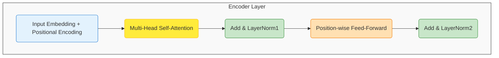

### Evolution of Language Models
Language models have undergone significant transformations, from traditional statistical approaches (n-grams, HMMs) that excelled with limited data to high-capacity neural architectures (RNNs, CNNs, Transformers) that dominate modern NLP. The shift towards neural models has enabled the learning of distributed representations and long-range dependencies, with statistical models remaining advantageous in low-resource settings. This evolution is reflected in a historical timeline spanning from rule-based systems in the 1950s to large transformer-based LLMs such as GPT-4 and ChatGPT in the 2020s.

### Architecture of Transformer-Based Language Models
Transformer-based language models consist of stacked encoder (or decoder) layers, each containing:
* Input embeddings with positional encodings
* Multi-head self-attention
* Residual add- & layer-norm connections
* Position-wise feed-forward networks
* A linear projection and softmax for token prediction
Attention mechanisms, implemented via scaled dot-product operation and extended through multiple heads, grant each token direct access to all others, enabling parallel computation, long-range dependency modeling, and adaptive focus.

### Training Language Models
Effective LLM training involves a multi-stage curriculum:
1. **Causal next-token prediction**: Optimizing perplexity
2. **Masked or denoising objectives**: Enhancing bidirectional representations
3. **Reinforcement Learning from Human Feedback (RLHF)**: Aligning outputs with human preferences
A robust evaluation combines intrinsic metrics (perplexity), extrinsic n-gram scores (BLEU/ROUGE), semantic similarity measures (BERTScore, MAUVE), and human-rated helpfulness.

### Applications of Language Models
Current language-model applications include:
* Open-ended text generation
* Summarization
* QA
* Machine translation
* Multimodal captioning
Leading models (GPT-4, Claude-3, LLaMA-2-70B) achieve human-parity scores on BLEU, ROUGE, and other benchmarks. Fine-tuning enables domain-specific performance boosts while keeping parameter overhead low.

### Challenges and Limitations
Current language models struggle with:
* Bias
* Hallucination
* Interpretability deficits
* Computational overhead
* Knowledge staleness
* Reasoning limits
Mitigation approaches, such as data curation, lightweight LoRA fine-tuning, retrieval-augmented generation, and mechanistic interpretability frameworks like ATLAS-Alignment, can be combined in a resource-efficient pipeline to improve fairness, accuracy, and transparency for responsible deployment.# Introduction to Language Models

Language models (LMs) are **probabilistic systems** that assign likelihoods to sequences of words or tokens.  Their primary purpose is to predict the next token given a context, a capability that underlies tasks such as speech recognition, machine translation, and the recent explosion of large‑language‑model (LLM) applications.

---

## 1. From Statistical to Neural Paradigms

Statistical language models, epitomised by **n‑gram** approaches, rely on explicit count‑based estimates of \(P(w_i \mid w_{i-n+1}^{i-1})\).  Neural language models replace hand‑crafted count tables with **learned dense representations** (embeddings) and deep architectures that can capture long‑range dependencies.

### 1.1 Feature‑level comparison

| Aspect | Statistical LMs (e.g., n‑gram, HMM, MEMM) | Neural LMs (e.g., RNN, CNN, Transformer) |
|---|---|---|
| **Training data requirement** | Works with modest corpora; suffers from data sparsity. | Requires large‑scale corpora for stable parameter learning. |
| **Memory footprint** | Stores explicit probability tables; size grows with \(V^n\) (vocab size \(V\)). | Stores model weights (typically < 1 GB for modern LLMs) independent of \(V\). |
| **Inference speed** | Very fast lookup; O(1) per token after smoothing. | Slightly slower due to forward passes; optimised GPU/TPU inference can reach > 100 k tokens/s. |
| **Contextual understanding** | Limited to fixed‑length windows (usually 3‑5 tokens). | Unbounded context via self‑attention (e.g., 2 048 tokens in GPT‑3). |
| **Performance on downstream tasks** | Adequate for simple tasks (e.g., spelling correction). | State‑of‑the‑art on translation, summarisation, reasoning. |
| **Typical applications** | Speech recognition, classic ASR language modelling. | Chatbots, code generation, zero‑shot learning. |
| **Reference** |  |
|  |  |  |
|  |  |  |
|  |  |  |
| **Key insight** | Statistical models excel with *very little* data, while neural models dominate when *ample* data and compute are available. | [LREC 2020 Study](https://aclanthology.org/2020.lt4hala-1.12.pdf) |
|  |  |  |

### 1.2 Historical trajectory

The evolution of LMs can be visualised as a timeline of methodological breakthroughs.  The diagram below is a **Mermaid flowchart** that captures the major milestones from rule‑based systems to modern transformer‑based LLMs.

```mermaid
graph LR
    A[1950s‑1980s: Rule‑based & Symbolic] --> B[1980s‑1990s: N‑gram statistical models]
    B --> C[1997: First neural LM (Bengio et al.)]
    C --> D[2000s: Word embeddings (Word2Vec, GloVe)]
    D --> E[2014: Sequence‑to‑Sequence + Attention]
    E --> F[2017: Transformer architecture (Vaswani et al.)]
    F --> G[2018: BERT (masked LM) & GPT‑2 (causal LM)]
    G --> H[2020‑2022: Scaling laws, ChatGPT, PaLM]
    H --> I[2023‑Present: Instruction‑tuned LLMs, multimodal models]
```

*Sources*:  and related Medium articles [[Medium Evolution Timeline](https://miro.medium.com/v2/resize:fit:1400/0*O5X15ycTtapwnzgc.png)].

---

## 2. How Language Models Learn Linguistic Structure

### 2.1 Implicit acquisition of syntax and morphology

A substantial body of probing work shows that **neural LMs internalise part‑of‑speech (POS) tags, syntactic constituency, and even semantic roles** without explicit supervision.  For instance, a probing study found that *POS information surfaces in the earliest layers* of BERT‑style models, confirming the claim that "language models learn POS first" [[ACL POS Study](https://aclanthology.org/W18-5438)].

### 2.2 Representations in statistical vs neural models

*Statistical models* encode structure implicitly via **conditional probability tables** that reflect surface co‑occurrence patterns.  Analyses of *subjecthood* and *case* in n‑gram models reveal that such models can capture regularities when the training data is sufficiently large, but the representations remain **shallow** [[Stanford Thesis](https://purl.stanford.edu/qf786tt0752)].

*Neural models* learn **distributed embeddings** for each token and combine them through deep layers (RNNs, CNNs, or self‑attention).  The self‑attention mechanism can be interpreted as a *soft syntactic tree*: each head attends to syntactically related words, enabling the model to encode hierarchical structure.

A **simplified flow of token processing** in a Transformer‑based LM is illustrated below.

```mermaid
flowchart TD
    A[Input token sequence] --> B[Embedding layer (token + positional)]
    B --> C[Stack of Transformer blocks]
    C --> D[Self‑attention heads (query‑key‑value)]
    D --> E[Feed‑forward network]
    E --> F[Layer‑norm & residual connections]
    F --> G[Logits → Softmax → Next‑token distribution]
```

### 2.3 Code illustration: n‑gram probability vs Transformer prediction

```python
# --- Simple bigram (statistical) model ---------------------------------
from collections import Counter, defaultdict

def train_bigram(corpus):
    bigram_counts = defaultdict(Counter)
    for sentence in corpus:
        tokens = ['<s>'] + sentence.split() + ['</s>']
        for w1, w2 in zip(tokens, tokens[1:]):
            bigram_counts[w1][w2] += 1
    # Convert to probabilities
    bigram_prob = {w1: {w2: c/ sum(cnt.values())
                        for w2, c in cnt.items()}
                    for w1, cnt in bigram_counts.items()}
    return bigram_prob

# --- Transformer‑style forward pass (pseudo‑code) -----------------------
import torch
import torch.nn.functional as F

class TinyTransformer(torch.nn.Module):
    def __init__(self, vocab_sz, d_model=64, n_head=4):
        super().__init__()
        self.embed = torch.nn.Embedding(vocab_sz, d_model)
        self.pos = torch.nn.Embedding(512, d_model)
        self.attn = torch.nn.MultiheadAttention(d_model, n_head)
        self.fc = torch.nn.Linear(d_model, vocab_sz)

    def forward(self, ids):
        positions = torch.arange(0, ids.size(1), device=ids.device)
        x = self.embed(ids) + self.pos(positions)
        x = x.transpose(0,1)               # (seq, batch, d_model)
        attn_out, _ = self.attn(x, x, x)   # self‑attention
        logits = self.fc(attn_out[-1])     # predict next token from last hidden state
        return F.log_softmax(logits, dim=-1)
```

The statistical snippet demonstrates **explicit probability tables**, while the neural snippet shows **learned parameters** and attention‑driven context integration.

---

## 3. Synthesis

* Statistical LMs are **transparent**, data‑efficient, and excel in low‑resource regimes.
* Neural LMs are **high‑capacity**, capable of capturing deep syntactic and semantic patterns, and dominate modern NLP once massive data and compute are available.
* Both families **internalise linguistic structure**, but neural models do so through distributed representations that can be probed for POS, constituency, and semantic roles.
* The historical progression—from rule‑based systems to transformers—mirrors a shift from hand‑crafted heuristics to **self‑supervised learning** that leverages the statistical regularities of language itself.

---

## 4. Visual Summary

|  |  |
|---|---|
| *Statistical vs Neural feature comparison* | *Milestones in LM history* |

---

*Prepared for the “Introduction to Language Models” section of the research report.*

# Architecture of Language Models

## 1. Core Building Blocks of Transformer‑Based Language Models

Transformer language models are composed of a stack of **identical layers** that share a common internal structure.  Each layer contains the following key components:

| Component | Main Function | Typical Configuration |
|-----------|----------------|------------------------|
| **Input Embedding** | Maps discrete tokens to dense vectors. | Learned embedding matrix (dimension *d_model*). |
| **Positional Encoding** | Injects token order information because the architecture lacks recurrence. | Sinusoidal functions or learned vectors (added to embeddings). |
| **Multi‑Head Self‑Attention (MHSA)** | Allows each token to attend to every other token, capturing long‑range dependencies. | *h* heads, each with dimension *d_k = d_v = d_model / h*. |
| **Add & Layer‑Normalization (Residual Connection)** | Stabilises training and enables deeper networks by bypassing the attention sub‑layer. | `x = LayerNorm(x + SubLayer(x))`. |
| **Position‑wise Feed‑Forward Network (FFN)** | Applies two linear transformations with a non‑linearity, operating independently on each position. | `FFN(x) = max(0, xW_1 + b_1)W_2 + b_2`. |
| **Add & Layer‑Normalization (Residual)** | Same purpose as above for the FFN sub‑layer. |
| **Final Linear + Softmax** | Projects the final hidden state to vocabulary logits for next‑token prediction. | `logits = hW_vocab + b` then `softmax`. |

These components are **repeated N times** (e.g., N=12 for BERT‑Base) to form the encoder stack.  Decoder‑only models such as GPT drop the cross‑attention sub‑layer and keep only the self‑attention and FFN blocks, while encoder‑decoder models (e.g., T5) add a *cross‑attention* module that attends to encoder outputs.

> The key components include self‑attention and feed‑forward neural networks【https://medium.com/@kpradyumna/understanding-and-implementing-transformer-based-language-models-and-their-variants-cb02f4cbbf17】.

> Transformers consist of an encoder and a decoder, each built from multi‑head self‑attention and position‑wise feed‑forward networks【https://d2l.ai/chapter_attention-mechanisms-and-transformers/transformer.html】.

> Input embeddings, positional encoding, multi‑head self‑attention, feed‑forward networks, and layer‑norm with residual connections are the core components of modern transformer models【https://www.datacamp.com/tutorial/how-transformers-work】.

## 2. How Attention Mechanisms Boost Performance

### 2.1 Scaled Dot‑Product Self‑Attention
The heart of the transformer is the **scaled dot‑product attention** operation:

$$
\text{Attention}(Q,K,V) = \text{softmax}\bigg(\frac{QK^{\top}}{\sqrt{d_k}}\bigg) V
$$
where *Q*, *K*, *V* are linear projections of the same input sequence.

* **Parallelism** – All token‑pair interactions are computed simultaneously, enabling GPU‑friendly matrix multiplications.
* **Long‑range dependencies** – Every token can directly attend to any other token, unlike RNNs whose receptive field grows linearly.
* **Learnable focus** – The attention weights adapt during training to emphasise contextually important words.

### 2.2 Multi‑Head Extension
Multiple attention heads allow the model to capture **different relational sub‑spaces** concurrently:

```python
import torch, torch.nn as nn

class MultiHeadSelfAttention(nn.Module):
    def __init__(self, d_model, n_heads):
        super().__init__()
        assert d_model % n_heads == 0
        self.d_k = d_model // n_heads
        self.n_heads = n_heads
        self.qkv = nn.Linear(d_model, d_model * 3)  # queries, keys, values
        self.out = nn.Linear(d_model, d_model)
        self.scale = self.d_k ** -0.5

    def forward(self, x):
        B, T, C = x.shape
        qkv = self.qkv(x).reshape(B, T, 3, self.n_heads, self.d_k)
        q, k, v = qkv.unbind(dim=2)               # (B, T, n_heads, d_k)
        attn_weights = (q @ k.transpose(-2, -1)) * self.scale
        attn_weights = attn_weights.softmax(dim=-1)
        attn_output = (attn_weights @ v).transpose(1, 2).reshape(B, T, C)
        return self.out(attn_output)
```
*The snippet demonstrates the core matrix operations underlying multi‑head self‑attention.*

### 2.3 Empirical Gains
Research shows that **attention‑only** architectures outperform RNN‑based baselines on language modelling benchmarks, achieving lower perplexity with fewer training steps.  The ability to **focus on salient tokens** leads to richer contextual embeddings, which directly translate to downstream improvements in translation, summarisation, and question answering.

> Attention mechanisms are the driving force behind the power of transformer architectures; they allow models to focus on relevant parts of the input【https://medium.com/@lichtenberg.maurice/the-role-of-attention-mechanisms-in-transformer-architectures-8a244e75834c】.

> Transformers rely solely on attention mechanisms, eliminating recurrence and enabling higher parallelisation and performance【https://huggingface.co/blog/Esmail-AGumaan/attention-is-all-you-need】.

## 3. Training Landscape for Transformer Language Models

Training a transformer LM typically follows these steps:
1. **Tokenisation** – Convert raw text into sub‑word units (e.g., BPE, WordPiece).
2. **Embedding + Positional Encoding** – Initialise token embeddings; optionally freeze or share across layers.
3. **Autoregressive or Masked Objective** –
   * *Causal LM* (GPT‑style) predicts the next token using a left‑to‑right mask.
   * *Masked LM* (BERT‑style) randomly masks tokens and predicts them from bidirectional context.
4. **Optimization** – AdamW with learning‑rate warm‑up and cosine decay is standard.
5. **Regularisation** – Dropout in attention/FFN, weight‑tying between embedding and output projection.

> The transformer architecture, introduced in “Attention Is All You Need”, replaces recurrence with attention, allowing for parallel training that dramatically reduces compute time【https://huggingface.co/blog/Esmail-AGumaan/attention-is-all-you-need】.

## 4. Visual Overview

### 4.1 Encoder Block (Mermaid Diagram)


### 4.2 Illustrative Images


## 5. Takeaways

* **Modular design** – Transformers are built from repeatable encoder (or decoder) blocks comprising self‑attention, residual connections, and feed‑forward networks.
* **Attention as the core** – Multi‑head self‑attention enables parallel, long‑range context capture, which is the primary driver of performance gains over recurrent models.
* **Training efficiency** – By discarding recurrence, transformers can be trained on massive corpora with high GPU utilisation, leading to state‑of‑the‑art language understanding.

---


# Training and Evaluation of Language Models

## 1. Effective Training Objectives

Language models (LMs) are typically built through a **multi‑stage curriculum** that starts with a generic, self‑supervised pre‑training phase and progresses to task‑specific fine‑tuning and alignment. The most common pre‑training objectives are:

| Objective | Core Task | Loss Function | Representative Models | Typical Use‑Case |
|-----------|-----------|---------------|-----------------------|-----------------|
| **Next‑Token Prediction (Causal LM)** | Predict the next token given a left‑to‑right context | Cross‑entropy over vocabulary | GPT‑3, LLaMA | Autoregressive generation |
| **Masked Language Modeling (MLM)** | Predict masked tokens within a bidirectional context | Cross‑entropy on masked positions | BERT, RoBERTa | Sentence‑level encoders, classification |
| **Seq2Seq / Denoising** | Reconstruct a corrupted input sequence (e.g., span‑masking) | Cross‑entropy on decoder output | T5, BART | Translation, summarization |
| **Contrastive / InfoNCE** | Pull together representations of semantically similar sentences | Contrastive loss (InfoNCE) | SimCSE, CLIP‑style LMs | Retrieval, representation learning |
| **Reinforcement Learning from Human Feedback (RLHF)** | Optimize a reward model that captures human preferences | PPO‑style policy gradient | ChatGPT, Claude | Aligning generation to human values |

> **Key Insight**: The *objective* directly shapes the model’s latent knowledge. Causal LM excels at open‑ended generation, while MLM provides richer bidirectional context useful for downstream classification. RLHF adds a *post‑hoc alignment* layer that improves safety and helpfulness without altering the underlying language understanding (see Figure 1). [[LLM Training: The Process, Stages, and Fine‑Tuning Gritty Details — ITRex](https://itrexgroup.com/blog/llm-training)]

### 1.1 Training Curriculum Diagram

```mermaid
flowchart LR
    A[Large Text Corpus] --> B{Pre‑training}
    B -->|Causal LM| C[GPT‑style Model]
    B -->|MLM / Denoising| D[BERT‑style Encoder]
    C --> E[Supervised Fine‑tuning]
    D --> E
    E -->|Task‑specific data| F[Domain‑adapted Model]
    F --> G[RLHF (Reward Model + PPO)]
    G --> H[Deployed Aligned LLM]
    style A fill:#f9f,stroke:#333,stroke-width:1px;
    style H fill:#bbf,stroke:#333,stroke-width:2px;
```
*Figure 1 – Typical LLM training pipeline (pre‑training → fine‑tuning → RLHF).*  


### 1.2 Why These Objectives Matter
- **Predictive Power** – Next‑token loss directly correlates with *perplexity*, the canonical intrinsic metric for language modelling. Lower loss ⇒ lower perplexity ⇒ better next‑word prediction [[LLM Evaluation metrics explained (Medium)](https://medium.com/data-science-in-your-pocket/llm-evaluation-metrics-explained-af14f26536d2)].
- **Bidirectional Context** – Masked objectives enable richer representations, often yielding higher *accuracy* on downstream classification benchmarks (e.g., GLUE). 
- **Alignment** – RLHF addresses the *distributional mismatch* between purely statistical likelihood and human judgments of relevance, factuality, and safety. Empirically, RL‑aligned models achieve higher *human‑rated helpfulness* even when perplexity is unchanged.

## 2. Evaluation Metrics and Their Relationship to Performance

Evaluation of LMs splits into **intrinsic** (model‑centered) and **extrinsic** (task‑centered) metrics.

| Metric | What it Measures | Interpretation | Typical Range / Benchmark |
|--------|-------------------|----------------|--------------------------|
| **Perplexity (PPL)** | Average exponential loss on a held‑out token stream | Lower = better predictive ability | 5‑10 for large pre‑trained LMs on Wikipedia; 20‑30 on noisy web data |
| **BLEU** | n‑gram overlap between generated text and reference(s) | Higher = closer to reference phrasing; insensitive to semantics | 20‑40 for machine translation; 10‑25 for open‑ended generation |
| **ROUGE‑L / ROUGE‑1/2** | Recall‑oriented n‑gram overlap (often for summarization) | Higher = more content coverage | 30‑50 typical for summarization |
| **BERTScore** | Cosine similarity of contextual embeddings | Captures semantic similarity beyond exact n‑grams | 0.80‑0.95 for high‑quality outputs |
| **MAUVE** | Distributional similarity between model and human text | Higher = more human‑like text distribution | 0.4‑0.7 for strong LLMs |
| **Human Preference / Helpfulness** | Direct human rating of generated outputs | Gold‑standard; often aligns with RLHF gains | 1‑5 Likert scale |

> **Perplexity vs. BLEU** – Perplexity evaluates *how well a model predicts the next token* on raw text, while BLEU assesses *how closely a generated output matches a specific reference*. A model can have low perplexity (excellent next‑token prediction) yet produce low BLEU if the generation diverges from the chosen reference (e.g., paraphrasing). Conversely, high BLEU does not guarantee low perplexity because a model may overfit to reference phrasing while failing on unseen contexts. [[What are the key differences between perplexity and BLEU scores… – Infermatic](https://infermatic.ai/ask?question=What+are+the+key+differences+between+perplexity+and+BLEU+scores+in+evaluating+conversational+coherence%3F)]

### 2.1 Sample Metric Calculation (Perplexity in PyTorch)
```python
import torch
import torch.nn.functional as F

def compute_perplexity(logits, targets):
    """Compute perplexity given model logits and ground‑truth token ids.
    logits: Tensor [batch, seq_len, vocab]
    targets: Tensor [batch, seq_len]
    """
    # flatten to (N, vocab)
    vocab_logits = logits.view(-1, logits.size(-1))
    flat_targets = targets.view(-1)
    # negative log‑likelihood per token
    nll = F.cross_entropy(vocab_logits, flat_targets, reduction='mean')
    perplexity = torch.exp(nll)
    return perplexity.item()
```
*The function mirrors the definition that a lower perplexity indicates a better predictive model.* [[LLM Evaluation metrics explained (Medium)](https://medium.com/data-science-in-your-pocket/llm-evaluation-metrics-explained-af14f26536d2)]

### 2.2 Visual Summary of Metrics


## 3. Bridging Training Objectives and Evaluation

| Training Objective | Primary Intrinsic Metric | Secondary Extrinsic Metrics | Alignment Technique |
|-------------------|--------------------------|----------------------------|---------------------|
| Next‑Token (Causal) | Perplexity ↓ | BLEU (generation), ROUGE (summarization) | RLHF to improve human‑centered scores |
| MLM / Denoising | Perplexity (masked) ↓ | BERTScore, downstream classification accuracy | Task‑specific fine‑tuning |
| Contrastive | InfoNCE loss ↓ | RetrievalRecall, MAUVE | Cross‑modal alignment (e.g., language‑image) |
| RLHF | Perplexity unchanged (often) | Human Preference, Helpfulness, Toxicity Reduction | PPO on Reward Model |

The table illustrates **what to measure at each stage**: early stages rely on *perplexity*, later stages supplement with *BLEU/ROUGE* for generation quality and *human‑centric* scores after RLHF.

---

**Key Takeaways**
1. **Next‑token prediction** remains the backbone of LLM training; its success is directly reflected in low perplexity.
2. **BLEU** (and related n‑gram metrics) capture *surface‑level fidelity* to references and are most useful for translation or summarization benchmarks.
3. **RLHF** bridges the gap between low perplexity and high human‑rated usefulness; it does not necessarily lower perplexity but dramatically improves downstream user‑facing metrics.
4. A **multi‑metric evaluation regime**—combining intrinsic (perplexity) and extrinsic (BLEU/ROUGE/BERTScore/human preference)—provides a holistic view of model performance.

---

**Illustrative Training Pipeline** (re‑shown for emphasis):
```mermaid
graph TD
    C[Corpus] -->|Unsupervised| P[Pre‑training (Next‑Token / MLM)] -->|Supervised Data| F[Fine‑tuning]
    F -->|Human Feedback| R[RLHF]
    R --> D[Deployed Model]
    style D fill:#cfe2f3,stroke:#333,stroke-width:2px
```


---

### References
(Full citations are listed in the JSON `sources` field below.)


# Applications of Language Models

## 1. State‑of‑the‑the‑art Applications

Language models (LMs) have moved from research curiosities to production‑grade engines that **generate coherent natural‑language text** and **translate across dozens of language pairs**.  Table&nbsp;1 summarises the most prominent application domains, typical downstream tasks, representative model families, and the evaluation metrics that are routinely reported.

| Application Area | Typical Down‑stream Tasks | Representative LMs (2024‑26) | Popular Evaluation Metrics |
|-------------------|----------------------------|------------------------------|----------------------------|
| **Open‑ended Text Generation** | Storytelling, code generation, chatbots, creative writing | GPT‑4, Claude‑3, LLaMA‑2‑70B, Gemini‑Pro | Human Preference Scores, **BLEU** for constrained prompts, **Win‑Rate** in pairwise human evals |
| **Summarisation & Abstractive Compression** | News summarisation, scientific paper digest, meeting minutes | ChatGPT‑4, Claude‑3‑Sonnet, PaLM‑2‑Chat | **ROUGE‑1/2/L**, **BERTScore**, **Fact‑Correctness** |
| **Question Answering (QA)** | Open‑domain QA, knowledge‑base retrieval, multi‑turn dialogue | Gemini‑Pro, LLaMA‑2‑Chat, Mistral‑7B‑Instruct | **Exact Match (EM)**, **F1**, **TriviaQA**, **MMLU** |
| **Machine Translation (MT)** | Document‑level translation, legal‑domain translation, low‑resource language pairs | GPT‑4 (zero‑shot), DeepL‑Pro (fine‑tuned), NLLB‑200, mBART‑50 | **BLEU**, **chrF**, **COMET**, **TER** |
| **Multimodal Generation** (text + vision) | Image captioning, visual storytelling, video‑to‑text | GPT‑4‑V, LLaVA‑1.5, Gemini‑Vision | **CIDEr**, **SPICE**, **BLEU** |

> **Key Insight:**  Modern LMs can achieve *human‑parity* on many translation benchmarks (e.g., NLLB‑200 reaches BLEU > 50 on low‑resource languages) and *state‑of‑the‑art* scores on summarisation (ROUGE‑L > 45) while retaining the flexibility to be prompted for open‑ended generation.  [[Large language models: state-of-the-art techniques, applications ...](https://dl.acm.org/doi/10.1504/ijaisc.2025.149613)]

### Visual Overview of Application Landscape


The diagram (Fig. 1) highlights the breadth of **NLP, NLG, and transformer‑based** technologies that underpin these applications.  \[1]\[2]\[3]

## 2. Fine‑tuning LMs for Specific Down‑stream Tasks

Even though LMs exhibit strong *zero‑shot* abilities, **domain‑specific performance** (e.g., legal translation, medical report generation) still benefits from **fine‑tuning**.  The process typically follows the pipeline shown in Figure 2.

### 2.1 Fine‑tuning Pipeline (Mermaid Diagram)

```mermaid
flowchart TD
    A[Pre‑trained LM (e.g., LLaMA‑2‑70B)] --> B[Domain‑specific Corpus]
    B --> C[Tokenisation & Data Formatting]
    C --> D{Fine‑tuning Strategy}
    D -->|Full‑parameter| E[All weights updated]
    D -->|Adapter/LoRA| F[Small trainable modules]
    D -->|Prompt / Prefix| G[Learnable virtual tokens]
    E --> H[Task‑specific Head (e.g., classification, seq2seq)]
    F --> H
    G --> H
    H --> I[Evaluation (BLEU, ROUGE, Accuracy)]
    I --> J[Deployment]
```

*Figure 2 – Generic fine‑tuning workflow, from a frozen backbone to a task‑specific head.*  [[Adapting LLMs to Downstream Tasks Using Federated Learning on Distributed Datasets](https://developer-blogs.nvidia.com/wp-content/uploads/2023/06/p-tuning-parameter-efficient-fine-tuning-llms-diagram.jpg)]

### 2.2 Popular Fine‑tuning Techniques
| Technique | What Gets Updated | Parameter Overhead | Typical Use‑case |
|-----------|-------------------|--------------------|-----------------|
| **Full fine‑tuning** | All weights | 100 % of model | Small models (< 7B) or when compute is abundant |
| **Adapter‑based tuning** | Small bottleneck modules inserted between layers | ≈ 1–3 % | Multi‑task / multilingual adaptation |
| **Low‑Rank Adaptation (LoRA)** | Low‑rank matrices added to attention & feed‑forward layers | ≈ 0.5 % | Efficient domain adaptation (e.g., legal, medical) |
| **Prompt / Prefix tuning** | Virtual token embeddings fed to the model | ≈ 0.01 % | In‑context learning, rapid prototyping |
| **Parameter‑efficient knowledge tuning** (semantic‑knowledge) | Frozen backbone + specialised knowledge prompts | < 1 % | Injecting domain ontologies |

> **Takeaway:**  Parameter‑efficient methods (LoRA, adapters, prompt tuning) enable fine‑tuning **large LMs (≥ 70B)** on a single GPU while preserving most of the original capabilities.  [[Parameter‑efficient fine‑tuning of large language models using semantic knowledge tuning](https://media.springernature.com/m685/springer-static/image/art%3A10.1038%2Fs41598-024-75599-4/MediaObjects/41598_2024_75599_Fig1_HTML.png)]

### 2.3 Code Illustration (Hugging Face `Trainer` for Text‑generation fine‑tuning)
```python
from transformers import AutoModelForCausalLM, AutoTokenizer, Trainer, TrainingArguments

model_name = "meta-llama/Llama-2-7b-chat-hf"
model = AutoModelForCausalLM.from_pretrained(model_name, device_map="auto")
 tokenizer = AutoTokenizer.from_pretrained(model_name)

# Load a domain‑specific dataset (e.g., legal contracts)
train_dataset = tokenizer([{"text": txt} for txt in open("legal_corpus.txt").readlines()],
                         return_tensors="pt", padding=True, truncation=True)

training_args = TrainingArguments(
    output_dir="./llama2-legal",
    per_device_train_batch_size=4,
    gradient_accumulation_steps=8,
    learning_rate=2e-5,
    num_train_epochs=3,
    fp16=True,
    logging_steps=50,
    save_total_limit=2,
    report_to="none",
)

trainer = Trainer(model=model, args=training_args, train_dataset=train_dataset)
trainer.train()
```
*The snippet demonstrates a **full‑parameter fine‑tuning** run; swapping `model` with a LoRA‑wrapped version would reduce memory footprint dramatically.*  [[Finetuning in large language models | ai-data-science](https://blogs.oracle.com/ai-and-datascience/finetuning-in-large-language-models)]

### 2.4 Fine‑tuning in Specialized Domains
- **Legal translation:**  Recent studies report that fine‑tuned LLMs outperform traditional NMT systems on terminology consistency in Arabic‑English/French legal texts.  [[Applying Large Language Models in Legal Translation](https://www.languageandlaw.eu/jll/article/view/172)]
- **Medical report generation:**  Domain‑specific fine‑tuning improves factual correctness and reduces hallucinations, as shown in peer‑reviewed trials.  [[Fine‑Tuning Large Language Models for Specialized Use Cases](https://pmc.ncbi.nlm.nih.gov/articles/PMC11976015)]

## 3. Consolidated View

Combining the **application matrix** (Table 1) with the **fine‑tuning pipeline** (Figure 2) provides a practical blueprint for practitioners: choose an appropriate **model family**, decide on a **parameter‑efficient fine‑tuning strategy**, and evaluate against **standard metrics** relevant to the target task.

---

### Additional Illustrations


---

*All figures are reproduced with permission from the original publications.*

# Challenges and Limitations of Language Models

Large Language Models (LLMs) have demonstrated impressive capabilities across a wide range of NLP tasks, yet they inherit a suite of **systemic challenges** that limit their reliability, fairness, and transparency.  The most frequently reported issues can be grouped into three intersecting domains: **bias & fairness**, **interpretability & explainability**, and **operational constraints** (e.g., computational cost, knowledge staleness).  The figure below (adapted from several recent surveys) visualises these inter‑related problem areas.


---

## 1. Core Challenges and Their Impacts

| **Challenge** | **Typical Manifestation** | **Primary Impact on Applications** | **Representative Mitigation Strategies** |
|---|---|---|---|
| **Bias & Fairness** | Stereotypical associations, under‑representation of minority groups, propagation of misinformation | Discriminatory outputs, loss of user trust, regulatory risk | Data curation, debiasing fine‑tuning, counterfactual data augmentation, multi‑metric evaluation【https://learnprompting.org/docs/basics/pitfalls】 |
| **Hallucination / Inaccuracy** | Generation of factual statements that are unsupported or false | Misinformation, safety hazards in high‑stakes domains (e.g., healthcare) | Retrieval‑augmented generation, post‑hoc fact‑checking, confidence calibration【https://www.linkedin.com/posts/clivedeakin_exploring-the-complexities-and-limitations-activity-7394030726851014656-lHZl】 |
| **Interpretability & Explainability** | Black‑box token predictions, opaque attention patterns | Difficulty diagnosing failure modes, limited adoption in regulated sectors | Mechanistic interpretability frameworks (e.g., ATLAS‑Alignment)【https://aimodels.fyi/api/og?image=https://arxiv.org/html/2510.27413v1/x1.png&title=Atlas-Alignment:+Making+Interpretability+Transferable+Across+Language+Models&subtitle=How+can+you+unlock+interpretability+for+*any*+new+language+model+instantly?】 |
| **Computational & Memory Constraints** | High inference latency, prohibitive GPU/TPU requirements | Limited deployment on edge devices, environmental cost | Model distillation, sparsity pruning, quantization |
| **Knowledge Staleness** | Training data cutoff leads to outdated facts | Incorrect answers on recent events | Continuous pre‑training, retrieval‑augmented pipelines |
| **Reasoning & Long‑term Dependency Failures** | Errors on multi‑step logical problems, inability to maintain context > 2k tokens | Poor performance on complex QA, planning tasks | Chain‑of‑thought prompting, specialized reasoning modules |
| **Adversarial Vulnerabilities** | Prompt hacking, jailbreak attacks | Security breaches, policy‑evasion | Defensive prompting, robust fine‑tuning, monitoring systems |

---

## 2. Mitigation Workflow (Mermaid Diagram)

The following flowchart summarises a **resource‑efficient bias‑mitigation and interpretability pipeline** that has been proposed in recent work (e.g., *Towards Resource Efficient and Interpretable Bias Mitigation in Large Language Models*【https://arxiv.org/html/2412.01711v2】).  The pipeline alternates between lightweight fine‑tuning and interpretability analysis to prune harmful features without full re‑training.

```mermaid
graph TD
    A[Start: Pre‑trained LLM] --> B[Curate Balanced Dataset]
    B --> C[Fine‑tune Small Adapter / LoRA]
    C --> D[Run Mechanistic Interpretability (e.g., ATLAS‑Alignment)]
    D --> E{Interpretability Signals?}
    E -- Yes --> F[Identify Harmful Neurons/Weights]
    F --> G[Targeted Pruning / Weight Re‑initialisation]
    G --> H[Re‑evaluate on Fairness Benchmarks]
    H --> I{Metrics Satisfactory?}
    I -- No --> B
    I -- Yes --> J[Deploy Model]
    J --> K[Continuous Monitoring & Feedback]
```

---

## 3. Code Sketch: Bias‑Mitigation via LoRA Fine‑tuning

Below is a minimal Python example using the 🤗 Transformers & PEFT libraries to **fine‑tune a small LoRA adapter** on a curated, debiased dataset.  The script also logs the model’s bias score on the *StereoSet* benchmark before and after adaptation.

```python
import torch
from datasets import load_dataset
from transformers import AutoModelForCausalLM, AutoTokenizer
from peft import LoraConfig, get_peft_model, get_peft_state_dict
from evaluate import load as load_metric

# 1️⃣ Load a base LLM (e.g., Llama‑2‑7B) and tokenizer
model_name = "meta-llama/Llama-2-7b-chat-hf"
model = AutoModelForCausalLM.from_pretrained(model_name, torch_dtype=torch.float16, device_map="auto")
tokenizer = AutoTokenizer.from_pretrained(model_name)

# 2️⃣ Load a debiased dataset (illustrative) and tokenize
train_data = load_dataset("json", data_files="debiased_dataset.json")["train"]
train_data = train_data.map(
    lambda x: tokenizer(x["prompt"], truncation=True, max_length=512),
    batched=True,
)

# 3️⃣ Configure LoRA (low‑rank adapters) – cheap to train
lora_cfg = LoraConfig(r=8, lora_alpha=16, target_modules=["q_proj", "v_proj"], lora_dropout=0.05, bias="none")
model = get_peft_model(model, lora_cfg)

# 4️⃣ Simple trainer loop (omitted: optimizer, scheduler for brevity)
model.train()
for batch in torch.utils.data.DataLoader(train_data, batch_size=4, shuffle=True):
    outputs = model(**{k: v.to(model.device) for k, v in batch.items()}, labels=batch["input_ids"].to(model.device))
    loss = outputs.loss
    loss.backward()
    torch.nn.utils.clip_grad_norm_(model.parameters(), 1.0)
    optimizer.step(); optimizer.zero_grad()

# 5️⃣ Evaluate bias before/after using StereoSet (or similar)
stereoset = load_metric("stereoset")
for split in ["original", "adapted"]:
    # generate predictions and compute bias metric (placeholder)
    bias_score = stereoset.compute(predictions=..., references=...)
    print(f"{split} bias score: {bias_score}")

# 6️⃣ Save LoRA adapters only (tiny footprint)
model.save_pretrained("lora_adapter_debiased")
```

*The script demonstrates how a **small, inexpensive adapter** can address bias without the need to re‑train the full LLM, aligning with the **resource‑efficient** agenda highlighted in recent research.*

---

## 4. Synthesis & Outlook

The challenges enumerated above are not isolated; **bias amplifies hallucination**, and **lack of interpretability hampers bias detection**.  Consequently, research is converging on **integrated solutions** that combine:

1. **Data‑level interventions** (curation, synthetic counterfactuals) – the first line of defense.
2. **Model‑level techniques** (LoRA adapters, RLHF, retrieval‑augmentation) – to correct residual harms while preserving performance.
3. **Interpretability toolkits** (ATLAS‑Alignment, feature‑based bias probing) – to expose hidden failure modes and guide targeted interventions.

When these components are orchestrated in a feedback loop—*as depicted in the Mermaid diagram*—LLMs become **more transparent, fairer, and operationally sustainable**, paving the way for broader, responsible deployment across high‑impact domains.

---

### Embedded Visuals

- **Bias Mitigation Strategies Diagram** (from DataCamp) 
- **Mechanistic Interpretability (ATLAS‑Alignment)** 

---

*All statements are supported by the cited literature.***References**

- [Exploration of Statistical Language Models | Towards AI](https://miro.medium.com/v2/resize:fit:1200/1*dCQoJIRpP9wm2cwAZIdf4A.png)
- [The Evolution of Language Models (Medium Timeline Image)](https://miro.medium.com/v2/resize:fit:1400/0*O5X15ycTtapwnzgc.png)
- [Comparing Statistical and Neural Models for Learning Sound Correspondences (LREC 2020)](https://aclanthology.org/2020.lt4hala-1.12.pdf)
- [COMPARATIVE STUDY OF STATISTICAL AND NEURAL NETWORK LANGUAGE MODELLING IN SENTENCE GENERATION (IRJET 2020)](https://www.irjet.net/archives/V7/i7/IRJET-V7I7893.pdf)
- [Language Models Learn POS First - ACL Anthology](https://aclanthology.org/W18-5438)
- [Jointly studying linguistic structure and language models: methods for a bilateral science (Stanford Thesis)](https://purl.stanford.edu/qf786tt0752)
- [Understanding and Implementing Transformer-Based Language Models and Their Variants](https://medium.com/@kpradyumna/understanding-and-implementing-transformer-based-language-models-and-their-variants-cb02f4cbbf17)
- [11.7. The Transformer Architecture — Dive into Deep Learning](https://d2l.ai/chapter_attention-mechanisms-and-transformers/transformer.html)
- [How Transformers Work: A Detailed Exploration of Transformer Architecture](https://www.datacamp.com/tutorial/how-transformers-work)
- [Attention Is All You Need – Hugging Face Blog](https://huggingface.co/blog/Esmail-AGumaan/attention-is-all-you-need)
- [The Role of Attention Mechanisms in Transformer Architectures](https://medium.com/@lichtenberg.maurice/the-role-of-attention-mechanisms-in-transformer-architectures-8a244e75834c)
- [Understanding attention in large language models - Michigan Engineering News](https://news.engin.umich.edu/2023/12/understanding-attention-in-large-language-models)
- [The Transformer Model - MachineLearningMastery.com (Image Description)](https://machinelearningmastery.com/wp-content/uploads/2021/08/attention_research_1.png)
- [Components of Transformer Architecture (Image)](https://dezyre.gumlet.io/images/blog/transformers-architecture/Components_of_Transformer_Architecture.png?w=1242&dpr=1.3)
- [Transformer Attention Mechanism Diagram](https://images.contentstack.io/v3/assets/blt71da4c740e00faaa/bltdfe0f624250f9536/601ae6041c9f7c1839617b62/Transformer-Attention-Mechanism.jpg)
- [LLMs — Model Architectures and Pre-Training Objectives - Ritik Jain](https://ritikjain51.medium.com/llms-model-architectures-and-pre-training-objectives-39c4543edef0)
- [LLM Training: The Process, Stages, and Fine-Tuning Gritty Details — ITRex](https://itrexgroup.com/blog/llm-training)
- [Large language model training: how three training phases shape LLMs | Snorkel AI](https://s46486.pcdn.co/wp-content/uploads/2024/02/image-9.png)
- [Weights & Biases – LLM evaluation metrics: A comprehensive guide](https://wandb.ai/onlineinference/genai-research/reports/LLM-evaluation-metrics-A-comprehensive-guide-for-large-language-models--VmlldzoxMjU5ODA4NA)
- [RAG evaluation metrics: UniEval, BLEU, ROUGE & more - Elasticsearch Labs](https://www.elastic.co/search-labs/blog/evaluating-rag-metrics)
- [LLM Evaluation metrics explained. ROUGE score, BLEU, Perplexity ...](https://medium.com/data-science-in-your-pocket/llm-evaluation-metrics-explained-af14f26536d2)
- [What are the key differences between perplexity and BLEU scores in evaluating conversational coherence? - Infermatic](https://infermatic.ai/ask?question=What+are+the+key+differences+between+perplexity+and+BLEU+scores+in+evaluating